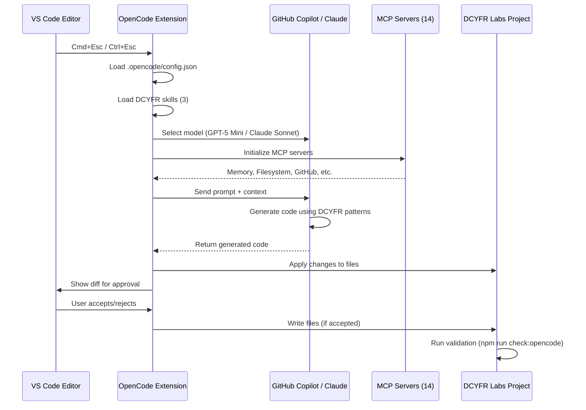

# OpenCode.ai Integration for DCYFR Labs

**Multi-provider AI fallback system with MCP integration, GitHub Copilot, and DCYFR-specific skills.**

## Table of Contents

<details>
<summary>📑 Table of Contents</summary>

- [What's Configured](#-whats-configured)
- [Phase 1 Complete: Enhanced Configuration](#-phase-1-complete-enhanced-configuration)
- [Quick Start](#quick-start)
- [How It Works](#-how-it-works)
- [Common Workflows](#common-workflows)
- [Available Providers](#available-providers)
- [NPM Scripts](#npm-scripts)
- [Configuration](#configuration)
- [Documentation](#documentation)
- [Keyboard Shortcuts](#keyboard-shortcuts-vs-code)
- [Cost Optimization](#cost-optimization)
- [Enforcement Rules](#enforcement-rules)
- [Troubleshooting](#troubleshooting)
- [Getting Help](#getting-help)

</details>

---

## ⚡ What's Configured

This project is fully configured with:

✅ **14 MCP Servers** - Memory, Filesystem, GitHub, Context7, Octocode, Perplexity, Vercel, Sentry, Axiom, 3 custom DCYFR MCPs
✅ **3 DCYFR Skills** - Design tokens, component patterns, quick fixes
✅ **GitHub Copilot Integration** - GPT-5 Mini + Raptor Mini (free with subscription)
✅ **Automated Validation** - Enhanced OpenCode-specific quality checks

**Configuration Files:**
- **`opencode.jsonc`** - ✨ NEW JSONC config with comments, variables, best practices
- `opencode.json` - Legacy JSON config (kept for reference)
- `.opencode/skill/*/SKILL.md` - DCYFR-specific reusable skills

**Setup Guides:**
- [OPENCODE_SETUP_GUIDE.md](../docs/ai/OPENCODE_SETUP_GUIDE.md) - Phase 1 migration & environment setup
- [OPENCODE_BEST_PRACTICES_ANALYSIS.md](../docs/ai/OPENCODE_BEST_PRACTICES_ANALYSIS.md) - Gap analysis & recommendations
- [OPENCODE_GLOBAL_CONFIG_TEMPLATE.jsonc](../docs/ai/OPENCODE_GLOBAL_CONFIG_TEMPLATE.jsonc) - Team global config

---

## ⚡ Phase 1 Complete: Enhanced Configuration

Your OpenCode config has been upgraded to JSONC format with:
- ✅ Variable substitution for environment variables (`{env:VAR}`)
- ✅ Comprehensive comments explaining each setting
- ✅ Enhanced MCP server configuration (autoRestart, auth)
- ✅ Global config template for team setup
- ✅ Environment variable documentation

See [OPENCODE_SETUP_GUIDE.md](../docs/ai/OPENCODE_SETUP_GUIDE.md) for implementation steps.

---

## Quick Start

### 1. Setup Environment Variables

```bash
# Copy environment template
cp .env.opencode.example .env.opencode.local

# Add your API keys (NEVER commit this file)
# REQUIRED: ANTHROPIC_API_KEY
# OPTIONAL: PERPLEXITY_API_KEY, OPENCODE_MODEL

nano .env.opencode.local
```

See [.env.opencode.example](../.env.opencode.example) for all available variables.

### 2. Install OpenCode CLI

```bash
# Using npm (recommended)
npm install -g opencode-ai

# Or using Homebrew
brew install anomalyco/tap/opencode

# Or using the install script
curl -fsSL https://opencode.ai/install | bash
```

### 3. Authenticate with GitHub Copilot (Optional)

OpenCode uses device code authentication (no API key required):

```bash
# Launch OpenCode
opencode

# In OpenCode interface, run:
/connect

# Select "GitHub Copilot" from provider list

# Follow on-screen instructions:
# 1. Navigate to: https://github.com/login/device
# 2. Enter code shown in terminal
# 3. Authorize OpenCode.ai

# Verify connection
/models
# Should show: gpt-5-mini, raptor-mini, gpt-4o, claude-sonnet-4, etc.
```

**No API key needed** - Uses your existing GitHub Copilot subscription.

### 4. Verify Setup

```bash
# Health check
npm run opencode:health

# Expected: ✅ GitHub Copilot connected
```

### 5. Start Using OpenCode

# Expected: ✅ GitHub Copilot connected
```

### 4. Start Using OpenCode

```bash
# Launch with GitHub Copilot (GPT-5 Mini)
opencode --preset dcyfr-feature

# Or use keyboard shortcut in VS Code
# Cmd+Esc (macOS) / Ctrl+Esc (Windows/Linux)
```

---

## 🔄 How It Works

OpenCode.ai integrates seamlessly with VS Code to provide AI-powered code generation with multiple provider support.



**Key Integration Points:**

1. **VS Code Extension** - Keyboard shortcuts, file watching, diff preview
2. **Provider Selection** - GitHub Copilot (free), Claude Sonnet (premium)
3. **MCP Servers** - 14 servers provide tools (memory, filesystem, GitHub, etc.)
4. **DCYFR Skills** - Design tokens, component patterns, quick fixes
5. **Validation** - Automated quality checks before commit

---

## Common Workflows

### Development with GitHub Copilot

```bash
# Feature implementation (GPT-5 Mini, 16K context)
opencode --preset dcyfr-feature

# Quick fixes (Raptor Mini, 8K context, fine-tuned for code)
opencode --preset dcyfr-quick

# Validate before committing
npm run check:opencode

# If violations, auto-fix
npm run lint -- --fix
```

### Premium Model Escalation

```bash
# Save current session
npm run session:save opencode "Feature X" implementation "30min"

# Switch to Claude Sonnet for complex logic
# In OpenCode: /connect → Select "Claude Sonnet 4"

# Restore session context
npm run session:restore opencode
```

### Multi-Model Comparison

```bash
# Implement with GPT-5 Mini
opencode --preset dcyfr-feature

# Compare with Claude Sonnet (if needed)
# Switch provider via /connect menu

# Merge best approaches from both
```

---

## Available Providers

### Provider Comparison

| Provider | Model | Cost (Input/Output per 1M tokens) | Context Window | Quality | Speed | Best For |
|----------|-------|-----------------------------------|----------------|---------|-------|----------|
| **GitHub Copilot** | GPT-5 Mini | $0* (Free with subscription) | 16K | 95% | Fast | 80% of development tasks |
| **GitHub Copilot** | Raptor Mini | $0* (Free with subscription) | 8K | 90% | Very Fast | Quick fixes, refactoring |
| **Anthropic** | Claude Sonnet 4 | $3/$15 (1x multiplier) | 200K | 98% | Fast | Complex logic, security reviews |
| **OpenAI** | GPT-4 Turbo | $10/$30 (2x multiplier) | 128K | 96% | Medium | Advanced reasoning (rare use) |

**\* Included with GitHub Copilot subscription ($10-20/month flat fee, no usage charges)**

### Cost Analysis

**GitHub Copilot Models (GPT-5 Mini, Raptor Mini):**
- **Pricing Model:** Fixed subscription fee ($10-20/month)
- **Usage Charges:** $0 (unlimited usage at 0x multiplier)
- **Total Monthly Cost:** $10-20 (predictable, no surprises)

**Premium Models (Claude Sonnet 4):**
- **Input Tokens:** $3 per 1M tokens (1x multiplier)
- **Output Tokens:** $15 per 1M tokens (1x multiplier)
- **Example:** Generating a 5,000-line module costs ~$0.75-1.50
- **Use Case:** Reserve for complex tasks (20% of work)

**Cost Optimization Strategy:**
```
Monthly GitHub Copilot: $15/month (fixed)
Occasional Claude Sonnet: $5-10/month (variable, ~20% of tasks)
Total: $20-25/month (vs. $100+ with pure premium usage)

Savings: 75-80% cost reduction while maintaining quality
```

**Recommendation**: Use GPT-5 Mini for routine work (80%), escalate to Claude Sonnet for complex/security tasks (20%).

---

## NPM Scripts

```bash
# Validation
npm run check:opencode          # Full validation (STRICT + FLEXIBLE)
npm run check                   # Standard validation (type + lint + test)

# Session Management
npm run session:save opencode "task" <phase> <estimate>
npm run session:restore <source-agent> opencode

# Health Checks
npm run opencode:health         # Check GitHub Copilot connection

# Provider Management
opencode /connect               # Change provider (GitHub Copilot ↔ Claude ↔ etc.)
opencode /models                # List available models
```

---

## Configuration

### Provider Presets (`.opencode/config.json`)

```json
{
  "primary": {
    "provider": "github-copilot",
    "model": "gpt-5-mini",
    "temperature": 0.3,
    "maxTokens": 16384,
    "description": "Primary GitHub Copilot model (16K context)"
  },
  "speed": {
    "provider": "github-copilot",
    "model": "raptor-mini",
    "temperature": 0.2,
    "maxTokens": 8192,
    "description": "Fast GitHub Copilot model (8K context, code-tuned)"
  },
  "presets": {
    "dcyfr-feature": {
      "providerId": "primary",
      "systemPrompt": "DCYFR pattern enforcement (design tokens, PageLayout, barrel exports)"
    },
    "dcyfr-quick": {
      "providerId": "speed",
      "systemPrompt": "DCYFR quick fixes (use existing patterns)"
    }
  }
}
```

**Authentication**: Device code flow (no API keys in config)

### VS Code Settings (`.vscode/settings.json`)

```json
{
  "opencode.defaultPreset": "dcyfr-feature",
  "opencode.autoSaveSession": true
}
```

---

## Documentation

### Patterns
- [Provider Selection](patterns/PROVIDER_SELECTION.md) - Decision tree for model selection
- [VS Code Integration](patterns/VS_CODE_INTEGRATION.md) - Extension setup & keyboard shortcuts

### Enforcement
- [Hybrid Enforcement](enforcement/HYBRID_ENFORCEMENT.md) - STRICT vs. FLEXIBLE rules
- [Enhanced Validation](enforcement/VALIDATION_ENHANCED.md) - Manual checklists for GitHub Copilot
- [Quality Gates](enforcement/QUALITY_GATES.md) - Pre-commit validation by provider

### Workflows
- [Session Handoff](workflows/SESSION_HANDOFF.md) - Switching between AI models
- [Cost Optimization](workflows/COST_OPTIMIZATION.md) - Strategic model usage (80/20 rule)
- [Troubleshooting](workflows/TROUBLESHOOTING.md) - Common issues & fixes

### Hub
- [DCYFR.opencode.md](DCYFR.opencode.md) - Main agent instructions

---

## Keyboard Shortcuts (VS Code)

| Shortcut | Action |
|----------|--------|
| `Cmd+Esc` (macOS) / `Ctrl+Esc` (Windows) | Launch OpenCode |
| `Cmd+Shift+Esc` / `Ctrl+Shift+Esc` | New session |
| `Cmd+Option+K` / `Ctrl+Alt+K` | Add file references |

---

## Cost Optimization

### 80/20 Strategy

**Use GitHub Copilot (GPT-5 Mini) for 80% of work:**
- Bug fixes following existing patterns
- Refactoring within established architecture
- UI updates using design system
- Documentation
- Adding tests

**Use premium models (Claude Sonnet) for 20% of work:**
- Security-sensitive changes (auth, API keys)
- Complex architectural decisions
- Breaking changes
- Emergency production fixes
- Performance optimization requiring benchmarks

### Expected Value

```
GitHub Copilot subscription: $10-20/month (fixed cost)
All models at 0 multiplier: No usage fees
Claude Sonnet (when needed): 1x multiplier (occasional use)

Benefit: Unlimited GPT-5 Mini + Raptor Mini usage at no extra cost
```

**No cost tracking needed** - GitHub Copilot models are included with subscription.

---

## Enforcement Rules

### STRICT Rules (Hard Block)

These violations **must be fixed** before committing:

1. **Design Tokens** - All visual properties use `@/design-system/tokens`
2. **PageLayout** - 90% of pages use `<PageLayout>` wrapper
3. **Barrel Exports** - All imports use barrel exports (no deep imports)
4. **Test Data** - No fabricated data in production environment
5. **Emoji Usage** - No emojis in public-facing content (use React icons)

**Auto-detection**: `npm run check:opencode`

### FLEXIBLE Rules (Warn Only)

These violations generate warnings (reviewed during PR):

6. **API Patterns** - 80% of POST routes should use Inngest (Validate→Queue→Respond)
7. **Test Coverage** - 99% test pass rate target (strategic skips allowed)

**Manual review**: See [VALIDATION_ENHANCED.md](enforcement/VALIDATION_ENHANCED.md)

---

## Troubleshooting

### GitHub Copilot Connection Issues

```bash
# Error: Not authenticated

# Fix: Re-authenticate via device code
opencode
/connect
# Select "GitHub Copilot"
# Follow authentication flow

# Verify
opencode /models
# Should show: gpt-5-mini, raptor-mini, etc.
```

### Model Not Available

```bash
# Error: Model not found

# Check available models
opencode /models

# Ensure GitHub Copilot subscription is active
# Visit: https://github.com/settings/copilot

# Restart VS Code if needed
```

### Validation Failures

```bash
# STRICT rule violations detected

# Auto-fix ESLint violations
npm run lint -- --fix

# Re-validate
npm run check:opencode

# If still failing, review manually or escalate
npm run session:save opencode "Issue X" blocked "15min"
# Switch to Claude Code or Claude (General) for investigation
```

**More issues**: See [TROUBLESHOOTING.md](workflows/TROUBLESHOOTING.md)

---

## Getting Help

### Internal Resources
- [Quick Reference](../docs/ai/quick-reference.md) - Commands & patterns
- [AGENTS.md](../AGENTS.md) - Multi-tier AI architecture overview
- [Testing Guide](../docs/testing/automated-testing-guide.md) - Test commands

### External Resources
- **OpenCode**: [opencode.ai/docs](https://opencode.ai/docs)
- **GitHub Copilot**: [github.com/features/copilot](https://github.com/features/copilot)
- **Authentication Help**: [github.com/login/device](https://github.com/login/device)

---

## Status

- **Version**: 2.0.0 (GitHub Copilot Integration)
- **Last Updated**: January 11, 2026
- **Maintainer**: Architecture Team
- **Status**: Production Ready ✅

---

**Next Steps:**

1. Authenticate with GitHub Copilot: `opencode` → `/connect`
2. Review [PROVIDER_SELECTION.md](patterns/PROVIDER_SELECTION.md) decision tree
3. Start development: `opencode --preset dcyfr-feature`
4. Validate before commit: `npm run check:opencode`

**Happy coding with AI! 🚀**
