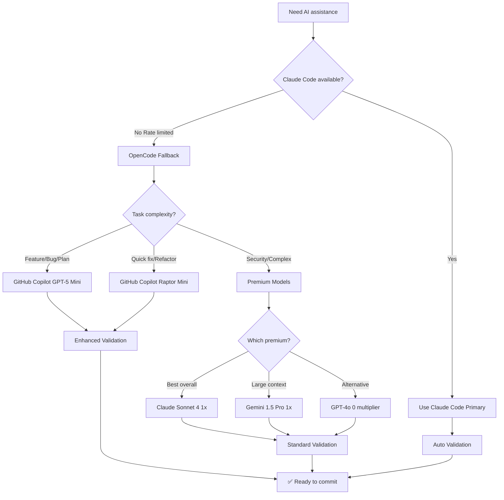

# Provider Selection Guide

**File:** `.opencode/patterns/PROVIDER_SELECTION.md`  
**Last Updated:** January 11, 2026  
**Scope:** Decision tree for choosing AI providers with GitHub Copilot integration

---

## Provider Decision Tree

Use this flowchart to select the optimal AI provider for your task:



---

## Provider Capabilities Matrix

| Provider | Model | Context | Cost Multiplier | Speed | DCYFR Enforcement | Use For |
|----------|-------|---------|-----------------|-------|-------------------|---------|
| **GitHub Copilot** | GPT-5 Mini | 16K | 0 (free*) | Fast | Manual verify | 80% of development |
| **GitHub Copilot** | Raptor Mini | 8K | 0 (free*) | Very Fast | Manual verify | Quick fixes, refactoring |
| **GitHub Copilot** | GPT-4o | 128K | 0 (free*) | Fast | Manual verify | Alternative perspective |
| **Anthropic** | Claude Sonnet 4 | 200K | 1 (paid) | Fast | Full (auto) | Complex logic, security |
| **Google** | Gemini 1.5 Pro | 1M | 1 (paid) | Fast | Full (auto) | Massive context needed |
| **OpenAI** | GPT-4 Turbo | 128K | 1 (paid) | Fast | Full (auto) | Direct API access |

**Included with GitHub Copilot subscription ($10-20/month flat fee)*

---

## Task-to-Provider Mapping

### Feature Implementation

**Best:** GitHub Copilot GPT-5 Mini (included)
- Quality: 90-95% of Claude Sonnet
- Speed: Fast
- Context: 16K tokens
- Validation: Enhanced (manual review required)
- Cost: $0 additional

**When to upgrade to premium:**
- Security-sensitive features (auth, permissions)
- Complex architectural changes
- Performance-critical optimizations
- Breaking changes requiring careful analysis

### Planning & Architecture

**Best:** GitHub Copilot GPT-5 Mini (included)
- Quality: Excellent for planning
- Speed: Fast
- Context: 16K tokens (sufficient for most plans)
- Validation: Manual review
- Cost: $0 additional

**When to use Gemini 1.5 Pro:**
- Massive context needed (100K+ tokens)
- Multi-file architecture analysis
- Large codebase refactoring plans

### Quick Fixes & Iterations

**Best:** GitHub Copilot Raptor Mini (included)
- Quality: Good for pattern-based tasks
- Speed: Very fast (fine-tuned for code)
- Context: 8K tokens
- Validation: Manual review
- Cost: $0 additional

**Use for:**
- Bug fixes following existing patterns
- Refactoring within established architecture
- UI updates using design system
- Documentation fixes
- Test additions

### Complex Logic & Security

**Best:** Claude Sonnet 4 (premium)
- Quality: Best-in-class reasoning
- Speed: Fast
- Context: 200K tokens
- Validation: Standard (automated via Claude Code)
- Cost: 1x multiplier (occasional use)

**Use for:**
- Authentication/authorization changes
- Payment processing
- Security audit fixes
- Complex state management
- Performance optimization

---

## GitHub Copilot Model Comparison

### GPT-5 Mini (Primary Model)

**Specs:**
- Context: 16K tokens
- Cost: 0 multiplier (included with subscription)
- Status: GA (General Availability)
- Speed: Fast

**Best for:**
- Feature implementation
- Planning and architecture
- Bug fixes
- Documentation
- Test writing

**Limitations:**
- 16K context (not suitable for massive multi-file operations)
- Manual DCYFR validation required

### Raptor Mini (Speed Model)

**Specs:**
- Context: 8K tokens
- Cost: 0 multiplier (included with subscription)
- Status: Preview (fine-tuned for code generation)
- Speed: Very fast

**Best for:**
- Quick fixes
- Refactoring
- Pattern-based implementations
- Code completion
- Syntax corrections

**Limitations:**
- 8K context (smaller than GPT-5 Mini)
- Best for focused, single-file tasks
- Manual DCYFR validation required

### GPT-4o (Alternative Model)

**Specs:**
- Context: 128K tokens
- Cost: 0 multiplier (included with subscription)
- Status: GA
- Speed: Fast

**Best for:**
- Large context operations
- Multi-file analysis
- Alternative perspective
- Cross-file refactoring

**Limitations:**
- Manual DCYFR validation required

---

## Cost Optimization Strategies

### Strategy 1: GitHub Copilot for Routine Work (80%)

```
Phase 1: Feature Development (GPT-5 Mini) - $0
  └─ Implement feature using DCYFR patterns
  
Phase 2: Quick Fixes (Raptor Mini) - $0
  └─ Bug fixes, refactoring, test additions
  
Phase 3: Validation (npm run check:opencode) - $0
  └─ Manual DCYFR compliance review
  
Total Cost: $0 additional (included with subscription)
Efficiency: 80% of development completed with no usage fees
```

### Strategy 2: Premium for Complex Tasks (20%)

```
Phase 1: Planning (GPT-5 Mini) - $0
  └─ Architecture plan, file structure, approach
  
Phase 2: Complex Implementation (Claude Sonnet 4) - $5-10
  └─ Security-sensitive or complex logic
  
Phase 3: Refinement (GPT-5 Mini) - $0
  └─ Polish, documentation, tests
  
Total Cost: $5-10 per complex feature
Outcome: Best quality where it matters, free elsewhere
```

### Strategy 3: Multi-Model Validation

```
Phase 1: Implementation (GPT-5 Mini) - $0
  └─ Complete feature implementation
  
Phase 2: Alternative Review (GPT-4o) - $0
  └─ Cross-validate approach, catch issues
  
Phase 3: Manual Validation (npm run check:opencode) - $0
  └─ DCYFR compliance, test coverage, quality gates
  
Total Cost: $0
Benefit: Two AI perspectives for better quality
```

---

## Quality Trade-Offs

### GitHub Copilot Models (GPT-5 Mini, Raptor Mini)

**Strengths:**
- ✅ $0 usage cost (included with subscription)
- ✅ Fast generation speed
- ✅ Good quality (90-95% of premium models)
- ✅ 16K context (GPT-5 Mini)
- ✅ Code-specialized (Raptor Mini)
- ✅ No rate limits (within subscription terms)

**Weaknesses:**
- ❌ Manual DCYFR validation required
- ❌ May miss edge cases
- ❌ No automatic pattern enforcement
- ❌ Requires enhanced validation workflow

**When to use:** 80% of development work (features, bugs, refactoring, documentation)

### Premium Models (Claude Sonnet 4, Gemini 1.5 Pro)

**Strengths:**
- ✅ Best reasoning and pattern recognition
- ✅ Automatic DCYFR enforcement (when used via Claude Code)
- ✅ Fewer hallucinations
- ✅ Better edge case handling
- ✅ Strong test writing
- ✅ Massive context (Gemini: 1M tokens)

**Weaknesses:**
- ❌ Usage fees (1x multiplier)
- ❌ API rate limits
- ❌ Requires internet

**When to use:** 20% of development work (security, complex logic, critical features)

---

## When to Upgrade from GitHub Copilot to Premium

Consider upgrading when:

1. **Security-sensitive work** - Auth, permissions, payment processing, API keys
2. **Complex architectural decisions** - Breaking changes, refactoring, system design
3. **Quality issues** - GitHub Copilot makes repeated mistakes or misses patterns
4. **Time pressure** - Premium models faster to correct solution
5. **Validation burden** - Manual review taking longer than premium model cost

**ROI Calculation:**

```
Scenario: Implementing OAuth integration (security-sensitive)

GitHub Copilot Approach:
- Development time: 3 hours (GPT-5 Mini)
- Manual validation: 1 hour (security review)
- Total time: 4 hours
- Total cost: $0
- Risk: Higher (manual security review required)

Claude Sonnet Approach:
- Development time: 2 hours (Claude Sonnet 4)
- Standard validation: 15 min (automated checks)
- Total time: 2.25 hours
- Total cost: $15
- Risk: Lower (premium model catches security issues)

Decision: Use premium for security-sensitive work
Reasoning: $15 cost justified by reduced risk and time savings
```

---

## Provider Health & Availability

Check provider status before starting work:

```bash
# Check GitHub Copilot connection
npm run opencode:health

# In OpenCode, verify models available
opencode
/models
# Should show: gpt-5-mini, raptor-mini, gpt-4o, claude-sonnet-4, etc.

# Test connection
/connect
# Select "GitHub Copilot"
# Follow device authentication if needed
```

**Fallback chain:**

```
1st: Claude Code (primary - best quality, auto-enforcement)
2nd: GitHub Copilot GPT-5 Mini (fallback - free, good quality)
3rd: GitHub Copilot Raptor Mini (speed - free, fast)
4th: Premium models (escalation - complex/security tasks)
```

---

## Provider Selection Cheatsheet

| Situation | Provider | Reasoning |
|-----------|----------|-----------|
| Claude Code rate limited | GitHub Copilot GPT-5 Mini | Free fallback, 90%+ quality |
| Quick bug fix | GitHub Copilot Raptor Mini | Fast, code-specialized |
| Planning new feature | GitHub Copilot GPT-5 Mini | 16K context, free |
| OAuth implementation | Claude Sonnet 4 | Security-sensitive, premium quality |
| Large refactoring | Gemini 1.5 Pro | Massive context (1M tokens) |
| Multi-file analysis | GitHub Copilot GPT-4o | 128K context, free |
| Documentation updates | GitHub Copilot Raptor Mini | Fast, simple task |
| Architecture decision | Claude Sonnet 4 | Complex reasoning needed |
| Emergency production fix | Claude Code → Claude Sonnet 4 | Best quality, critical situation |
| Routine development | GitHub Copilot GPT-5 Mini | Free, unlimited usage |

---

## Authentication & Setup

### GitHub Copilot Device Authentication

```bash
# Launch OpenCode
opencode

# Connect to GitHub Copilot
/connect

# Select "GitHub Copilot" from provider list

# Follow device code flow:
# 1. Navigate to https://github.com/login/device
# 2. Enter code shown in terminal
# 3. Authorize OpenCode.ai

# Verify connection
/models
# Should show all GitHub Copilot models
```

**No API key required** - Uses existing GitHub Copilot subscription

### Premium Model Setup (Optional)

If using premium models occasionally:

```bash
# Add to .env.local (optional)
ANTHROPIC_API_KEY=sk-ant-...    # For Claude Sonnet 4
GOOGLE_API_KEY=...              # For Gemini 1.5 Pro
OPENAI_API_KEY=sk-...           # For direct GPT-4 access

# In OpenCode, connect to premium providers
/connect
# Select "Claude" or "Gemini" or "OpenAI"
# Use API key authentication
```

---

## Related Documentation

- [**VS_CODE_INTEGRATION.md**](VS_CODE_INTEGRATION.md) - Extension setup for OpenCode
- [**COST_OPTIMIZATION.md**](../workflows/COST_OPTIMIZATION.md) - Budget strategies
- [**TROUBLESHOOTING.md**](../workflows/TROUBLESHOOTING.md) - Common provider issues
- [**config.json**](../config.json) - Provider configuration and presets

---

## Quick Decision Flow

```
Need AI help
    ↓
Is Claude Code available?
    ├─ YES → Use Claude Code (best quality)
    └─ NO → Use OpenCode fallback
        ↓
        What task type?
        ├─ Feature/Bug/Plan → GitHub Copilot GPT-5 Mini (free, 16K)
        ├─ Quick fix → GitHub Copilot Raptor Mini (free, fast)
        └─ Security/Complex → Claude Sonnet 4 (premium, best)
```

**Default choice:** GitHub Copilot GPT-5 Mini (covers 80% of use cases)

---

**Status:** Production Ready (GitHub Copilot Integration v2.0)  
**Maintained By:** DCYFR Labs Architecture Team
