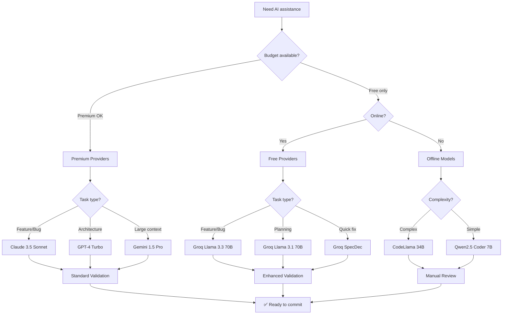

# Provider Selection Guide

**File:** `.opencode/patterns/PROVIDER_SELECTION.md`  
**Last Updated:** January 5, 2026  
**Scope:** Decision tree for choosing AI providers, free model optimization, quality trade-offs

---

## Provider Decision Tree

Use this flowchart to select the optimal AI provider for your task:



---

## Provider Capabilities Matrix

| Provider | Model | Context | Cost | Speed | DCYFR Enforcement | Use For |
|----------|-------|---------|------|-------|-------------------|---------|
| **Groq** | Llama 3.3 70B Versatile | 8K | Free | Ultra Fast | Partial (manual verify) | Feature implementation, bug fixes |
| **Groq** | Llama 3.1 70B | 8K | Free | Fast | Partial (manual verify) | Planning, architecture, refactoring |
| **Groq** | Llama 3.3 70B SpecDec | 8K | Free | 2x Speed | Partial (manual verify) | Quick fixes, iterations |
| **Ollama** | CodeLlama 34B | 16K | Free | Medium | Manual only | Offline development, complex tasks |
| **Ollama** | Qwen2.5 Coder 7B | 32K | Free | Fast | Manual only | Offline quick tasks |
| **Anthropic** | Claude 3.5 Sonnet | 200K | Premium | Fast | Full (auto) | Production features (via Claude Code) |
| **OpenAI** | GPT-4 Turbo | 128K | Premium | Fast | Full (auto) | Alternative perspective |
| **Google** | Gemini 1.5 Pro | 2M | Medium | Fast | Full (auto) | Massive context needed |

---

## Task-to-Provider Mapping

### Feature Implementation

**Best:** Groq Llama 3.3 70B Versatile (free)
- Quality: 85-90% of Claude 3.5 Sonnet
- Speed: 100+ tokens/sec
- Validation: Enhanced (manual review required)
- Cost: $0

**Alternative:** Claude 3.5 Sonnet (premium - when Claude Code available)
- Quality: Best-in-class
- Speed: Fast
- Validation: Standard (automated)
- Cost: ~$0.015 per 1K tokens

### Planning & Architecture

**Best:** Groq Llama 3.1 70B (free)
- Quality: Excellent for planning
- Speed: Fast
- Validation: Manual review
- Cost: $0

**Alternative:** Claude or GPT-4 for critical architecture decisions

### Quick Fixes & Iterations

**Best:** Groq Llama 3.3 70B SpecDec (free)
- Quality: Good for simple tasks
- Speed: 200+ tokens/sec (2x faster)
- Validation: Manual review
- Cost: $0

### Offline Development

**Best:** Ollama CodeLlama 34B (free, offline)
- Quality: Good for code tasks
- Speed: Depends on hardware
- Validation: Full manual review required
- Cost: $0 (local inference)

**Alternative:** Qwen2.5 Coder 7B for faster but simpler tasks

---

## Free Model Optimization Strategies

### Strategy 1: Use Free for Planning, Premium for Implementation

```
Phase 1: Planning (Groq Llama 3.1 70B) - $0
  └─ Generate architecture plan, file list, step-by-step guide
  
Phase 2: Implementation (Claude Code) - $10-15
  └─ Execute plan with full DCYFR enforcement
  
Phase 3: Validation (Groq Llama 3.3 70B) - $0
  └─ Review changes, cross-validate compliance
  
Total Cost: $10-15 (vs $20-25 all-Claude approach)
Savings: 40-50%
```

### Strategy 2: Use Free Until Rate Limited

```
Start: Claude Code (premium) - Best quality
  └─ Continue until rate limit or token exhaustion
  
Fallback: Groq Llama 3.3 70B (free) - Good quality
  └─ Continue development with enhanced validation
  
Return: Claude Code when available - Final polish
  └─ Review free model output, validate compliance
  
Outcome: Extended development session without interruption
```

### Strategy 3: Offline-First for Exploratory Work

```
Explore: Ollama CodeLlama 34B (offline) - No internet needed
  └─ Experiment, draft implementations, test ideas
  
Refine: Groq Llama 3.3 70B (online, free) - Polish draft
  └─ Improve quality, add patterns, validate approach
  
Finalize: Claude Code (premium) - Production ready
  └─ Final validation, edge case handling, tests
  
Use Case: Air-gapped development, secure environments
```

---

## Quality Trade-Offs

### Premium Models (Claude, GPT-4)

**Strengths:**
- ✅ Best pattern recognition
- ✅ Automatic DCYFR enforcement
- ✅ Fewer hallucinations
- ✅ Better edge case handling
- ✅ Strong test writing

**Weaknesses:**
- ❌ Expensive ($0.015-0.03 per 1K tokens)
- ❌ API rate limits
- ❌ Requires internet

**When to use:** Critical features, complex refactoring, production code

### Free Models (Groq Llama 3.3/3.1 70B)

**Strengths:**
- ✅ $0 cost (unlimited free tier)
- ✅ Ultra-fast (100+ tokens/sec)
- ✅ Good quality (85-90% of premium)
- ✅ No rate limits (within reason)

**Weaknesses:**
- ❌ Manual DCYFR validation required
- ❌ May miss edge cases
- ❌ Occasional hallucinations
- ❌ Requires enhanced validation

**When to use:** Planning, refactoring, documentation, extended sessions

### Offline Models (Ollama CodeLlama 34B)

**Strengths:**
- ✅ $0 cost (local inference)
- ✅ Works offline
- ✅ Private (data never leaves machine)
- ✅ No rate limits

**Weaknesses:**
- ❌ Requires good hardware (16GB+ RAM)
- ❌ Slower than cloud models
- ❌ No tool access (MCP servers)
- ❌ Full manual validation required

**When to use:** Offline development, secure environments, exploratory work

---

## When to Upgrade from Free to Premium

Consider upgrading when:

1. **Quality issues** - Free model makes repeated mistakes or misses patterns
2. **Complex tasks** - Architecture decisions, security-sensitive code, critical features
3. **Time pressure** - Premium models faster to correct solution
4. **Validation burden** - Manual review taking longer than premium model cost
5. **Production readiness** - Final polish before merge/deploy

**ROI Calculation:**

```
Scenario: Implementing new feature with blog category filter

Free Model Approach:
- Development time: 2 hours (Groq Llama 3.3 70B)
- Manual validation: 30 min (enhanced checks)
- Total time: 2.5 hours
- Total cost: $0

Premium Model Approach:
- Development time: 1.5 hours (Claude 3.5 Sonnet)
- Standard validation: 10 min (automated)
- Total time: 1.67 hours
- Total cost: $12

Time saved: 0.83 hours (~50 minutes)
Cost per hour saved: $14.50/hour

Decision: Use free for first pass, premium for final polish
```

---

## Provider Health & Availability

Check provider status before starting work:

```bash
# Check all providers
npm run opencode:health

# Manual checks
curl https://api.groq.com/openai/v1/models  # Groq API
curl http://localhost:11434/api/version     # Ollama local
```

**Fallback chain:**

```
1st: Claude Code (primary - via existing workflow)
2nd: Groq Llama 3.3 70B (free fallback)
3rd: Ollama CodeLlama 34B (offline fallback)
```

---

## Related Documentation

- [**VS_CODE_INTEGRATION.md**](VS_CODE_INTEGRATION.md) - Extension setup for OpenCode
- [**OFFLINE_DEVELOPMENT.md**](OFFLINE_DEVELOPMENT.md) - Ollama model setup
- [**COST_OPTIMIZATION.md**](../workflows/COST_OPTIMIZATION.md) - Budget strategies
- [**config.json**](../config.json) - Provider configuration and presets
