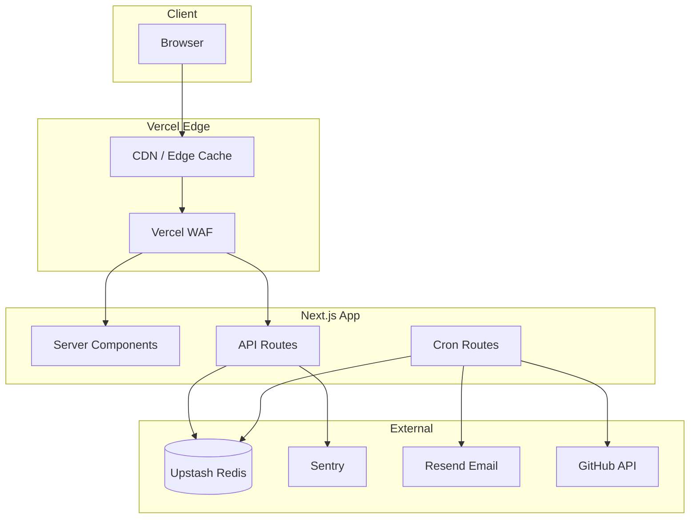

# API Architecture Diagram

## Metadata

- Title: dcyfr-labs System Architecture
- Diagram Type: architecture
- Version: 1
- Last Updated: 2026-03-24
- Audience: blog readers
- TLP: CLEAR

## Diagram



## Usage in MDX

```tsx
import { StaticDiagram } from '@/components/StaticDiagram';

<StaticDiagram src="/diagrams/api-architecture-v1.html" alt="dcyfr-labs System Architecture" />;
```
