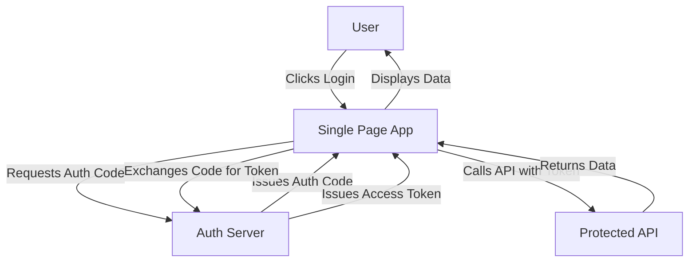

# Authentication Flow Diagram

## Metadata

- Title: OAuth 2.0 Authentication Flow
- Diagram Type: flowchart
- Version: 1
- Last Updated: 2026-03-24
- Audience: blog readers
- TLP: CLEAR

## Diagram



## Usage in MDX

```tsx
import { StaticDiagram } from '@/components/StaticDiagram';

<StaticDiagram src="/diagrams/auth-flow-v1.html" alt="OAuth 2.0 Authentication Flow" />;
```
