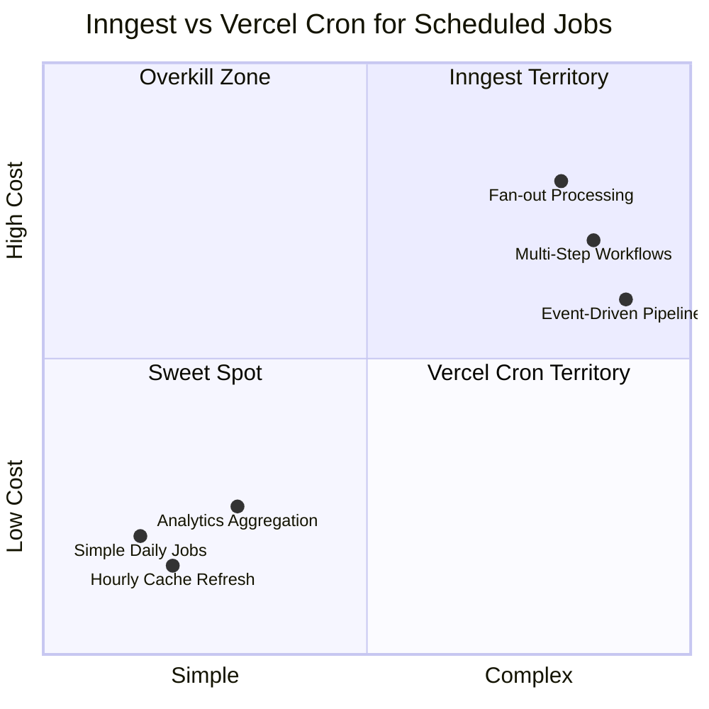

# Feature Comparison Diagram

## Metadata

- Title: Inngest vs Vercel Cron — Scheduled Jobs Comparison
- Diagram Type: comparison
- Version: 1
- Last Updated: 2026-03-24
- Audience: blog readers
- TLP: CLEAR

## Diagram



## Usage in MDX

```tsx
import { StaticDiagram } from '@/components/StaticDiagram';

<StaticDiagram
  src="/diagrams/feature-comparison-v1.html"
  alt="Inngest vs Vercel Cron comparison chart"
/>;
```
