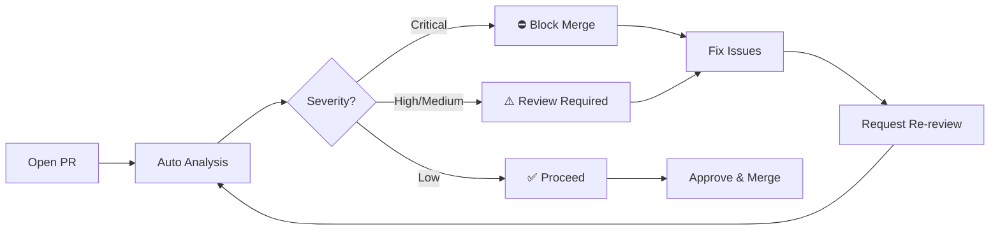

<!-- TLP:CLEAR -->

# GitHub Copilot PR Workflow - Automated Resolution Plans

**Version:** 1.0.0
**Last Updated:** February 1, 2026
**Purpose:** Guide for using automated PR resolution plans with GitHub Copilot

---

## 🎯 Overview

When you open a PR, GitHub Actions automatically:

1. ✅ Scans for security issues, code quality, design tokens, tests
2. ✅ Generates a prioritized resolution plan
3. ✅ Posts plan as PR comment with severity assessment
4. ✅ Sets commit status (⛔ block / ⚠️ review / ✅ proceed)
5. ✅ Enables Copilot-assisted fixes

---

## 🔄 Workflow Lifecycle



### Timeline by Severity

| Severity        | Timeline | Auto-Action                      | Example Issues                                         |
| --------------- | -------- | -------------------------------- | ------------------------------------------------------ |
| 🔴 **CRITICAL** | 24 hours | ⛔ Block merge + request changes | TypeScript errors, test failures (<99%), broken builds |
| 🟠 **HIGH**     | 72 hours | ⚠️ Review required               | 50+ ESLint errors, 20+ token violations                |
| 🟡 **MEDIUM**   | 1 week   | ⚠️ Review suggested              | ESLint warnings, token violations, security findings   |
| 🟢 **LOW**      | 2 weeks  | ✅ Merge approved                | Markdown linting, minor quality issues                 |

---

## 📊 What Gets Analyzed

### 1. TypeScript Compilation

```bash
npx tsc --noEmit
```

- **Critical if:** Any type errors
- **Blocking:** Yes
- **Auto-fix:** Partial (Copilot can suggest fixes)

### 2. ESLint Code Quality

```bash
npm run lint
```

- **Critical if:** >50 errors
- **Medium if:** Any warnings
- **Auto-fix:** Yes (`npm run lint -- --fix` or Copilot)

### 3. Design Token Compliance

```bash
# Detects hardcoded values like:
className="gap-8 mt-4 text-3xl"
```

- **High if:** >20 violations
- **Medium if:** Any violations
- **Auto-fix:** Yes (Copilot with design token context)

### 4. Test Coverage

```bash
npm run test:run
```

- **Critical if:** Pass rate <99%
- **Medium if:** Pass rate <100%
- **Auto-fix:** No (manual test fixes)

### 5. Security Scanning (Gitleaks)

```bash
gitleaks detect
```

- **Critical if:** Actual secrets found
- **Medium if:** >10 findings (likely false positives)
- **Auto-fix:** No (manual review, add to baseline)

### 6. Markdown Quality

```bash
markdownlint '**/*.md'
```

- **Low priority:** Always
- **Auto-fix:** Yes (`markdownlint --fix`)

---

## 🤖 Using Copilot for Fixes

### For PR Authors (Self-Fix)

When the resolution plan identifies issues:

**Step 1: Review the plan**

- Wait 2-3 minutes for auto-analysis to complete
- Read the resolution plan comment
- Note critical vs. medium vs. low priority issues

**Step 2: Use Copilot Chat to plan fixes**

```
@workspace Review the PR resolution plan and create a fix strategy
for the critical issues. Prioritize TypeScript errors and test failures.
```

**Step 3: Fix issues with Copilot assistance**

```
// In Copilot Chat:
@workspace Fix ESLint warnings in src/lib/github-data.ts by using
console.warn instead of console.log for production-safe logging

@workspace Convert hardcoded spacing in src/components/blog/post-card.tsx
to use SPACING constants from @/lib/design-tokens

@workspace Add missing test coverage for the handleSubmit function
in src/app/contact/actions.ts
```

**Step 4: Verify fixes**

```bash
npm run lint        # Should pass
npx tsc --noEmit    # Should pass
npm run test:run    # Should be ≥99%
```

**Step 5: Push and request re-review**

- Commit fixes
- Push to PR branch
- Auto-analysis runs again
- Request review from team

### For Reviewers (Request Copilot Fixes)

**Use batch review comments for efficiency:**

1. Click **"Start a review"** (not "Add single comment")
2. Add multiple comments with `@copilot` requests:

```
@copilot Fix ESLint warnings by converting console.log to
console.warn with environment checks
```

```
@copilot This spacing should use SPACING.content instead of gap-8.
See docs/ai/design-system.md for token reference.
```

```
@copilot Add tests for error handling in this function.
Follow patterns in tests/lib/api.test.ts
```

3. Click **"Submit review"**
4. Copilot processes ALL comments at once (more efficient)

---

## 🎯 Resolution Plan Format

The auto-generated plan includes:

### Executive Summary

- Total issues count
- Breakdown by category
- Severity level
- Recommended action

### Critical Priority Issues

- TypeScript errors → Must fix before merge
- Test failures → Must fix before merge
- Build failures → Must fix before merge

### Medium Priority Issues

- ESLint violations → Fix before final review
- Design token violations → Fix before merge
- Security findings → Review and document
- Test coverage gaps → Add tests

### Low Priority Issues

- Markdown quality → Nice to have
- Documentation completeness → Improve over time

### Pre-Merge Checklist

- [ ] TypeScript compiles (0 errors)
- [ ] ESLint passes (0 errors)
- [ ] Tests pass (≥99%)
- [ ] Design tokens used
- [ ] Security reviewed
- [ ] Documentation updated

### Copilot Integration Guide

- How to request fixes
- Example commands
- Batch review tips

### Resources

- Links to patterns, guides, docs

---

## 💡 Best Practices

### For Authors

✅ **DO:**

- Wait for auto-analysis before requesting review
- Address critical issues immediately
- Use Copilot for repetitive fixes (token replacements, logging)
- Request re-review after fixes
- Reference the resolution plan in commit messages

❌ **DON'T:**

- Ignore critical blocking issues
- Request review before analysis completes
- Skip tests because "it works locally"
- Merge with failing checks

### For Reviewers

✅ **DO:**

- Check the auto-generated resolution plan first
- Use batch review comments for multiple Copilot requests
- Be specific in Copilot requests (reference files, patterns, docs)
- Verify fixes before approving

❌ **DON'T:**

- Approve PRs with critical issues
- Make individual comments for each Copilot request (use batch review)
- Request vague fixes ("make it better")
- Override security findings without justification

---

## 🔧 Workflow Configuration

### Enable on Your Repo

The workflow runs automatically, but you can customize:

**File:** `.github/workflows/pr-resolution-plan.yml`

**Triggers:**

```yaml
on:
  pull_request:
    types: [opened, synchronize, reopened]
    branches:
      - main
      - preview
```

**Severity Thresholds:**

```yaml
# Edit in workflow:
# Critical: TS errors > 0, test failures > 10, pass rate < 95%
# High: ESLint > 50, token violations > 20
# Medium: Any ESLint/tokens/gitleaks
# Low: Markdown issues only
```

### Manual Trigger

Run analysis on existing PR:

```bash
gh workflow run pr-resolution-plan.yml \
  -f pr_number=123
```

Or via GitHub UI:

1. Go to Actions tab
2. Select "Generate PR Resolution Plan"
3. Click "Run workflow"
4. Enter PR number

---

## 📥 Accessing Reports

### In PR Comments

The resolution plan appears as a comment ~2-3 minutes after PR open/update.

### As Artifacts

Download detailed reports from workflow run:

1. Go to PR → Checks tab
2. Click on "Generate PR Resolution Plan"
3. Scroll to "Artifacts" section
4. Download `pr-analysis-reports-{pr_number}.zip`

**Included reports:**

- `pr-resolution-plan.md` - Full resolution plan
- `gitleaks-report.json` - Security findings
- `eslint-report.json` - Code quality issues
- `typescript-report.txt` - Type errors
- `test-report.json` - Test results
- `markdown-report.json` - Documentation quality

**Retention:** 30 days

---

## 🚨 Troubleshooting

### Plan Not Appearing

**Symptom:** No resolution plan comment after 5+ minutes

**Solutions:**

1. Check workflow run in Actions tab for errors
2. Verify workflow has `pull-requests: write` permission
3. Check if PR is from a fork (may have permission issues)
4. Manually trigger workflow: `gh workflow run pr-resolution-plan.yml -f pr_number=X`

### False Positive Blocking

**Symptom:** Merge blocked for false positive issues

**Solutions:**

1. **Gitleaks:** Add to `.gitleaksignore` and re-run
2. **ESLint:** Add `// eslint-disable-next-line rule-name` with justification
3. **TypeScript:** Fix or add `// @ts-expect-error` with explanation
4. **Tests:** Update test or mark as `.skip` with documented reason

### Copilot Not Responding

**Symptom:** `@copilot` requests not generating fixes

**Solutions:**

1. Verify Copilot enabled on repo (Settings → GitHub Copilot)
2. Use "Start a review" for batch comments (more reliable)
3. Be specific: reference files, line numbers, patterns
4. Check Copilot quota/limits on organization

---

## 🔄 Integration with Other Workflows

This workflow integrates with:

### PR Automation (`pr-automation.yml`)

- Runs after resolution plan
- Adds labels based on severity
- Assigns reviewers based on changed files

### Code Scanning (CodeQL)

- Runs in parallel
- Results may reference each other
- Both contribute to merge decision

### Deployment Checks

- Runs before deploy
- Preview deploys even if issues found
- Production deploy blocked if critical issues

### Lighthouse CI

- Performance checks run separately
- Not included in resolution plan
- Reported via different workflow

---

## 📚 Related Documentation

- [Quick Reference](quick-reference.md) - Common commands and patterns
- [Component Patterns](component-patterns.md) - Design system usage
- [Testing Guide](../testing/README.md) - Test requirements
- [Security Baseline](../security/code-scanning-quick-reference.md) - Security scan info
- [Enforcement Rules](enforcement-rules.md) - Quality gates

---

## 🎓 Examples

### Example 1: Critical TypeScript Errors

**Resolution plan says:**

> 🔴 CRITICAL - 5 TypeScript errors detected
> Timeline: Must fix before merge
> See `typescript-report.txt` for details

**Author action:**

```
@workspace Fix TypeScript errors in src/lib/api-client.ts by adding
proper type definitions for the API response interface
```

**Result:** Copilot suggests type definitions, author reviews and commits

---

### Example 2: Design Token Violations

**Resolution plan says:**

> 🟡 MEDIUM - 12 design token violations
> Timeline: 1 week
> Common violations: gap-8, mt-4, text-3xl

**Reviewer action:** (batch review)

```
File: src/components/blog/post-card.tsx
Line 42: @copilot Replace gap-8 with gap-${SPACING.content}

File: src/components/blog/post-card.tsx
Line 58: @copilot Replace mt-4 with mt-${SPACING.compact}

File: src/components/blog/post-header.tsx
Line 15: @copilot Replace text-3xl with ${TYPOGRAPHY.h1.standard}
```

**Result:** Copilot updates all files at once with proper tokens

---

### Example 3: Security Findings Review

**Resolution plan says:**

> 🟡 MEDIUM - 8 Gitleaks findings
> Timeline: Review within 24 hours
> See `gitleaks-report.json` for details

**Author action:**

```bash
# Review findings
cat gitleaks-report.json | jq '.[] | {file: .File, line: .StartLine}'

# Confirmed false positives (example tokens in docs)
echo "docs/examples/api-usage.md:generic-api-key:*" >> .gitleaksignore
echo "tests/fixtures/mock-data.ts:generic-api-key:*" >> .gitleaksignore

# Commit and push
git add .gitleaksignore
git commit -m "docs: Add false positive baseline for example API keys"
git push
```

**Result:** Re-analysis shows 0 findings, status changes to ✅

---

**Status:** Production Ready
**Maintained By:** Development Team
**Review Schedule:** Quarterly
**Last Review:** February 1, 2026

For questions or issues, see [CONTRIBUTING.md](../../CONTRIBUTING.md) or open a discussion.
