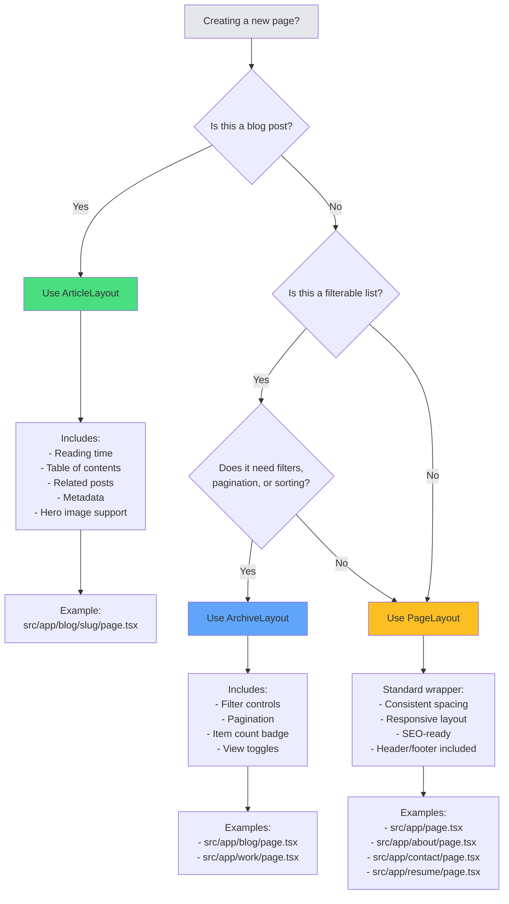
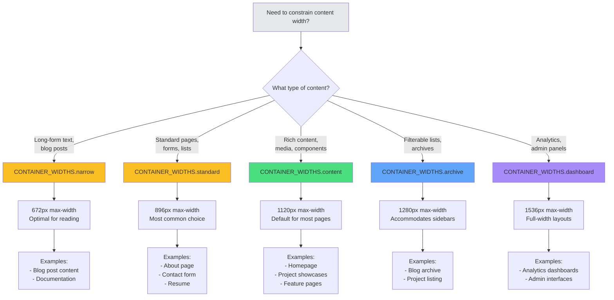
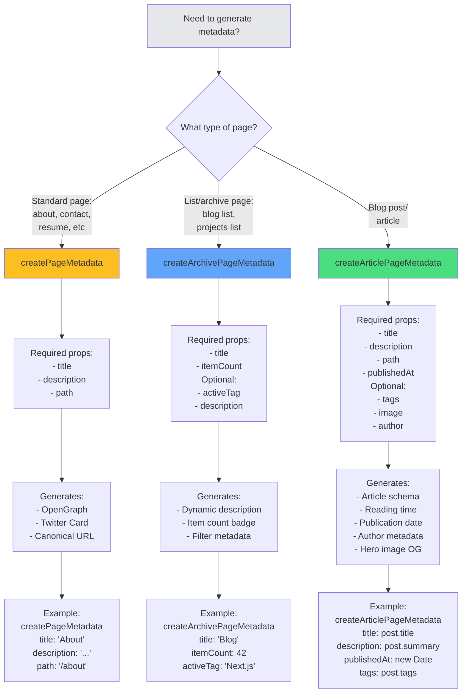
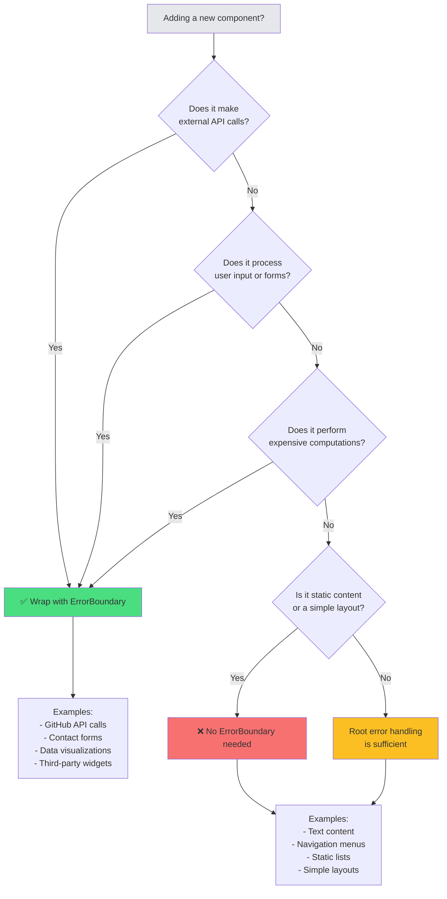
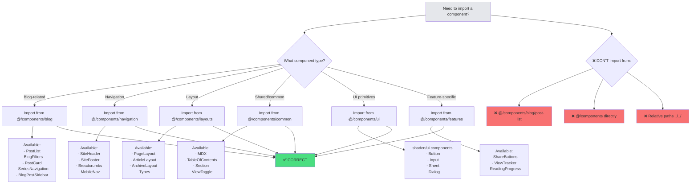

# Component-First Decision Trees

Visual flowcharts for making architectural decisions in the dcyfr-labs codebase. Use these to quickly determine which patterns, layouts, and helpers to use without re-reading documentation.

**Quick Links:**
- [Which Layout Should I Use?](#which-layout-should-i-use)
- [Which Container Width?](#which-container-width)
- [Which Metadata Helper?](#which-metadata-helper)
- [Do I Need an Error Boundary?](#do-i-need-an-error-boundary)
- [How Should I Import Components?](#how-should-i-import-components)

---

## Which Layout Should I Use?

**TL;DR: Use PageLayout for 90% of pages. Only use ArticleLayout for blog posts, ArchiveLayout for filterable lists.**



**Code Examples:**

```typescript
// ✅ PageLayout (90% of pages)
import { PageLayout } from "@/components/layouts";
import { createPageMetadata } from "@/lib/metadata";

export const metadata = createPageMetadata({
  title: "About",
  description: "Learn more about me",
  path: "/about",
});

export default function AboutPage() {
  return (
    <PageLayout>
      {/* Your content */}
    </PageLayout>
  );
}

// ✅ ArticleLayout (blog posts only)
import { ArticleLayout } from "@/components/layouts";
import { createArticlePageMetadata } from "@/lib/metadata";

export const metadata = createArticlePageMetadata({
  title: post.title,
  description: post.summary,
  path: `/blog/${post.slug}`,
  publishedAt: new Date(post.publishedAt),
  tags: post.tags,
  image: post.image?.url,
});

export default function BlogPost() {
  return (
    <ArticleLayout post={post}>
      <MDX source={post.content} />
    </ArticleLayout>
  );
}

// ✅ ArchiveLayout (filterable lists)
import { ArchiveLayout } from "@/components/layouts";
import { createArchivePageMetadata } from "@/lib/metadata";

export const metadata = createArchivePageMetadata({
  title: "Blog",
  itemCount: posts.length,
});

export default function BlogArchive() {
  return (
    <ArchiveLayout>
      <PostList posts={posts} />
    </ArchiveLayout>
  );
}
```

---

## Which Container Width?

**TL;DR: Use `CONTAINER_WIDTHS.content` for 80% of content. Narrow for focused reading, wide for dashboards.**



**Code Examples:**

```typescript
import { CONTAINER_WIDTHS } from "@/lib/design-tokens";

// ✅ Narrow (blog content)
<div className={`mx-auto ${CONTAINER_WIDTHS.narrow}`}>
  <MDX source={content} />
</div>

// ✅ Standard (most pages - 80% choice)
<div className={`mx-auto ${CONTAINER_WIDTHS.standard}`}>
  <AboutContent />
</div>

// ✅ Content (rich layouts)
<div className={`mx-auto ${CONTAINER_WIDTHS.content}`}>
  <ProjectShowcase />
</div>

// ✅ Archive (with filters)
<div className={`mx-auto ${CONTAINER_WIDTHS.archive}`}>
  <ArchiveLayout>...</ArchiveLayout>
</div>

// ✅ Dashboard (analytics)
<div className={`mx-auto ${CONTAINER_WIDTHS.dashboard}`}>
  <AnalyticsDashboard />
</div>
```

---

## Which Metadata Helper?

**TL;DR: Use `createPageMetadata` for standard pages, `createArchivePageMetadata` for lists, `createArticlePageMetadata` for blog posts.**



**Code Examples:**

```typescript
import { 
  createPageMetadata,
  createArchivePageMetadata,
  createArticlePageMetadata 
} from "@/lib/metadata";

// ✅ Standard pages (80% of pages)
export const metadata = createPageMetadata({
  title: "About",
  description: "Learn more about me and my work",
  path: "/about",
});

// ✅ Archive/list pages
export const metadata = createArchivePageMetadata({
  title: "Blog",
  description: "All blog posts about web development",
  itemCount: posts.length,
  activeTag: searchParams.tag, // optional
});

// ✅ Blog posts/articles
export const metadata = createArticlePageMetadata({
  title: post.title,
  description: post.summary,
  path: `/blog/${post.slug}`,
  publishedAt: new Date(post.publishedAt),
  tags: post.tags,
  image: post.image?.url,
  author: "Drew",
});
```

---

## Do I Need an Error Boundary?

**TL;DR: Only wrap components that make external API calls, process user input, or perform expensive computations. Don't wrap everything.**



**Code Examples:**

```typescript
// ✅ WRAP: External API call
import { GitHubHeatmapErrorBoundary } from "@/components/errors";

<GitHubHeatmapErrorBoundary>
  <GitHubHeatmap userId="dcyfr" />
</GitHubHeatmapErrorBoundary>

// ✅ WRAP: User input/forms
import { ContactFormErrorBoundary } from "@/components/errors";

<ContactFormErrorBoundary>
  <ContactForm />
</ContactFormErrorBoundary>

// ❌ DON'T WRAP: Static content
<div>
  <h1>About Me</h1>
  <p>Simple text content</p>
</div>

// ❌ DON'T WRAP: Simple list
<PostList posts={posts} />

// ❌ DON'T WRAP: Navigation
<SiteHeader />
```

---

## How Should I Import Components?

**TL;DR: Always use barrel exports from subdirectories. Never import from root `@/components` or direct files.**



**Code Examples:**

```typescript
// ✅ CORRECT - Use barrel exports
import { PostList, BlogFilters } from "@/components/blog";
import { SiteHeader, SiteFooter } from "@/components/navigation";
import { PageLayout, ArticleLayout } from "@/components/layouts";
import { MDX, TableOfContents } from "@/components/common";
import { Button, Input } from "@/components/ui";

// ❌ WRONG - Direct file import
import PostList from "@/components/blog/post-list";

// ❌ WRONG - Import from root
import { PostList } from "@/components";

// ❌ WRONG - Relative paths
import { PostList } from "../../components/blog/post-list";
```

---

## Quick Reference Table

| Decision | Default Choice (80%+) | Alternative | When to Use Alternative |
|----------|----------------------|-------------|------------------------|
| **Layout** | `PageLayout` | `ArticleLayout`, `ArchiveLayout` | Blog posts or filterable lists |
| **Container** | `CONTAINER_WIDTHS.content` | `narrow`, `standard`, `archive`, `dashboard` | Based on content density |
| **Metadata** | `createPageMetadata` | `createArchivePageMetadata`, `createArticlePageMetadata` | Lists or blog posts |
| **Error Boundary** | None | Wrap component | External APIs, forms, computations |
| **Imports** | Barrel exports | N/A | Never use direct imports |

---

## Interactive Decision Tools

Visit `/dev/docs/decision-trees` for interactive versions with:
- Clickable flowchart nodes
- Live code examples
- Template generation
- Quick copy buttons

---

## Related Documentation

- [Component Patterns Guide](./component-patterns)
- [Design Token System](./design-system)
- [Templates Library](../templates/)
- [Best Practices](./best-practices)
