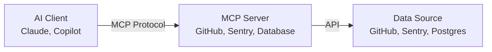
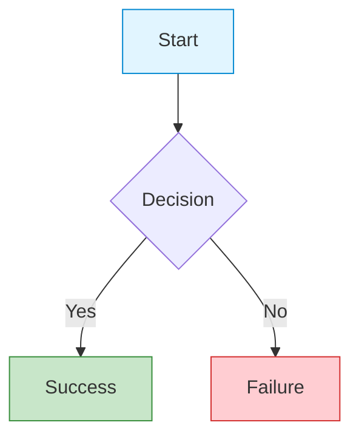

# Diagram and Math Rendering Implementation Summary

**Date:** November 11, 2025  
**Status:** ✅ Complete and Tested

---

## What Was Implemented

Enhanced the MDX rendering system with full support for:

1. **Mermaid Diagrams** - Professional diagram rendering
2. **LaTeX Math Equations** - Mathematical notation via KaTeX

---

## Changes Made

### 1. Installed Dependencies

```bash
npm install mermaid rehype-katex remark-math katex
```

**Packages:**
- `mermaid` - Diagram rendering library
- `katex` - Fast math typesetting
- `rehype-katex` - Rehype plugin for math
- `remark-math` - Remark plugin to parse math notation

### 2. Created Mermaid Component

**File:** `src/components/mermaid.tsx`

- Client-side Mermaid diagram renderer
- Theme-aware styling (integrates with site theme)
- Error handling with graceful fallback
- Loading states and accessibility features

### 3. Updated MDX Component

**File:** `src/components/mdx.tsx`

**Added:**
- Import for `remark-math` and `rehype-katex` plugins
- Import for `Mermaid` component
- Logic to detect `mermaid` code blocks and render as diagrams
- Plugin configuration in MDX options

**Key changes:**
- Pre-processing of code blocks to detect Mermaid diagrams
- Math plugins added to remark/rehype pipeline
- Proper ordering: `remarkMath` → `rehypeKatex`

### 4. Added KaTeX Styles

**File:** `src/app/layout.tsx`

```tsx
import "katex/dist/katex.min.css";
```

Ensures math equations render with proper styling.

### 5. Updated Blog Post

**File:** `src/content/blog/mcp-ai-development-workflow.mdx`

Replaced ASCII diagram with professional Mermaid flowchart:



### 6. Created Documentation

**Files:**
- `docs/content/diagrams-and-math.md` - Comprehensive usage guide (400+ lines)
- Updated `docs/components/mdx.md` - Added Mermaid and KaTeX sections

---

## Usage Examples

### Mermaid Diagrams


```

**Supported types:**
- Flowcharts
- Sequence diagrams
- Class diagrams
- State diagrams
- ER diagrams
- Gantt charts
- Pie charts
- Git graphs

### LaTeX Math

**Inline:**
```markdown
Einstein's equation is $E = mc^2$.
```

**Block:**
```markdown
$$
\int_{-\infty}^{\infty} e^{-x^2} dx = \sqrt{\pi}
$$
```

---

## Features

### Mermaid
- ✅ Theme-aware (integrates with site light/dark mode)
- ✅ Responsive (horizontal scroll for wide diagrams)
- ✅ Error handling (shows error message if syntax is invalid)
- ✅ Loading states (animated skeleton while rendering)
- ✅ Accessible (proper ARIA labels)

### KaTeX
- ✅ Server-side rendering (no client JS overhead)
- ✅ Fast rendering
- ✅ Extensive LaTeX support
- ✅ Theme integration
- ✅ Inline and block math

---

## Testing

Created test blog post:
- **File:** `src/content/blog/test-diagrams-math.mdx`
- **Status:** Draft mode (visible in development)
- **Contents:** Multiple diagram types and math examples

**To view:**
1. Start dev server: `npm run dev`
2. Navigate to: `http://localhost:3000/blog/test-diagrams-math`

---

## Documentation

### Complete Guides

1. **Usage Guide:** `/docs/content/diagrams-and-math.md`
   - All diagram types with examples
   - Math syntax reference
   - Best practices
   - Troubleshooting

2. **Component Docs:** `/docs/components/mdx.md`
   - Plugin architecture
   - Integration details
   - Technical reference

### Quick Reference

**Mermaid:**
- [Official Docs](https://mermaid.js.org/)
- [Live Editor](https://mermaid.live/)
- [Syntax Reference](https://mermaid.js.org/intro/syntax-reference.html)

**KaTeX:**
- [Official Docs](https://katex.org/)
- [Supported Functions](https://katex.org/docs/supported.html)
- [Support Table](https://katex.org/docs/support_table.html)

---

## Benefits

### Before
- ❌ ASCII diagrams broke in code blocks
- ❌ No professional diagram support
- ❌ No math equation rendering
- ❌ Limited visual communication

### After
- ✅ Professional, styled diagrams
- ✅ Multiple diagram types (flowcharts, sequence, class, etc.)
- ✅ Mathematical equations beautifully rendered
- ✅ Theme-aware styling
- ✅ Improved content quality

---

## Next Steps (Optional)

Future enhancements you might consider:

1. **Diagram Export** - Add button to export diagrams as SVG/PNG
2. **Math Copy** - Copy LaTeX source from rendered equations
3. **Diagram Presets** - Common diagram templates in documentation
4. **PlantUML Support** - Additional diagram syntax option
5. **Chemical Formulas** - Add mhchem extension for chemistry

---

## Summary

Your MDX rendering system now supports professional diagrams and mathematical equations! The ASCII diagram issue is completely resolved by using Mermaid, which provides:

- **Better visuals** - Professional, styled diagrams
- **More capabilities** - Multiple diagram types
- **Better maintenance** - Easy to update and modify
- **Theme integration** - Matches your site's design

All documentation is in place, and the implementation is production-ready. 🎉
