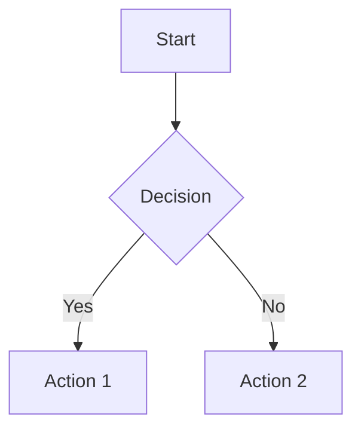
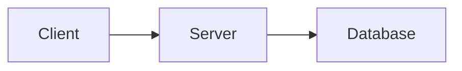
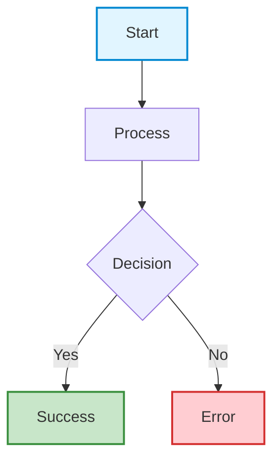
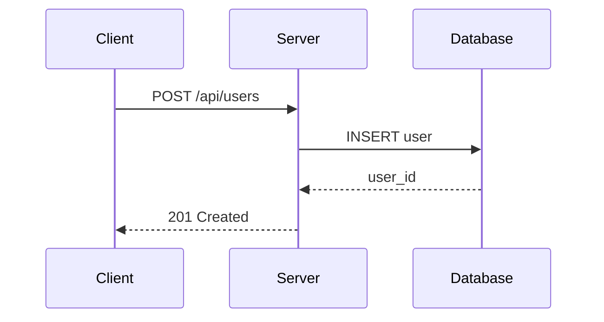
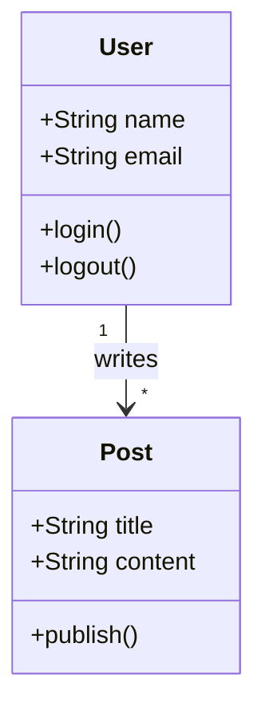
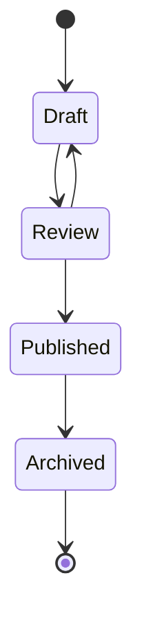
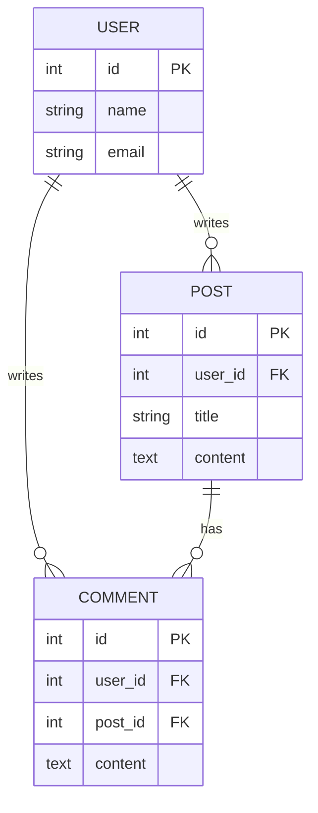
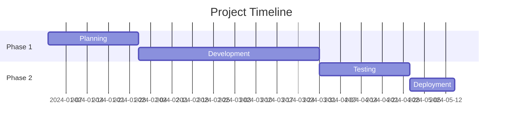
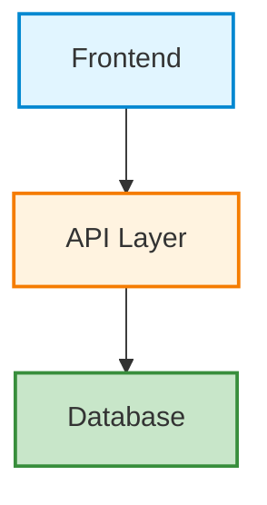

{/* TLP:CLEAR */}

# Diagram and Math Rendering Guide

This guide covers how to create diagrams and render mathematical equations in your blog posts using Mermaid and KaTeX.

## Table of Contents
- [Mermaid Diagrams](#mermaid-diagrams)
- [LaTeX Math with KaTeX](#latex-math-with-katex)
- [Best Practices](#best-practices)
- [Troubleshooting](#troubleshooting)

---

## Mermaid Diagrams

[Mermaid](https://mermaid.js.org/) is a JavaScript-based diagramming tool that renders Markdown-inspired text definitions to create diagrams dynamically.

### Supported Diagram Types

Mermaid supports many diagram types:

- **Flowcharts** - Process flows and decision trees
- **Sequence Diagrams** - API calls and interactions
- **Class Diagrams** - Object-oriented design
- **State Diagrams** - State machines
- **Entity Relationship Diagrams** - Database schemas
- **Gantt Charts** - Project timelines
- **Pie Charts** - Data visualization
- **Git Graphs** - Branch workflows
- **User Journey** - UX flows

### Basic Syntax

To create a Mermaid diagram, use a code fence with the `mermaid` language identifier:

```markdown

```

### Flowchart Examples

#### Simple Flowchart

```markdown

```

#### Styled Flowchart with Colors

```markdown

```

### Sequence Diagram Example

Perfect for API documentation:

```markdown

```

### Class Diagram Example

Great for architecture documentation:

```markdown

```

### State Diagram Example

Useful for feature workflows:

```markdown

```

### Entity Relationship Diagram

For database schema documentation:

```markdown

```

### Gantt Chart Example

For project timelines:

```markdown

```

---

## LaTeX Math with KaTeX

[KaTeX](https://katex.org/) is a fast math typesetting library for the web that renders LaTeX math notation.

### Inline Math

Use single dollar signs `$` for inline math:

```markdown
The formula $E = mc^2$ is Einstein's famous equation.

The quadratic formula is $x = \frac{-b \pm \sqrt{b^2 - 4ac}}{2a}$.
```

**Renders as:**
The formula $E = mc^2$ is Einstein's famous equation.

### Block Math

Use double dollar signs `$$` for block-level equations:

```markdown
$$
\int_{-\infty}^{\infty} e^{-x^2} dx = \sqrt{\pi}
$$
```

**Renders as:**

$$
\int_{-\infty}^{\infty} e^{-x^2} dx = \sqrt{\pi}
$$

### Common Math Examples

#### Fractions

```markdown
$$
\frac{1}{2} + \frac{1}{3} = \frac{5}{6}
$$
```

#### Summation

```markdown
$$
\sum_{i=1}^{n} i = \frac{n(n+1)}{2}
$$
```

#### Matrix

```markdown
$$
\begin{bmatrix}
a & b \\
c & d
\end{bmatrix}
$$
```

#### Calculus

```markdown
$$
\frac{d}{dx}(x^n) = nx^{n-1}
$$
```

#### Greek Letters

```markdown
$$
\alpha, \beta, \gamma, \delta, \epsilon, \theta, \lambda, \mu, \pi, \sigma, \omega
$$
```

#### Complex Equations

```markdown
$$
f(x) = \begin{cases}
x^2 & \text{if } x \geq 0 \\
-x^2 & \text{if } x < 0
\end{cases}
$$
```

---

## Best Practices

### Mermaid Diagrams

1. **Keep it Simple**: Complex diagrams can be hard to read. Break them into multiple simpler diagrams if needed.

2. **Use Meaningful Names**: Use descriptive labels instead of A, B, C.
   ```mermaid
   graph LR
       User[User] --> API[API Gateway]
       API --> DB[Database]
   ```

3. **Add Styling**: Use colors to highlight important nodes or show different types of components.
   ```mermaid
   graph TD
       A[Input]
       B[Process]
       C[Output]
       
       style A fill:#e1f5ff
       style B fill:#fff3e0
       style C fill:#c8e6c9
   ```

4. **Consider Mobile**: Test how diagrams look on smaller screens. Horizontal layouts (`LR`) often work better than vertical (`TD`).

5. **Use Comments**: Add comments to explain complex parts of your diagram:
   ```mermaid
   graph TD
       A[Start] --> B[Step 1]
       %% This is a critical decision point
       B --> C{Important?}
   ```

### LaTeX Math

1. **Inline vs Block**: Use inline math for simple expressions in text, block math for important equations that deserve focus.

2. **Readability**: Add spacing and line breaks for complex equations:
   ```markdown
   $$
   \begin{aligned}
   f(x) &= (x + 1)^2 \\
        &= x^2 + 2x + 1
   \end{aligned}
   $$
   ```

3. **Variable Names**: Use `\text{}` for text in equations:
   ```markdown
   $$
   \text{Speed} = \frac{\text{Distance}}{\text{Time}}
   $$
   ```

4. **Test Rendering**: Preview your post to ensure math renders correctly before publishing.

---

## Troubleshooting

### Mermaid Issues

**Diagram Not Rendering**
- Check that the code fence uses `mermaid` (lowercase)
- Verify syntax with [Mermaid Live Editor](https://mermaid.live/)
- Look for syntax errors (missing quotes, semicolons, etc.)

**Styling Not Working**
- Ensure node IDs match in style declarations
- Use valid CSS color values (hex, rgb, or named colors)

**Diagram Too Wide**
- Change graph direction: Use `LR` (left-right) instead of `TD` (top-down)
- Split into multiple smaller diagrams
- The component has horizontal scroll built-in

### KaTeX Issues

**Math Not Rendering**
- Check for unescaped special characters (use `\\` for backslash)
- Ensure dollar signs are balanced (`$...$` or `$$...$$`)
- Some LaTeX commands may not be supported ([see KaTeX support table](https://katex.org/docs/support_table.html))

**Spacing Issues**
- Use `\,` for thin space, `\:` for medium space, `\;` for thick space
- Use `\quad` or `\qquad` for larger spaces

**Special Characters**
- Escape special characters in math mode: `\{`, `\}`, `\#`, etc.

---

## Resources

### Mermaid
- [Official Documentation](https://mermaid.js.org/)
- [Live Editor](https://mermaid.live/)
- [Syntax Reference](https://mermaid.js.org/intro/syntax-reference.html)
- [Examples Gallery](https://mermaid.js.org/ecosystem/integrations.html)

### KaTeX
- [Official Documentation](https://katex.org/)
- [Supported Functions](https://katex.org/docs/supported.html)
- [Support Table](https://katex.org/docs/support_table.html)
- [LaTeX Math Cheat Sheet](https://katex.org/docs/support_table.html)

### General
- [Markdown Guide - Extended Syntax](https://www.markdownguide.org/extended-syntax/)
- [MDX Documentation](https://mdxjs.com/)

---

## Example Blog Post Template

Here's a complete example showing both Mermaid and LaTeX:

```markdown
---
title: "My Technical Post"
publishedAt: "2024-01-01"
tags: ["Technical", "Math"]
---

## Architecture Overview

Our system follows a three-tier architecture:



## Performance Analysis

The response time follows the equation:

$$
T_{total} = T_{network} + T_{processing} + T_{database}
$$

For our use case, where $n$ is the number of requests:

$$
\text{Throughput} = \frac{n}{T_{total}}
$$
```

---

**Happy diagramming and equation writing! 🎨📐**
