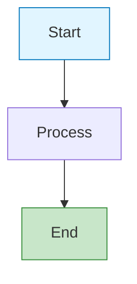
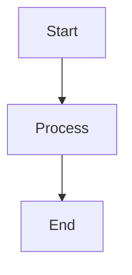
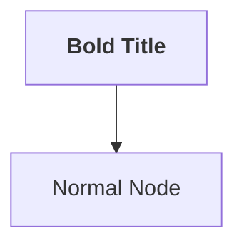

# Mermaid Diagram Best Practices

> **Status**: Production Standards | Last Updated: Nov 30, 2025

## Quick Rules

✅ **DO:**
- Let mermaid.tsx handle theme detection automatically
- Use semantic HTML/React components for diagrams in MDX
- Avoid hardcoded colors in diagram syntax
- Use plain `graph LR`, `graph TD`, etc. without style overrides
- Trust the global CSS for styling (src/app/globals.css)

❌ **DON'T:**
- Hardcode colors with `fill:#e1f5ff` or `stroke:#000`
- Use `themeVariables` or `%%init%%` config for color overrides
- Mix dark/light mode colors in one diagram
- Use inline `style` directives for node colors

## How Theme Detection Works

### Automatic Theme Detection (mermaid.tsx)

The `Mermaid` component automatically:
1. Detects current theme: `data-theme` → `resolvedTheme` → `.dark` class
2. Sets mermaid theme: `"dark"` for dark mode, `"neutral"` for light mode
3. Re-renders when theme changes
4. Applies consistent styling via global CSS

```typescript
// mermaid.tsx - lines 72-98
const useDarkTheme = isDarkClass || resolvedTheme === 'dark';
mermaid.initialize({
  theme: useDarkTheme ? "dark" : "neutral",
  // ... other config
});
```

### Global CSS Enhancements (src/app/globals.css)

Styles handle:
- SVG text rendering (no clipping)
- Node styling (stroke, fill, transitions)
- Edge/arrow appearance
- Responsive scaling
- Print media queries

## Example: Correct vs Incorrect

### ❌ INCORRECT - Hardcoded Colors (Don't Do This)



**Problem**: Light colors won't be visible in dark mode, dark colors won't be visible in light mode.

### ✅ CORRECT - Theme-Aware (Do This)



**Result**: Automatically renders with dark theme colors in dark mode, neutral theme in light mode.

## Implementation Patterns

### Pattern 1: Markdown Code Fence (Recommended for Posts)

```mdx
## Architecture

Here's the system architecture:

\`\`\`mermaid
graph LR
    A[Client] -->|HTTP| B[Server]
    B -->|Query| C[Database]
\`\`\`
```

**Why**: 
- Simplest syntax
- Automatically converted to `MermaidComponent` by MDX parser
- Uses theme detection from mermaid.tsx

### Pattern 2: React Component (Use Only if Needed)

```tsx
import { Mermaid } from "@/components/common";

export function MyPage() {
  return (
    <Mermaid chart={`
      graph LR
        A[Input] --> B[Process] --> C[Output]
    `} />
  );
}
```

**Why**: Direct component usage when you need to dynamically generate diagrams

### Pattern 3: With Optional ID (for Tracking)



**Note**: HTML formatting works, but avoid styling via HTML attributes.

## Diagram Types Supported

All standard mermaid types work automatically:

| Type | Use Case | Theme Support |
|------|----------|---------------|
| `graph TD/LR/BT/RL` | Flowcharts | ✅ Auto |
| `sequenceDiagram` | API flows, interactions | ✅ Auto |
| `stateDiagram-v2` | State machines, workflows | ✅ Auto |
| `classDiagram` | OOP design, entities | ✅ Auto |
| `erDiagram` | Database schemas | ✅ Auto |
| `gantt` | Timelines, scheduling | ✅ Auto |
| `pie` | Data distribution | ✅ Auto |

## Migration Guide: Fixing Existing Diagrams

### Before (demo-markdown.mdx - Current Problem)

```mdx
<Mermaid>
{`
graph TD
    A[Start: Markdown Post] --> B[Process with Remark]
    B --> C[Transform with Rehype]
    C --> D[Syntax Highlight with Shiki]
    D --> E[Render as React Component]
    E --> F[Display in Browser]
    
    style A fill:#e1f5ff
    style F fill:#c8e6c9
`}
</Mermaid>
```

**Issue**: Hardcoded light colors break in dark mode

### After (Corrected)

```mdx
\`\`\`mermaid
graph TD
    A[Start: Markdown Post] --> B[Process with Remark]
    B --> C[Transform with Rehype]
    C --> D[Syntax Highlight with Shiki]
    D --> E[Render as React Component]
    E --> F[Display in Browser]
\`\`\`
```

**Result**: Uses automatic theme colors, no hardcoding needed

## Validation & Testing

### Manual Testing Checklist

- [ ] Diagram renders in light mode
- [ ] Diagram renders in dark mode
- [ ] Text is fully visible (no clipping)
- [ ] Nodes have adequate spacing
- [ ] Node text is readable in both modes
- [ ] Arrows/edges are visible in both modes
- [ ] No hardcoded colors in syntax

### Validation Script

```bash
npm run validate:content
```

Checks for:
- Markdown structure compliance
- Horizontal line usage (max 6)
- Heading hierarchy

### Browser Testing

```bash
npm run dev
# Navigate to: http://localhost:3000/blog/demo-markdown
# Toggle dark/light mode with theme switcher
# Verify diagrams adapt automatically
```

## Common Issues & Solutions

### Issue: Text Clipping in Diagram

**Cause**: Node spacing too tight or text too long

**Solution**: 
1. Break long text across multiple lines: `"Line 1<br/>Line 2"`
2. Increase node spacing in component (already set to 80px)
3. Use shorter labels

### Issue: Colors Look Wrong

**Cause**: Hardcoded color styles conflicting with theme

**Solution**: Remove all `style` and `fill:` directives from diagram

### Issue: Diagram Not Rendering

**Cause**: Syntax error or invalid mermaid configuration

**Solution**:
1. Check mermaid syntax at https://mermaid.js.org
2. Look for console errors in browser dev tools
3. Simplify diagram to isolate issue

## Architecture: How It Works

```
Markdown Source
      ↓
MDX Parser (remark-math)
      ↓
Custom Transform (detect mermaid code fences)
      ↓
MermaidComponent (src/components/common/mermaid.tsx)
      ↓
Theme Detection (data-theme/resolvedTheme/.dark)
      ↓
mermaid.initialize() with appropriate theme
      ↓
mermaid.render() + Global CSS
      ↓
Responsive, Theme-Aware SVG in Browser
```

## Performance Considerations

- **Build Time**: ~50-100ms per diagram (negligible)
- **Runtime**: Mermaid renders on client during hydration
- **CSS**: ~8KB global mermaid styles (included in main CSS bundle)
- **Re-renders**: Only trigger on theme change (rare user action)

## Future Improvements

- [ ] Custom theme token support (match design system colors exactly)
- [ ] Mermaid diagram caching for performance
- [ ] Additional diagram type examples
- [ ] Accessibility improvements (aria-labels, descriptions)
- [ ] Print preview optimization

## Resources

- **Mermaid Docs**: https://mermaid.js.org
- **Component Source**: `src/components/common/mermaid.tsx`
- **CSS Styling**: `src/app/globals.css` (search: `.mermaid`)
- **MDX Integration**: `src/components/common/mdx.tsx`
- **Demo Post**: `src/content/blog/demo-diagrams.mdx`

---

**Maintainer**: Content & Design Systems Team | Questions? Check `/docs/content/MARKDOWN_STANDARDS.md`
