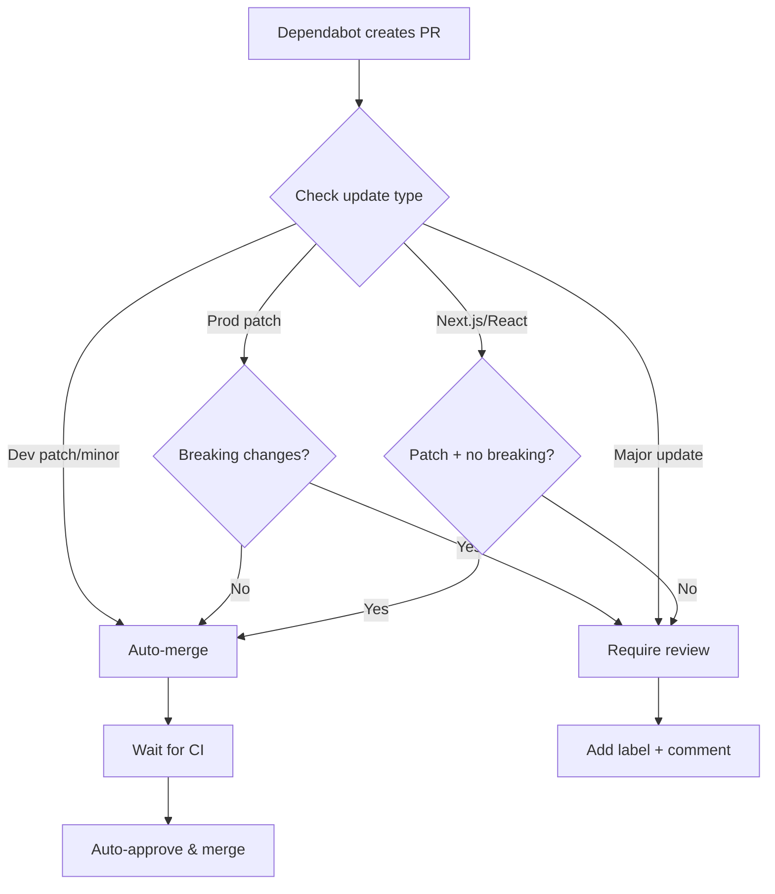
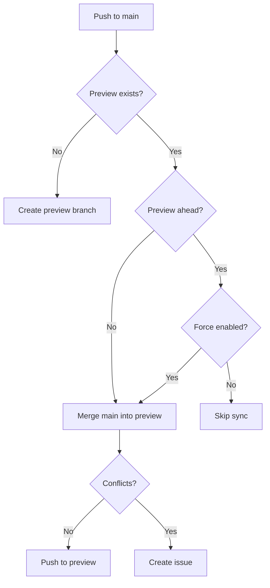

{/* TLP:CLEAR */}

# Dependabot Automation

Automated dependency management with intelligent auto-merge capabilities.

## Overview

This repository uses two GitHub Actions workflows to automate Dependabot updates:

1. **Dependabot Auto-Merge** - Automatically merges safe dependency updates
2. **Preview Branch Sync** - Keeps the preview branch in sync with main

## Dependabot Auto-Merge Workflow

### Rules

The workflow automatically merges PRs based on these criteria:

#### ✅ Auto-merge (no review needed)

- **Dev dependencies**: Patch and minor updates
  - Examples: `@types/*`, `vitest`, `eslint-*`, `@testing-library/*`
- **Production dependencies**: Patch updates without breaking changes
  - Examples: `lucide-react` 0.553.0 → 0.553.1

#### 🔍 Auto-merge with extra validation

- **Next.js/React**: Patch updates only, if no breaking changes mentioned
  - Example: `next` 16.0.1 → 16.0.3 ✅
  - Example: `next` 16.0.0 → 16.1.0 ⚠️ (requires review)

#### ⚠️ Manual review required

- **Major version updates**: All dependencies
- **Minor updates**: Production dependencies
- **Breaking changes**: Any update mentioning breaking changes in release notes
- **Critical frameworks**: Next.js/React minor or major updates

### How It Works



### Workflow Steps

1. **Metadata fetch**: Extract dependency info from PR
2. **Safety check**: Determine if update is safe to auto-merge
3. **CI wait**: Wait for all required checks to pass
4. **Auto-approve**: Approve safe PRs automatically
5. **Auto-merge**: Enable auto-merge (squash strategy)
6. **Manual review**: Add labels and comments for unsafe PRs

### Configuration

The workflow is configured in `.github/workflows/dependabot-auto-merge.yml`

**Permissions required:**
- `contents: write` - To merge PRs
- `pull-requests: write` - To approve and comment
- `checks: read` - To check CI status

**Triggers:**
- Pull request opened
- Pull request synchronized (new commits)
- Pull request reopened
- Pull request labeled

### Customizing Rules

To modify auto-merge rules, edit the "Determine if safe to auto-merge" step:

```yaml
- name: Determine if safe to auto-merge
  id: check
  run: |
    # Add custom logic here
    if [[ "condition" ]]; then
      SAFE="true"
    fi
```

## Preview Branch Sync Workflow

### Purpose

Automatically syncs the `preview` branch with `main` after Dependabot PRs (or any other changes) are merged.

### Features

- **Automatic sync**: Triggers on every push to main
- **Manual trigger**: Can be run manually from Actions UI
- **Conflict detection**: Creates issue if merge conflicts occur
- **Safety check**: Skips sync if preview is ahead of main (prevents data loss)
- **Force option**: Manual trigger can force sync even if preview is ahead

### How It Works



### Usage

**Automatic sync:**
- Runs automatically after every merge to main
- No action needed

**Manual sync:**
1. Go to Actions → Sync Preview Branch
2. Click "Run workflow"
3. Optional: Enable "force" to override ahead-of-main check
4. Click "Run workflow" button

**Resolving conflicts:**
```bash
git checkout preview
git pull origin main
# Resolve conflicts in your editor
git add .
git commit -m "Resolve merge conflicts"
git push origin preview
```

### Configuration

The workflow is configured in `.github/workflows/sync-preview-branch.yml`

**Permissions required:**
- `contents: write` - To push to preview branch

**Triggers:**
- Push to main branch
- Manual workflow dispatch

## Monitoring

### Check Workflow Status

```bash
# List recent workflow runs
gh run list --workflow=dependabot-auto-merge.yml

# View details of a specific run
gh run view <run-id>

# Watch a workflow run
gh run watch
```

### Review Auto-merged PRs

```bash
# List recently merged Dependabot PRs
gh pr list --author app/dependabot --state merged --limit 10

# Check what was auto-merged today
gh pr list --author app/dependabot --state merged --search "merged:>=$(date -v-1d +%Y-%m-%d)"
```

## Troubleshooting

### Workflow Not Running

**Symptom:** Dependabot PR created, but no auto-merge activity

**Solutions:**
1. Check workflow file syntax: `gh workflow view dependabot-auto-merge.yml`
2. Verify permissions in workflow file
3. Check if actor is `dependabot[bot]`: Look at PR author

### Auto-merge Enabled But Not Merging

**Symptom:** Auto-merge enabled, but PR sits open

**Causes:**
- CI checks failing (Snyk, Vercel, tests)
- Branch protection rules require additional approvals
- PR has merge conflicts

**Solutions:**
1. Check CI status: `gh pr checks <pr-number>`
2. Review branch protection: Repository Settings → Branches
3. Check for conflicts: View PR in GitHub

### Preview Sync Failed

**Symptom:** Preview branch out of sync, merge conflicts

**Solutions:**
1. Check for created issue: `gh issue list --label preview-branch`
2. Manually resolve conflicts:
   ```bash
   git checkout preview
   git merge origin/main
   # Resolve conflicts
   git push origin preview
   ```
3. Run sync with force option if preview has unwanted commits

### Accidental Auto-merge

**Symptom:** PR was auto-merged that shouldn't have been

**Solutions:**
1. Revert the merge commit on main:
   ```bash
   git revert <merge-commit-sha>
   git push origin main
   ```
2. Update workflow rules to prevent similar PRs from auto-merging
3. Report issue if it's a workflow bug

## Security Considerations

- Workflow uses `GITHUB_TOKEN` (not PAT) for security
- Token has limited scope to this repository only
- Auto-merge only for non-breaking dependency updates
- All merges go through required CI checks
- Breaking changes always require human review

## Disabling Auto-merge

To temporarily disable auto-merge without deleting the workflow:

1. Add this to the workflow file after the `if` condition:
   ```yaml
   if: github.actor == 'dependabot[bot]' && false
   ```

2. Or disable the workflow in GitHub:
   - Actions → Workflows → Dependabot Auto-Merge → "···" → Disable workflow

## Testing Changes

To test workflow changes without affecting real PRs:

1. Create a test branch
2. Modify workflow file
3. Create a fake Dependabot PR (manually)
4. Trigger workflow with `workflow_dispatch` or by updating the test PR

## Related Documentation

- [Dependabot Configuration](/.github/dependabot.yml)
- [GitHub Actions Documentation](https://docs.github.com/en/actions)
- [Dependabot Metadata Action](https://github.com/dependabot/fetch-metadata)

## Maintenance

**Review workflow effectiveness quarterly:**
- Check how many PRs were auto-merged vs manual review
- Adjust rules based on patterns (too conservative/aggressive?)
- Update for new dependencies or framework changes
- Review security implications of auto-merged updates
