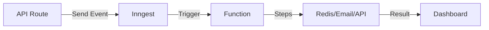

# Inngest Integration Guide

Complete guide to the Inngest background job system integrated into cyberdrew-dev.

## Table of Contents

- [Overview](#overview)
- [Setup & Configuration](#setup--configuration)
- [Architecture](#architecture)
- [Functions](#functions)
- [Events](#events)
- [Testing](#testing)
- [Deployment](#deployment)
- [Troubleshooting](#troubleshooting)

## Overview

Inngest provides durable background job processing for:
- **Contact Form**: Async email delivery with retries
- **GitHub Data**: Scheduled cache refresh every 5 minutes
- **Blog Analytics**: View tracking, trending calculations, milestone detection

### Benefits

✅ **Better Performance**: API responses < 100ms (vs 1-2s synchronous)  
✅ **Reliability**: Automatic retries with exponential backoff  
✅ **Observability**: Built-in dashboard for monitoring and debugging  
✅ **Type Safety**: Full TypeScript support with event schemas  
✅ **Serverless**: Works perfectly on Vercel

## Setup & Configuration

### Required Environment Variables

```bash
# Inngest (required for production)
INNGEST_EVENT_KEY=your_event_key_here
INNGEST_SIGNING_KEY=your_signing_key_here

# Email (required for contact form)
RESEND_API_KEY=your_resend_key_here

# Redis (optional, graceful fallback)
REDIS_URL=redis://localhost:6379

# GitHub (optional, increases rate limits)
GITHUB_TOKEN=github_pat_your_token_here
```

### Local Development

1. **Start Dev Server**:
   ```bash
   npm run dev
   ```

2. **Open Inngest UI**:
   - Navigate to: http://localhost:3001/api/inngest
   - View all registered functions
   - Test functions directly
   - Monitor execution logs

3. **Trigger Events**:
   ```ts
   // From any server component or API route
   import { inngest } from "@/inngest/client";
   
   await inngest.send({
     name: "contact/form.submitted",
     data: { name, email, message, submittedAt: new Date().toISOString() }
   });
   ```

### Production Setup

1. **Sign up for Inngest**: https://inngest.com
2. **Create an app** in the Inngest dashboard
3. **Get credentials**:
   - Event Key (for sending events)
   - Signing Key (for webhook verification)
4. **Add environment variables** to Vercel
5. **Configure webhook**:
   - URL: `https://cyberdrew.dev/api/inngest`
   - Add to Inngest dashboard

## Architecture

### File Structure

```
src/
├── inngest/
│   ├── client.ts                 # Inngest client instance
│   ├── types.ts                  # Event type definitions
│   ├── functions.ts              # Demo hello-world function
│   ├── contact-functions.ts      # Contact form processing
│   ├── github-functions.ts       # GitHub data refresh
│   └── blog-functions.ts         # Blog analytics
├── app/api/
│   ├── inngest/route.ts          # Function registration endpoint
│   └── contact/route.ts          # Updated to use Inngest events
```

### Event Flow



## Functions

### Contact Form Processing

**Function**: `contactFormSubmitted`  
**Trigger**: `contact/form.submitted` event  
**Purpose**: Async email delivery with confirmations

**Steps**:
1. Send notification email to site owner
2. Send confirmation email to submitter
3. Track delivery status

**Benefits**:
- 100ms API response (vs 1-2s synchronous)
- Automatic retries (3 attempts)
- No user-facing errors if email is slow
- Better UX with confirmation emails

**Usage**:
```ts
// From /api/contact
await inngest.send({
  name: "contact/form.submitted",
  data: {
    name: "John Doe",
    email: "john@example.com",
    message: "Hello!",
    submittedAt: new Date().toISOString(),
    ip: "1.2.3.4",
  },
});
```

### GitHub Data Refresh

**Functions**:
1. `refreshGitHubData` (scheduled)
2. `manualRefreshGitHubData` (event-driven)

**Schedule**: Every 5 minutes  
**Purpose**: Pre-populate contribution heatmap cache

**Steps**:
1. Fetch latest data from GitHub GraphQL API
2. Update Redis cache
3. Handle API failures gracefully

**Benefits**:
- Instant page loads (cache always fresh)
- Better rate limit handling
- Proactive error detection
- No client-side loading states

**Manual Trigger**:
```ts
await inngest.send({
  name: "github/data.refresh",
  data: { force: true },
});
```

### Blog Analytics

**Functions**:
1. `trackPostView` - Track individual views
2. `handleMilestone` - Celebrate achievements
3. `calculateTrending` - Hourly trending calculation
4. `generateAnalyticsSummary` - On-demand reports
5. `dailyAnalyticsSummary` - Daily report generation

**Purpose**: Comprehensive blog engagement analytics

**Features**:
- Real-time view counting
- Daily/weekly/monthly statistics
- Milestone detection (100, 1K, 10K, 50K, 100K views)
- Trending post calculations
- Analytics summaries

**Usage**:
```ts
// Track a view
await inngest.send({
  name: "blog/post.viewed",
  data: {
    slug: "my-post",
    title: "My Post",
    viewedAt: new Date().toISOString(),
  },
});

// Generate summary
await inngest.send({
  name: "analytics/summary.generate",
  data: {
    period: "weekly",
    startDate: "2025-10-19",
    endDate: "2025-10-25",
  },
});
```

## Events

All events follow the pattern: `category/resource.action`

### Contact Events

```ts
// Form submission
"contact/form.submitted"
data: { name, email, message, submittedAt, ip? }

// Email delivery
"contact/email.delivered"
"contact/email.failed"
data: { email, type, messageId?, error? }
```

### GitHub Events

```ts
// Data refresh (manual)
"github/data.refresh"
data: { manual?, force? }
```

### Blog Events

```ts
// Post view
"blog/post.viewed"
data: { slug, title, viewedAt, referrer?, region? }

// Milestone reached
"blog/milestone.reached"
data: { slug, title, milestone, totalViews, reachedAt }

// Analytics summary
"analytics/summary.generate"
data: { period, startDate, endDate }
```

## Testing

### Test in Dev UI

1. Open http://localhost:3001/api/inngest
2. Select a function
3. Click "Test" or "Invoke"
4. Provide test data
5. Watch step-by-step execution

### Test via Code

```ts
// In any API route or server component
import { inngest } from "@/inngest/client";

// Send test event
await inngest.send({
  name: "test/hello.world",
  data: { email: "test@example.com" },
});
```

### Test Scheduled Functions

Scheduled functions (cron) will show in the dev UI with their schedule. You can manually trigger them for testing.

## Deployment

### Vercel Deployment

1. **Add environment variables** in Vercel dashboard
2. **Deploy** as normal: `git push`
3. **Configure Inngest webhook**:
   - Dashboard → Your App → Serve
   - Add URL: `https://cyberdrew.dev/api/inngest`
4. **Verify** functions appear in Inngest dashboard

### Monitoring

- **Inngest Dashboard**: View all function runs, logs, errors
- **Vercel Logs**: See function invocations
- **Redis**: Monitor cache hits/misses

## Troubleshooting

### Functions Not Appearing

**Problem**: Functions don't show in dev UI  
**Solution**: 
- Check `/api/inngest/route.ts` imports
- Restart dev server
- Check for TypeScript errors

### Events Not Triggering

**Problem**: Events sent but functions don't run  
**Solution**:
- Verify event name matches function trigger
- Check Inngest dashboard for errors
- Ensure dev server is running

### Redis Connection Issues

**Problem**: Functions fail with Redis errors  
**Solution**:
- Verify `REDIS_URL` is set
- Check Redis is running: `redis-cli ping`
- Functions gracefully degrade without Redis

### Email Delivery Issues

**Problem**: Contact form emails not sending  
**Solution**:
- Verify `RESEND_API_KEY` is set
- Check Resend dashboard for bounces
- Review function logs in Inngest UI
- Test email address is verified in Resend

### Rate Limiting

**Problem**: GitHub API rate limit exceeded  
**Solution**:
- Add `GITHUB_TOKEN` environment variable
- Increases limit from 60 → 5,000 req/hour
- Scheduled refresh uses token automatically

## Next Steps

### Enhancements

1. **Email Templates**: HTML email templates with branding
2. **Slack Notifications**: Post milestone achievements to Slack
3. **Analytics Dashboard**: Public analytics page showing trending posts
4. **Newsletter**: Weekly digest emails to subscribers
5. **Search Indexing**: Background search index updates
6. **Image Optimization**: Process uploaded images in background
7. **Social Media**: Auto-post new blog posts to Twitter/LinkedIn

### Integration Ideas

- **Webhooks**: GitHub webhooks for auto-refresh on push
- **Admin Panel**: Trigger manual refreshes and view analytics
- **User Notifications**: Email alerts for comment replies
- **A/B Testing**: Track post variants and performance
- **SEO Monitoring**: Track search rankings and backlinks

## Resources

- [Inngest Documentation](https://www.inngest.com/docs)
- [Inngest TypeScript SDK](https://www.inngest.com/docs/sdk/typescript)
- [Resend Documentation](https://resend.com/docs)
- [GitHub GraphQL API](https://docs.github.com/en/graphql)
- [Redis Commands](https://redis.io/commands/)
