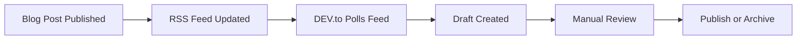

{/* TLP:CLEAR */}

# DEV.to RSS Feed Setup Guide

**Status:** Active Configuration  
**Last Updated:** January 19, 2026

## Overview

dcyfr-labs automatically syncs blog posts to DEV.to via **DEV.to's Publishing from RSS feature**. This creates draft posts that can be reviewed and published manually.

## How It Works



1. You publish a blog post on dcyfr.dev
2. RSS feed automatically updates (`/blog/feed?format=rss`)
3. DEV.to checks the feed periodically (every 1-6 hours)
4. DEV.to creates a draft post with the content
5. You review the draft and publish manually

## RSS Feed Details

### Feed URLs

- **Primary:** https://dcyfr.dev/blog/feed?format=rss
- **Atom:** https://dcyfr.dev/blog/feed?format=atom (default)
- **JSON:** https://dcyfr.dev/blog/feed?format=json
- **Legacy:** https://dcyfr.dev/blog/rss.xml (301 redirect)

### Feed Configuration

**Route:** `src/app/blog/feed/route.ts`

```typescript
export async function GET(request: NextRequest) {
  const { searchParams } = new URL(request.url);
  const format = searchParams.get('format') || 'atom';

  const feed = await buildBlogFeed(posts, format, 20); // Last 20 posts

  return new NextResponse(feed, {
    headers: {
      'Content-Type': 'application/rss+xml; charset=utf-8',
      'Cache-Control': 'public, s-maxage=3600, stale-while-revalidate=86400',
    },
  });
}
```

**Features:**

- ✅ Last 20 blog posts
- ✅ Full HTML content (MDX → HTML)
- ✅ Featured images with proper URLs
- ✅ Categories/tags
- ✅ Publication dates
- ✅ Author information
- ✅ Canonical URL (points to dcyfr.dev)
- ✅ 1-hour cache, 24-hour stale-while-revalidate

## DEV.to Configuration

### Initial Setup

1. **Log into DEV.to**
   - Go to https://dev.to

2. **Navigate to RSS Settings**
   - Click your profile picture (top right)
   - Select "Settings"
   - Click "Publishing from RSS" in left sidebar

3. **Configure Feed URL**

   ```
   RSS Feed URL: https://dcyfr.dev/blog/feed?format=rss
   ```

4. **Set Import Preferences**
   - **Import as:** Drafts (recommended) ✅
   - **Mark canonical URL:** Yes ✅
   - **Include content:** Yes ✅

5. **Save Settings**

### Verification

After saving, DEV.to will:

- Poll the feed within a few hours
- Create draft posts from new items
- Update existing posts if content changes (matched by GUID)

**Check import status:**

- Settings → Publishing from RSS
- View "Last fetched" timestamp
- Check for any errors or warnings

## Draft Review Workflow

### Weekly Review (Recommended)

**Every Monday:**

1. **Check DEV.to Dashboard**

   ```
   https://dev.to/dashboard
   → Click "Drafts" tab
   ```

2. **Review Each Draft**
   - ✅ Title matches original
   - ✅ Content formatted correctly
   - ✅ Code blocks render properly
   - ✅ Images display correctly
   - ✅ Canonical URL set to dcyfr.dev
   - ✅ Tags are appropriate

3. **Fix Formatting Issues**
   - Adjust code blocks if needed
   - Check image alignment
   - Verify links work
   - Update tags if needed

4. **Publish or Archive**
   - **Publish:** If ready for DEV.to audience
   - **Save as Draft:** If needs more work
   - **Delete:** If not suitable for DEV.to

### Publishing Checklist

Before publishing a draft:

- [ ] Content is accurate and complete
- [ ] Code examples work correctly
- [ ] Images are visible and properly attributed
- [ ] Canonical URL points to dcyfr.dev
- [ ] Tags match content (max 4 tags)
- [ ] Cover image set (if applicable)
- [ ] Introduction/summary is engaging
- [ ] No sensitive information exposed

## Managing the RSS Feed

### What's Included in the Feed

**Automatically included:**

- Post title
- Full content (MDX → HTML)
- Publication date
- Last updated date
- Categories (as tags)
- Featured image
- Excerpt/description
- Author information

**Not included:**

- Draft posts (only published posts)
- Private/unlisted posts
- Posts with `noindex: true` in frontmatter

### Limiting Posts in Feed

Default: 20 most recent posts

**To change limit:**

```typescript
// src/app/blog/feed/route.ts
const feed = await buildBlogFeed(posts, format, 10); // Change 20 → 10
```

### Excluding Posts from RSS

Add frontmatter to any post:

```yaml
---
title: My Post
noRss: true # Add this line
---
```

Then update feed generation:

```typescript
// src/lib/feeds.ts
const filteredPosts = posts.filter((post) => !post.noRss);
```

## Troubleshooting

### Drafts Not Appearing

**Possible causes:**

1. **Feed not updating**
   - Clear Vercel cache
   - Check `/blog/feed?format=rss` manually
   - Verify post is published (not draft)

2. **DEV.to not polling**
   - Check "Last fetched" timestamp in settings
   - Verify feed URL is correct
   - Check for error messages

3. **GUID conflicts**
   - Each post has unique GUID (URL)
   - Changing URL creates new draft
   - Same URL updates existing draft

### Formatting Issues

**Code blocks:**

- DEV.to uses Markdown, not MDX
- Custom components won't render
- Use standard Markdown fenced code blocks

**Images:**

- Must be publicly accessible
- Use absolute URLs
- Check CORS settings

**Links:**

- Use absolute URLs (not relative)
- Verify links work from DEV.to

### Duplicate Posts

**If you see duplicates:**

1. **Different GUIDs**
   - Check if URL changed
   - Delete old draft manually

2. **Manual + RSS import**
   - Delete manually created version
   - Keep RSS-imported version

## Advanced Configuration

### Canonical URLs

**Default behavior:**

- RSS feed includes `<link>` pointing to dcyfr.dev
- DEV.to respects this as canonical URL
- Good for SEO (no duplicate content penalty)

**Verify canonical setting:**

```
DEV.to post editor → "Basic" tab
→ Check "Canonical URL" field
→ Should be: https://dcyfr.dev/blog/[slug]
```

### Auto-Publish Mode

**⚠️ Not Recommended**

You can configure DEV.to to auto-publish instead of creating drafts:

```
Settings → Publishing from RSS
→ Import as: Published (instead of Drafts)
```

**Risks:**

- No quality control
- Formatting errors go live immediately
- Can't customize tags or cover image
- No chance to add DEV.to-specific context

**Recommendation:** Keep as "Drafts" for manual review

### Custom RSS Feed

**For different content on DEV.to:**

1. Create custom feed route:

   ```typescript
   // src/app/api/dev-to-feed/route.ts
   export async function GET() {
     // Custom filtering logic
     const devToPosts = posts.filter((post) => post.tags.includes('dev-to'));
     return buildBlogFeed(devToPosts, 'rss', 10);
   }
   ```

2. Update DEV.to settings:
   ```
   RSS Feed URL: https://dcyfr.dev/api/dev-to-feed
   ```

## Related Documentation

- [DEV.to Integration Verification](../features/DEV_TO_INTEGRATION_VERIFICATION.md)
- [DEV.to Draft Investigation](./DEV_TO_DRAFT_INVESTIGATION.md)
- [Blog Content Creation Guide](../blog/content-creation.md)
- [Feed Generation Library](../../src/lib/feeds.ts)

## External Resources

- [DEV.to Publishing from RSS Guide](https://dev.to/p/publishing_from_rss_guide)
- [DEV.to Settings](https://dev.to/settings/publishing-from-rss)
- [RSS 2.0 Specification](https://www.rssboard.org/rss-specification)

---

**Status:** ✅ Active and working  
**Feed URL:** https://dcyfr.dev/blog/feed?format=rss  
**Review Schedule:** Weekly (Mondays)  
**Import Mode:** Drafts (manual publish)

**Last Reviewed:** January 19, 2026
