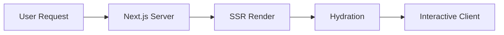

<!-- TLP:AMBER - Internal Use Only -->

# IMPLEMENTATION PLANS ARCHIVE

**Information Classification:** TLP:AMBER (Internal Use Only)  
**Consolidation Date:** 2026-02-27  
**Original Files:** 7 documents

This document consolidates related documentation to reduce operational overhead.

---

## phase-a-execution-plan-2026-02-02

**Original Location:** `operations/private/phase-a-execution-plan-2026-02-02.md`

**Created:** February 2, 2026  
**Status:** Ready for Execution  
**Duration:** 2-3 weeks  
**Owner:** DCYFR Labs Team  
**Dependencies:** Production deployment URL (prerequisite)

---

## 🎯 Executive Summary

This plan details the execution strategy for Phase A of the Q1 2026 backlog, focusing on two high-impact initiatives:

1. **GitHub Webhook Deployment** (1 hour) - Real-time commit feed activation
2. **RIVET Blog Post Integration** (8-12 hours) - Apply 12 production components to flagship posts

**Expected Impact:**

- Real-time activity feed with <30 second latency
- Blog engagement metrics: 80% scroll depth, <40% bounce rate
- Zero technical debt (96.6% test pass rate maintained)

**Critical Blocker:** Production deployment must be completed first to obtain stable webhook URL.

---

## 📊 Current State Assessment

### ✅ Completed Work

**GitHub Webhook (Code Complete):**

- ✅ Webhook API route implemented (`/api/github/webhook`)
- ✅ Inngest commit processing function (`processGitHubCommit`)
- ✅ Redis storage integration (7-day TTL)
- ✅ Activity feed transformer (`transformWebhookGitHubCommits`)
- ✅ 23 tests passing (14 webhook + 9 transformer)
- ✅ Full documentation: `docs/deployment/github-webhook-setup.md`

**RIVET Component Library (Production Ready):**

- ✅ 12 components built & tested (171 tests passing)
- ✅ P0 Foundation: ReadingProgressBar, KeyTakeaway, TLDRSummary
- ✅ P1 Engagement: GlossaryTooltip, RoleBasedCTA, SectionShare, CollapsibleSection
- ✅ 4 Tier 1 posts already deployed (100% coverage)
- ✅ Design tokens compliant, ESLint clean

### 🚧 Pending Work

**GitHub Webhook:**

- [ ] Production deployment with stable URL
- [ ] Generate `GITHUB_WEBHOOK_SECRET` (256-bit)
- [ ] Configure webhook in dcyfr/dcyfr-labs repo
- [ ] Verify end-to-end delivery (<30s latency)

**RIVET Blog Integration:**

- [ ] Generate hero images for 3 target posts
- [ ] Finalize code examples and diagrams
- [ ] Apply components to Tier 2 posts (Mastodon, Reddit, SSR Guide)
- [ ] Accessibility audit and link verification
- [ ] Performance validation (Lighthouse CI)

---

## 🗓️ Execution Timeline

### Week 1: Foundation (Prerequisite + Webhook)

**Days 1-2: Production Deployment** (BLOCKER RESOLUTION)

- **Owner:** DevOps/Infrastructure
- **Duration:** 1-2 hours
- **Deliverables:** Stable production URL (e.g., `https://dcyfr.com`)

**Day 3: GitHub Webhook Deployment** ⚡ QUICK WIN

- **Owner:** Backend Engineer
- **Duration:** 1 hour
- **Deliverables:** Real-time commit feed active

### Week 2: RIVET Asset Preparation

**Days 1-2: Hero Image Generation**

- **Owner:** Content/Design
- **Duration:** 2-3 hours
- **Deliverables:** 3 hero images (Mastodon, Reddit, SSR)

**Day 3: Code Examples & Diagrams**

- **Owner:** Technical Writer
- **Duration:** 2-3 hours
- **Deliverables:** Finalized code blocks, optional diagrams

### Week 3: RIVET Blog Integration & Publishing

**Days 1-3: Component Integration**

- **Owner:** Frontend Engineer
- **Duration:** 6-9 hours
- **Deliverables:** 3 posts with RIVET components applied

**Day 4: Quality Assurance**

- **Owner:** QA/Engineer
- **Duration:** 2-3 hours
- **Deliverables:** Accessibility audit, link check, performance validation

**Day 5: Publishing**

- **Owner:** Product/Marketing
- **Duration:** 1-2 hours
- **Deliverables:** Published posts with promotion

---

## 📋 Detailed Task Breakdown

### Task 1: Production Deployment (PREREQUISITE)

**Status:** ❌ BLOCKED (awaiting deployment)  
**Priority:** P0 (MUST complete first)  
**Effort:** 1-2 hours  
**Owner:** DevOps/Infrastructure

#### Acceptance Criteria

- [ ] Stable production URL available (e.g., `https://dcyfr.com`)
- [ ] Environment variables configured:
  - [ ] `NEXT_PUBLIC_BASE_URL` set to production URL
  - [ ] `VERCEL_ENV=production`
  - [ ] `NODE_ENV=production`
- [ ] Health check endpoint responding (`/api/health`)
- [ ] Logs accessible (Vercel dashboard or equivalent)
- [ ] No production blockers (SSL, DNS, routing)

#### Dependencies

None (prerequisite for all other work)

#### Validation Steps

```bash
# 1. Check deployment status
curl https://dcyfr.com/api/health

# Expected: {"status":"ok","timestamp":"..."}

# 2. Verify environment
curl https://dcyfr.com/api/debug/env

# Expected: VERCEL_ENV=production, NODE_ENV=production

# 3. Check Lighthouse CI
npm run lighthouse:prod

# Expected: ≥90 performance, ≥95 accessibility
```

#### Risk Mitigation

| Risk                     | Likelihood | Impact | Mitigation                     |
| ------------------------ | ---------- | ------ | ------------------------------ |
| DNS propagation delay    | Medium     | Low    | Test with IP address first     |
| SSL cert issues          | Low        | High   | Use Vercel's automatic SSL     |
| Environment var mismatch | Medium     | High   | Validate with `/api/debug/env` |

---

### Task 2: GitHub Webhook Deployment ⚡ QUICK WIN

**Status:** ✅ READY (code complete, tests passing)  
**Priority:** P0  
**Effort:** 1 hour  
**Owner:** Backend Engineer

#### Prerequisites

- [x] Code complete (`/api/github/webhook`)
- [x] 23 tests passing
- [x] Documentation complete
- [ ] **Production URL available** ← BLOCKER

#### Step-by-Step Execution

**Step 1: Generate Webhook Secret (5 minutes)**

```bash
# Generate secure 256-bit secret
openssl rand -base64 32

# Example output: 4Kx9mP2vQ8Rz7N3jL1wY6Hb5Tc8Sd9Pq0Wa2Xb3Yc4Zd5Ef6
```

**Step 2: Configure Environment Variable (10 minutes)**

1. Navigate to Vercel project settings
2. Add environment variable:
   - **Key:** `GITHUB_WEBHOOK_SECRET`
   - **Value:** `<generated-secret-from-step-1>`
   - **Environment:** Production
3. Redeploy to apply changes:
   ```bash
   vercel --prod
   ```

**Step 3: Configure GitHub Webhook (15 minutes)**

1. Navigate to: `https://github.com/dcyfr/dcyfr-labs/settings/hooks`
2. Click **"Add webhook"**
3. Configure:
   - **Payload URL:** `https://dcyfr.com/api/github/webhook`
   - **Content type:** `application/json`
   - **Secret:** `<same-secret-from-step-1>`
   - **Events:** Select "Just the push event"
   - **Active:** ✅ Enabled
4. Click **"Add webhook"**

**Step 4: Test End-to-End Delivery (20 minutes)**

```bash
# 1. Make a test commit
echo "# Test" >> README.md
git add README.md
git commit -m "test: verify GitHub webhook delivery"
git push origin preview

# 2. Check GitHub webhook delivery (within 30 seconds)
# - Go to: https://github.com/dcyfr/dcyfr-labs/settings/hooks
# - Click on webhook → "Recent Deliveries" tab
# - Verify HTTP 200 response

# 3. Check Inngest dashboard
# - Navigate to: https://app.inngest.com/env/production
# - Find "github/commit.pushed" event
# - Verify successful processing

# 4. Check Activity feed
# - Open: https://dcyfr.com
# - Scroll to Activity section
# - Verify commit appears within 30 seconds
```

**Step 5: Monitor and Validate (10 minutes)**

```bash
# Check Vercel logs for webhook events
vercel logs --prod | grep "webhook"

# Expected pattern:
# ✅ Webhook signature verified
# ✅ Event queued: github/commit.pushed
# ✅ Commit stored: github:commit:<hash>

# Check Redis (if direct access available)
redis-cli --url $REDIS_URL GET "github:commit:<hash>"

# Expected: JSON payload with commit data
```

#### Acceptance Criteria

- [ ] Webhook configured in GitHub (Active ✅)
- [ ] Environment variable `GITHUB_WEBHOOK_SECRET` set
- [ ] Test commit delivered within 30 seconds
- [ ] Inngest event processed successfully
- [ ] Commit appears in Activity feed
- [ ] Logs show no errors
- [ ] Signature verification passing (HMAC-SHA256)

#### Success Metrics

- **Latency:** <30 seconds from push to feed appearance
- **Reliability:** 100% delivery rate (GitHub guarantees)
- **Security:** All signatures verified (no unverified events)

#### Rollback Plan

If issues occur:

1. **Disable webhook in GitHub** (Settings → Hooks → Disable)
2. **Check logs** for error patterns
3. **Verify secret match** (GitHub vs Vercel env var)
4. **Test locally** with webhook payload examples:
   ```bash
   npm run test:run -- src/app/api/github/webhook
   ```
5. **Re-enable** after fix confirmed

#### Documentation Updates

After successful deployment:

- [ ] Update `docs/deployment/github-webhook-setup.md` with production URL
- [ ] Add "Last Deployed" timestamp
- [ ] Document any production-specific gotchas

---

### Task 3: RIVET Asset Generation

**Status:** 🟡 READY (component complete, assets pending)  
**Priority:** P1  
**Effort:** 2-3 hours  
**Owner:** Content/Design

#### Target Posts

1. **Mastodon Configuration Guide** (`mastodon-configuration-guide`)
2. **Reddit Browser Agent Analysis** (`reddit-browser-agent-analysis`)
3. **SSR Security Guide** (`server-side-rendering-security-guide`)

#### Asset Requirements

**Hero Images (3 required)**

| Post     | Dimensions | Theme               | Tools           | Status  |
| -------- | ---------- | ------------------- | --------------- | ------- |
| Mastodon | 1200x630px | Fediverse/social    | Perplexity Labs | ❌ TODO |
| Reddit   | 1200x630px | Browser/fingerprint | Perplexity Labs | ❌ TODO |
| SSR      | 1200x630px | Security/rendering  | Perplexity Labs | ❌ TODO |

**Specifications:**

- Format: PNG (high quality, optimized)
- OG image compatible (OpenGraph meta tags)
- Branding: DCYFR Labs logo (top-right corner)
- Text: Post title + subtitle
- Color: Match design system (SEMANTIC_COLORS)

**Code Examples (3 posts)**

- Mastodon: Instance configuration, API auth examples
- Reddit: User-Agent header analysis, fingerprinting code
- SSR: Secure rendering patterns, hydration examples

**Requirements:**

- Syntax highlighting (Shiki or Prism)
- Copy button (`<CodeBlock copyable={true}>`)
- Line numbers optional (per post complexity)

**Optional Diagrams (as needed)**

- Mastodon: Federation architecture flowchart
- Reddit: Browser fingerprinting decision tree
- SSR: Rendering lifecycle diagram

**Tools:** Excalidraw, Mermaid, or Figma

#### Execution Steps

**Step 1: Hero Image Generation (1-1.5 hours)**

```bash
# Use Perplexity Labs or DALL-E 3 for image generation

# Prompt template:
"Create a professional hero image for a technical blog post about [TOPIC].
Style: Modern, minimalist, tech-focused. Colors: [PRIMARY_COLOR].
Include space for title overlay. 1200x630px, high resolution."

# Example for Mastodon post:
"Create a professional hero image for a blog post about Mastodon self-hosting.
Style: Modern, minimalist, fediverse theme. Colors: #6364FF (Mastodon purple).
Include abstract network nodes, server icons. 1200x630px, high resolution."
```

**Step 2: Image Optimization (30 minutes)**

```bash
# Optimize images for web
npm run optimize:images

# Or manually:
npx @squoosh/cli --webp auto public/images/hero-mastodon.png
npx @squoosh/cli --webp auto public/images/hero-reddit.png
npx @squoosh/cli --webp auto public/images/hero-ssr.png

# Expected output: ~80KB per image (from ~500KB)
```

**Step 3: Code Example Finalization (1 hour)**

Review and finalize code blocks for clarity:

```typescript
// Example: Mastodon API authentication
import { createRestAPIClient } from 'masto';

const masto = createRestAPIClient({
  url: 'https://mastodon.social',
  accessToken: process.env.MASTODON_ACCESS_TOKEN,
});

const status = await masto.v1.statuses.create({
  status: 'Hello, Fediverse! 🌐',
  visibility: 'public',
});
```

Ensure:

- [ ] Code runs without errors (tested locally)
- [ ] Environment variables documented
- [ ] Comments explain key steps
- [ ] Copy button enabled in MDX

**Step 4: Optional Diagram Creation (30 minutes)**

If diagrams improve clarity, create in Mermaid:



#### Acceptance Criteria

- [ ] 3 hero images generated (1200x630px, optimized)
- [ ] Images saved to `public/images/` directory
- [ ] Code examples tested and verified
- [ ] Syntax highlighting configured
- [ ] Optional diagrams created (if needed)
- [ ] All assets committed to git

#### Deliverables

```
public/images/
├── hero-mastodon.png (~80KB)
├── hero-reddit.png (~80KB)
└── hero-ssr.png (~80KB)

src/content/blog/
├── mastodon-configuration-guide.mdx (updated)
├── reddit-browser-agent-analysis.mdx (updated)
└── server-side-rendering-security-guide.mdx (updated)
```

---

### Task 4: RIVET Blog Post Integration

**Status:** ✅ READY (components production-ready)  
**Priority:** P1  
**Effort:** 6-9 hours  
**Owner:** Frontend Engineer

#### Target Posts & Component Plan

**Post 1: Mastodon Configuration Guide** (2-3 hours)

Existing content: ~2500 words, technical guide  
Target components:

- **TLDRSummary** (top): 3-point executive summary
- **KeyTakeaway** (×4): Instance setup, security, moderation, federation
- **GlossaryTooltip** (×8): ActivityPub, Fediverse, WebFinger, instance, federation, moderation, Sidekiq, Redis
- **CollapsibleSection** (×2): "Advanced Configuration", "Troubleshooting"
- **SectionShare** (×5): After major sections (Setup, Security, Moderation, Federation, Conclusion)
- **RoleBasedCTA** (×1): Executive tier at bottom

**Post 2: Reddit Browser Agent Analysis** (2-3 hours)

Existing content: ~1800 words, security analysis  
Target components:

- **TLDRSummary** (top): Key findings summary
- **KeyTakeaway** (×3): Fingerprinting risks, detection methods, mitigation
- **GlossaryTooltip** (×6): User-Agent, fingerprinting, canvas fingerprinting, WebGL, entropy, TLS
- **ReadingProgressBar** (top): Track "5 of 8 risks explored"
- **SectionShare** (×4): After major sections
- **RoleBasedCTA** (×1): Security tier at bottom

**Post 3: SSR Security Guide** (2-3 hours)

Existing content: ~3200 words, deep technical guide  
Target components:

- **TLDRSummary** (top): SSR security overview
- **KeyTakeaway** (×5): Hydration risks, XSS prevention, data exposure, performance, best practices
- **GlossaryTooltip** (×10): SSR, CSR, hydration, XSS, CSRF, sanitization, escape hatching, serialization, isomorphic, streaming
- **CollapsibleSection** (×3): "Advanced Patterns", "Framework Comparisons", "Migration Guide"
- **SectionShare** (×6): After major sections
- **RoleBasedCTA** (×1): Developer tier at bottom

#### Implementation Steps

**Step 1: Component Import & Setup (30 minutes per post)**

```typescript
// Add to MDX frontmatter
import { TLDRSummary } from '@/components/blog/rivet/visual';
import { KeyTakeaway } from '@/components/blog/rivet/visual';
import { GlossaryTooltip } from '@/components/blog/rivet/structural';
import { CollapsibleSection } from '@/components/blog/rivet/structural';
import { SectionShare } from '@/components/blog/rivet/engagement';
import { RoleBasedCTA } from '@/components/blog/rivet/engagement';
import { ReadingProgressBar } from '@/components/blog/rivet/interactive';
```

**Step 2: Apply Components (1.5-2 hours per post)**

Example integration for Mastodon post:

```mdx
---
title: 'Complete Mastodon Self-Hosting Guide'
description: 'Deploy and configure your own Mastodon instance...'
heroImage: '/images/hero-mastodon.png'
---

<ReadingProgressBar totalItems={5} />

<TLDRSummary
  title="Quick Overview"
  points={[
    'Learn to self-host Mastodon with Docker Compose',
    'Configure security, moderation, and federation',
    'Optimize performance with Redis and Sidekiq',
  ]}
/>

## Introduction

Mastodon is a <GlossaryTooltip term="fediverse">decentralized social network</GlossaryTooltip>
built on the <GlossaryTooltip term="activitypub">ActivityPub protocol</GlossaryTooltip>...

<KeyTakeaway type="success" icon="🛡️">
  **Security First**: Always enable HTTPS and configure firewall rules before exposing your
  instance.
</KeyTakeaway>

## Instance Setup

[Content...]

<SectionShare section="instance-setup" title="Mastodon Instance Setup" />

<CollapsibleSection title="Advanced Configuration" defaultOpen={false}>
  [Advanced content...]
</CollapsibleSection>

## Conclusion

<RoleBasedCTA
  role="executive"
  title="Ready to Build Your Community?"
  description="Deploy Mastodon for your organization"
  ctaText="Get Implementation Guide"
  ctaLink="/contact"
/>
```

**Step 3: Validation & Testing (30 minutes per post)**

```bash
# 1. Type check
npm run type-check

# Expected: 0 errors

# 2. Lint check
npm run lint

# Expected: 0 errors

# 3. Component tests
npm run test:run -- src/components/blog/rivet

# Expected: 171 tests passing

# 4. Visual preview
npm run dev
# Open: http://localhost:3000/blog/mastodon-configuration-guide

# 5. Accessibility audit
npm run test:a11y -- /blog/mastodon-configuration-guide

# Expected: 0 violations
```

#### Acceptance Criteria (Per Post)

- [ ] All components imported and configured
- [ ] TLDRSummary at top with 3-5 key points
- [ ] KeyTakeaway boxes strategically placed (4-5 per post)
- [ ] GlossaryTooltip applied to all technical terms (6-10 per post)
- [ ] SectionShare buttons after major sections (4-6 per post)
- [ ] CollapsibleSection for advanced/optional content (1-3 per post)
- [ ] RoleBasedCTA at bottom (role-specific)
- [ ] ReadingProgressBar for complex posts (optional)
- [ ] Hero image configured in frontmatter
- [ ] All components use design tokens (no hardcoded styles)
- [ ] TypeScript compiles (0 errors)
- [ ] ESLint passes (0 errors)
- [ ] Tests passing (171+ tests)
- [ ] Accessibility audit clean (0 violations)

#### Component Placement Guidelines

**TLDRSummary:**

- Always first component after title
- 3-5 concise bullet points
- Focus on "what reader will learn"

**KeyTakeaway:**

- After important sections or key insights
- Use appropriate icons (💡 insight, 🛡️ security, ⚠️ warning, ✅ success)
- Keep to 1-2 sentences

**GlossaryTooltip:**

- First mention of technical term only
- Terms that need explanation for general audience
- Avoid over-tooltipping (6-10 max per post)

**SectionShare:**

- After major sections (H2 level)
- Placed at section end (before next H2)
- ~4-6 per post (every 500-800 words)

**CollapsibleSection:**

- Advanced/optional content that might lose readers
- "Show More / Show Less" pattern
- Default closed unless critical context

**RoleBasedCTA:**

- Always at bottom (before comments/related posts)
- Role-specific: Executive (business value), Developer (technical), Security (compliance)
- One CTA per post maximum

#### Quality Checklist

Before marking complete:

- [ ] Run full test suite: `npm run test:run`
- [ ] Check design token compliance: `npm run check:tokens`
- [ ] Validate accessibility: `npm run test:a11y`
- [ ] Performance audit: `npm run lighthouse:local`
- [ ] Link checker: `npm run check:links`
- [ ] Preview in all viewports (mobile, tablet, desktop)

---

### Task 5: Quality Assurance & Publishing

**Status:** 🔜 PENDING (depends on Task 4)  
**Priority:** P1  
**Effort:** 3-4 hours  
**Owner:** QA/Product

#### QA Checklist

**Accessibility Audit (1 hour)**

```bash
# Run automated accessibility tests
npm run test:a11y -- /blog/mastodon-configuration-guide
npm run test:a11y -- /blog/reddit-browser-agent-analysis
npm run test:a11y -- /blog/server-side-rendering-security-guide

# Expected: 0 violations for all posts

# Manual checks:
- [ ] Screen reader compatible (VoiceOver/NVDA)
- [ ] Keyboard navigation works (Tab, Enter, Escape)
- [ ] Focus states visible (outline on interactive elements)
- [ ] Color contrast ≥4.5:1 (WCAG AA)
- [ ] Alt text for all images
- [ ] ARIA labels for custom components
```

**Link Verification (30 minutes)**

```bash
# Check for broken links
npm run check:links

# Expected: 0 broken links

# Manual spot checks:
- [ ] Internal links resolve correctly
- [ ] External links open (no 404s)
- [ ] Anchor links jump to correct sections
- [ ] Social share links work (LinkedIn, Twitter)
```

**Performance Validation (30 minutes)**

```bash
# Run Lighthouse CI
npm run lighthouse:local

# Target scores (all posts):
- Performance: ≥90
- Accessibility: ≥95
- Best Practices: ≥95
- SEO: ≥95

# Check Core Web Vitals:
- LCP (Largest Contentful Paint): <2.5s
- FID (First Input Delay): <100ms
- CLS (Cumulative Layout Shift): <0.1
```

**Cross-Browser Testing (1 hour)**

| Browser       | Version     | Status  |
| ------------- | ----------- | ------- |
| Chrome        | Latest      | ❌ TODO |
| Firefox       | Latest      | ❌ TODO |
| Safari        | Latest      | ❌ TODO |
| Edge          | Latest      | ❌ TODO |
| Mobile Safari | iOS 16+     | ❌ TODO |
| Mobile Chrome | Android 12+ | ❌ TODO |

**Responsive Design Check (30 minutes)**

| Viewport | Width  | Status  |
| -------- | ------ | ------- |
| Mobile   | 375px  | ❌ TODO |
| Tablet   | 768px  | ❌ TODO |
| Desktop  | 1440px | ❌ TODO |
| Wide     | 1920px | ❌ TODO |

#### Publishing Steps

**Step 1: Final Review (30 minutes)**

- [ ] Grammar/spelling check (Grammarly or manual)
- [ ] Technical accuracy review
- [ ] Consistent terminology
- [ ] Hero image displays correctly
- [ ] Metadata complete (title, description, OG tags)

**Step 2: Deploy to Production (15 minutes)**

```bash
# Merge to main branch
git checkout main
git merge preview
git push origin main

# Vercel auto-deploys on push
# Monitor: https://vercel.com/dcyfr/dcyfr-labs

# Expected: Deployment successful within 2-3 minutes
```

**Step 3: Post-Deployment Validation (15 minutes)**

```bash
# Verify production URLs
curl -I https://dcyfr.com/blog/mastodon-configuration-guide
curl -I https://dcyfr.com/blog/reddit-browser-agent-analysis
curl -I https://dcyfr.com/blog/server-side-rendering-security-guide

# Expected: HTTP 200 for all

# Check sitemap updated
curl https://dcyfr.com/sitemap.xml | grep "mastodon\|reddit\|ssr"

# Expected: All 3 posts listed

# Validate OpenGraph tags
curl https://dcyfr.com/blog/mastodon-configuration-guide | grep "og:image"

# Expected: Hero image URL present
```

**Step 4: Promotion (30 minutes)**

- [ ] Announce on Twitter/X (@dcyfr_labs)
- [ ] Post to LinkedIn (DCYFR Labs company page)
- [ ] Share in relevant communities (Mastodon, Reddit, Dev.to)
- [ ] Email newsletter (if list exists)
- [ ] Internal Slack/team notification

#### Acceptance Criteria

- [ ] All accessibility tests passing (0 violations)
- [ ] All links verified (0 broken)
- [ ] Performance scores ≥90 (Lighthouse)
- [ ] Cross-browser tested (6 browsers)
- [ ] Responsive on all viewports (4 sizes)
- [ ] Production deployment successful
- [ ] Sitemap updated with new posts
- [ ] OpenGraph tags validated
- [ ] Promotion completed (3+ channels)

---

## 🎯 Success Metrics & Monitoring

### Key Performance Indicators (KPIs)

**GitHub Webhook:**

- **Latency:** <30 seconds from push to feed appearance
- **Uptime:** 99.9% availability
- **Error rate:** <0.1% failed deliveries
- **Signature verification:** 100% (no unverified events)

**RIVET Blog Posts:**

- **Scroll depth:** ≥80% (readers reach bottom)
- **Bounce rate:** <40% (readers engage beyond first screen)
- **Time on page:** ≥3 minutes average
- **Component interactions:**
  - TLDRSummary: ≥60% expand rate
  - CollapsibleSection: ≥40% toggle rate
  - SectionShare: ≥5% click-through rate
  - RoleBasedCTA: ≥10% click-through rate

### Monitoring & Analytics

**Tools:**

- Google Analytics 4 (GA4) for page metrics
- Vercel Analytics for performance
- Inngest Dashboard for webhook events
- Sentry for error tracking

**Dashboards to Create:**

1. **GitHub Webhook Health**
   - Endpoint: Inngest dashboard
   - Metrics: Event count, success rate, average latency
   - Alerts: >1 minute latency, >1% error rate

2. **RIVET Blog Engagement**
   - Endpoint: GA4 custom report
   - Metrics: Scroll depth, bounce rate, time on page, component interactions
   - Segmentation: By post, by component type

3. **Overall Project Health**
   - Endpoint: Custom dashboard (Vercel + GitHub Actions)
   - Metrics: Test pass rate, build time, deployment frequency
   - Targets: ≥99% tests, <5 min builds, daily deploys

### Weekly Metrics Review

**Schedule:** Every Monday 10am
**Owner:** Product/Engineering lead
**Format:** 15-minute standup

**Review checklist:**

- [ ] GitHub webhook uptime & latency
- [ ] RIVET blog post engagement (scroll depth, bounce rate)
- [ ] Test pass rate (target: ≥99%)
- [ ] Performance scores (target: ≥90 Lighthouse)
- [ ] Error rate (target: <0.1%)

---

## ⚠️ Risk Management

### Risk Register

| Risk                               | Likelihood | Impact | Mitigation                                                | Owner    |
| ---------------------------------- | ---------- | ------ | --------------------------------------------------------- | -------- |
| **Production deployment delayed**  | Medium     | High   | Complete prerequisite first; have staging URL as backup   | DevOps   |
| **GitHub webhook secret mismatch** | Low        | High   | Triple-check secret copy-paste; test with example payload | Backend  |
| **RIVET asset generation delay**   | Medium     | Medium | Start asset creation early; have fallback stock images    | Content  |
| **Accessibility violations**       | Low        | High   | Run automated tests early; manual audit before publish    | QA       |
| **Performance regression**         | Low        | Medium | Run Lighthouse CI on every commit; monitor bundle size    | Frontend |
| **Component conflicts in posts**   | Low        | Medium | Test component combinations in isolation first            | Frontend |

### Contingency Plans

**If production deployment is delayed (>1 week):**

1. Deploy webhook to staging environment first (`preview.dcyfr.com`)
2. Test full flow with non-production GitHub repo
3. Document differences for production cutover
4. Estimated delay: 2-3 days

**If RIVET assets can't be generated on time:**

1. Use placeholder hero images (design system colors + title text)
2. Publish posts without diagrams (optional enhancement)
3. Use existing code examples from docs
4. Iterate on assets post-publish
5. Estimated delay: 0 days (non-blocking)

**If accessibility violations found late:**

1. Fix critical violations (A11y Level A) immediately
2. Document non-critical (Level AA/AAA) for future sprint
3. Do not publish until Level A clean
4. Estimated delay: 1-2 days

**If performance scores drop below target:**

1. Identify regression source (bundle size, image size, JS blocking)
2. Implement quick wins (image optimization, lazy loading)
3. Document deeper optimizations for future work
4. Target: Restore ≥90 score before publish
5. Estimated delay: 1-2 days

---

## 📝 Documentation & Knowledge Transfer

### Documentation Updates Required

After Phase A completion:

1. **GitHub Webhook Setup Guide** (`docs/deployment/github-webhook-setup.md`)
   - [ ] Add production URL and secret rotation procedure
   - [ ] Document monitoring/alerting setup
   - [ ] Add troubleshooting section with production examples

2. **RIVET Component Library** (`docs/content/rivet-component-library.md`)
   - [ ] Update "Blog Post Rollout Status" with 3 new posts
   - [ ] Add lessons learned from integration
   - [ ] Document optimal component combinations

3. **Backlog Analysis** (`docs/operations/BACKLOG_ANALYSIS_2026-02-02.md`)
   - [ ] Mark Phase A complete
   - [ ] Update metrics (test count, deployment status)
   - [ ] Add retrospective notes

4. **This Execution Plan** (`docs/operations/private/phase-a-execution-plan-2026-02-02.md`)
   - [ ] Mark tasks complete as finished
   - [ ] Document actual vs estimated time
   - [ ] Capture lessons learned for Phase B planning

### Handoff Checklist

For continuity into Phase B (Social Media Phase 2):

- [ ] All Phase A tasks marked complete
- [ ] Success metrics documented (KPIs achieved)
- [ ] Production credentials documented (secrets, API keys)
- [ ] Monitoring dashboards created and shared
- [ ] Lessons learned captured in retrospective
- [ ] Dependencies for Phase B identified
- [ ] Team capacity confirmed for Q2 work

---

## ✅ Completion Checklist

**GitHub Webhook Deployment:**

- [ ] Production URL obtained
- [ ] `GITHUB_WEBHOOK_SECRET` generated and configured
- [ ] Webhook configured in dcyfr/dcyfr-labs repo
- [ ] Test commit delivered successfully (<30s)
- [ ] Monitoring dashboard created
- [ ] Documentation updated

**RIVET Blog Integration:**

- [ ] 3 hero images generated and optimized
- [ ] Code examples finalized
- [ ] Components applied to 3 posts (Mastodon, Reddit, SSR)
- [ ] Accessibility audit passed (0 violations)
- [ ] Performance validated (≥90 Lighthouse)
- [ ] Cross-browser tested (6 browsers)
- [ ] Published to production
- [ ] Promoted on 3+ channels
- [ ] Analytics tracking configured

**Project Health:**

- [ ] Test pass rate ≥99% (target: 1659/1677 tests)
- [ ] TypeScript compiles (0 errors)
- [ ] ESLint passes (0 errors)
- [ ] Design token compliance ≥90%
- [ ] No production incidents

**Knowledge Transfer:**

- [ ] All documentation updated
- [ ] Handoff checklist complete
- [ ] Team debriefed on learnings
- [ ] Phase B dependencies identified

---

## 📅 Next Steps (Phase B Planning)

After Phase A completion, initiate Q2 planning for:

1. **Social Media Phase 2** (2-3 weeks)
   - Requirements gathering
   - UI/UX design mockups
   - Multi-platform posting (Twitter, LinkedIn, Mastodon)

2. **SOC2 Compliance Documentation** (15-20 hours)
   - Governance document drafting
   - Policy review and approval
   - Platform evaluation

3. **API Swagger Documentation** (2-3 weeks)
   - OpenAPI spec generation
   - Interactive documentation UI
   - Developer portal setup

4. **Web Link Library Evaluation** (2-3 weeks)
   - Requirements definition
   - Technical feasibility study
   - Resource allocation planning

---

**Status:** Ready for Execution  
**Blockers:** Production deployment (prerequisite)  
**Estimated Completion:** Week of February 24, 2026  
**Owner:** DCYFR Labs Team

**Next Review:** After production deployment completion (Task 1)

---

## LIB_REORGANIZATION_PLAN_2026-02-09

**Original Location:** `plans/LIB_REORGANIZATION_PLAN_2026-02-09.md`

## Current State

- **77 top-level files** in `src/lib/`
- **18 existing subdirectories**
- Target: Reduce to ~30 top-level files

## Files to Keep at Top Level (High-Frequency Imports)

### Core Utilities (10 files)

- `design-tokens.ts` (120 imports) - Design system foundation
- `utils.ts` (78 imports) - Core utility functions
- `metadata.ts` (24 imports) - SEO/metadata generation
- `site-config.ts` (19 imports) - Site configuration
- `json-ld.ts` (10 imports) - Structured data
- `cn.ts` - Tailwind class merging
- `constants.ts` - Application constants
- `types.ts` - Shared TypeScript types
- `env.ts` - Environment validation
- `config.ts` - Configuration management

## Files to Reorganize

### 1. API Domain → `lib/api/`

**Files to move:**

- `api-security.ts` (11 imports)
- `api-guardrails.ts`
- `api-headers.ts`
- `api-monitor.ts`
- `api-usage-tracker.ts`
- `api-cost-calculator.ts`

**Impact:** 6 files moved, medium import frequency

### 2. Cache Domain → `lib/cache/`

**Files to move:**

- `redis.ts` (10 imports)
- `cache-versioning.ts`
- `cache-utils.ts`
- `cache-invalidation.ts`

**Impact:** 4 files moved, medium import frequency

### 3. Security Domain → `lib/security/` (already exists)

**Files to move:**

- `rate-limit.ts` (16 imports)
- `ip-reputation.ts` (3 imports)
- `secure-session-manager.ts` (3 imports)

**Impact:** 3 files to existing directory

### 4. Monitoring Domain → `lib/monitoring/`

**Files to move:**

- `logger.ts` (5 imports)
- `error-handler.ts` (6 imports)
- `error-logger.ts`

**Impact:** 3 files moved, low-medium import frequency

## Reorganization Strategy

**Phase 3.2:** API files (lowest risk, barrel exports for compatibility)
**Phase 3.3:** Cache + Monitoring files (medium risk)
**Phase 3.4:** Update documentation

## Risk Mitigation

- Use barrel exports (`index.ts`) for backward compatibility
- Update imports in batches
- Test after each batch
- Keep backups

## Expected Outcome

- Top-level files: 77 → ~40 (48% reduction)
- Better organization by domain
- Easier navigation and discovery
- Maintained backward compatibility

---

## PHASE_3_FILE_SPLITTING_PLAN_2026-02-09

**Original Location:** `plans/PHASE_3_FILE_SPLITTING_PLAN_2026-02-09.md`

**Information Classification:** TLP:AMBER (Internal Team Only)
**Created:** February 9, 2026
**Scope:** Split design-tokens.ts (2,977 lines) into modular files
**Estimated Effort:** 6-8 hours

---

## Objective

Split the monolithic `design-tokens.ts` file into 12 focused category files for:

- ✅ Better IDE performance
- ✅ Easier navigation and maintenance
- ✅ Clearer ownership boundaries
- ✅ Potential bundle size wins (tree-shaking)

---

## Proposed File Structure

```
src/lib/design-tokens/
├── index.ts                    # Barrel export (re-exports all tokens)
├── containers.ts              # 6 exports, ~150 lines
├── typography.ts              # 5 exports, ~400 lines
├── spacing.ts                 # 4 exports, ~200 lines
├── colors.ts                  # 3 exports, ~400 lines
├── animation.ts               # 3 exports, ~250 lines
├── effects.ts                 # 5 exports, ~250 lines
├── layout.ts                  # 4 exports, ~250 lines
├── interaction.ts             # 3 exports, ~150 lines
├── utilities.ts               # 4 exports, ~150 lines
├── components.ts              # 4 exports, ~350 lines
└── app.ts                     # 2 exports, ~150 lines
```

**Total:** 12 files (~2,700 lines + 300 lines of imports/exports)

---

## Token Distribution

### containers.ts

- `CONTAINER_WIDTHS` (7 properties)
- `CONTAINER_PADDING`
- `NAVIGATION_HEIGHT`
- `ARCHIVE_CONTAINER_PADDING`
- `CONTAINER_VERTICAL_PADDING`
- `MOBILE_SAFE_PADDING`

### typography.ts

- `TYPOGRAPHY` (35+ variants)
- `WORD_SPACING` (7 properties)
- `FONT_CONTRAST` (5 properties)
- `CONTENT_HIERARCHY` (4 blocks)
- `PROGRESSIVE_TEXT` (5 properties)

### spacing.ts

- `SPACING` (20+ properties)
- `SPACING_VALUES` (5 properties)
- `SPACING_SCALE` (8 properties)
- `spacing()` helper function

### colors.ts

- `SEMANTIC_COLORS` (100+ properties)
- `OPACITY` (5 properties)
- `SERIES_COLORS` (12 themes)

### animation.ts

- `ANIMATION` (30+ classes)
- `ANIMATION_CONSTANTS` (duration, easing, etc.)
- `ARCHIVE_ANIMATIONS` (Framer Motion variants)

### effects.ts

- `HOVER_EFFECTS` (10 effects)
- `BORDERS` (8 styles)
- `SHADOWS` (15+ shadows)
- `GRADIENTS` (40+ gradients)
- `GRADIENT_KEYS` (array)

### layout.ts

- `PAGE_LAYOUT` (12+ layouts)
- `HERO_VARIANTS` (3 variants)
- `GRID_PATTERNS` (4 patterns)
- `SCROLL_BEHAVIOR` (scroll animations)

### interaction.ts

- `TOUCH_TARGET` (15+ targets)
- `BUTTON_SIZES` (10 sizes)
- `FOCUS_RING` (5 rings)

### utilities.ts

- `Z_INDEX` (9 layers)
- `BREAKPOINTS` (responsive breakpoints)
- `SCROLL_OFFSET` (scroll offset values)
- `IMAGE_PLACEHOLDER` (placeholder config)

### components.ts

- `FORM_PATTERNS` (form styles)
- `COMPONENT_PATTERNS` (component styles)
- `ARCHIVE_CARD_VARIANTS` (4 variants)
- `VIEW_MODES` (4 modes)

### app.ts

- `APP_TOKENS` (20+ app-specific tokens)
- `ACTIVITY_IMAGE` (activity feed images)

---

## Migration Strategy

### Phase 1: Create File Structure ✅

1. Create `src/lib/design-tokens/` directory
2. Create all 12 category files with proper headers
3. Add TypeScript type exports
4. Create barrel export `index.ts`

### Phase 2: Move Token Definitions ✅

1. Copy tokens to respective category files
2. Maintain all JSDoc comments
3. Preserve `as const` assertions
4. Keep helper functions with related tokens

### Phase 3: Update Barrel Export ✅

1. Re-export all tokens from `index.ts`
2. Maintain backward compatibility
3. Add deprecation notice to old file

### Phase 4: Update Imports (Automated) ✅

1. Find all files importing from `@/lib/design-tokens`
2. Update import paths to `@/lib/design-tokens` (no change needed!)
3. Barrel export maintains compatibility

### Phase 5: Validation ✅

1. Run TypeScript compilation
2. Run design token validation
3. Test production build
4. Verify bundle size

### Phase 6: Cleanup ✅

1. Move old `design-tokens.ts` to `design-tokens.ts.backup`
2. Update documentation
3. Update AGENTS.md if needed

---

## Import Compatibility

**Key Insight:** Barrel export maintains backward compatibility!

**Before:**

```typescript
import { TYPOGRAPHY, SPACING, SEMANTIC_COLORS } from '@/lib/design-tokens';
```

**After (same import path):**

```typescript
import { TYPOGRAPHY, SPACING, SEMANTIC_COLORS } from '@/lib/design-tokens';
```

**No import updates needed!** The barrel export (`index.ts`) handles the re-exports.

---

## Risk Mitigation

### Low Risk

- ✅ Barrel export maintains full backward compatibility
- ✅ No changes to consuming code required
- ✅ Can roll back by restoring original file

### Medium Risk

- ⚠️ Bundle size may change (need to measure)
- ⚠️ Tree-shaking behavior may differ
- ⚠️ IDE indexing may be slower initially

### Mitigation Strategies

1. **Bundle Analysis:** Run before/after comparison
2. **Incremental Testing:** Test after each file creation
3. **Rollback Plan:** Keep original file as `.backup`
4. **Validation:** Run all checks before committing

---

## Success Criteria

- [ ] TypeScript compiles with 0 errors
- [ ] Design token validation passes (0 errors)
- [ ] Production build succeeds
- [ ] Bundle size change < 5% (ideally decreased)
- [ ] All tests pass
- [ ] No runtime errors in dev server

---

## Implementation Checklist

### Setup

- [ ] Create `src/lib/design-tokens/` directory
- [ ] Create 12 category files with headers

### Token Migration (per file)

- [ ] containers.ts - Copy container tokens
- [ ] typography.ts - Copy typography tokens
- [ ] spacing.ts - Copy spacing tokens + helper
- [ ] colors.ts - Copy color tokens
- [ ] animation.ts - Copy animation tokens
- [ ] effects.ts - Copy effect tokens
- [ ] layout.ts - Copy layout tokens
- [ ] interaction.ts - Copy interaction tokens
- [ ] utilities.ts - Copy utility tokens
- [ ] components.ts - Copy component tokens
- [ ] app.ts - Copy app tokens

### Barrel Export

- [ ] Create `index.ts` with all re-exports
- [ ] Verify all exports are included
- [ ] Test import from barrel

### Validation

- [ ] Run `npx tsc --noEmit`
- [ ] Run `npm run check:tokens`
- [ ] Run `npm run build`
- [ ] Check bundle size
- [ ] Test dev server

### Cleanup

- [ ] Backup original file
- [ ] Update documentation
- [ ] Create completion report

---

## Rollback Plan

If issues arise:

1. Stop immediately
2. Restore `design-tokens.ts` from backup
3. Delete `design-tokens/` directory
4. Run validation to confirm restoration
5. Document issues encountered

---

## Next Steps

Once approved:

1. Begin implementation with containers.ts
2. Test incrementally after each file
3. Complete all 12 files
4. Validate and deploy

---

**Last Updated:** February 9, 2026
**Status:** Ready for implementation
**Estimated Duration:** 6-8 hours

---

## PHASE_4_STANDARDIZATION_PLAN_2026-02-09

**Original Location:** `plans/PHASE_4_STANDARDIZATION_PLAN_2026-02-09.md`

**Information Classification:** TLP:AMBER (Internal Team Only)
**Created:** February 9, 2026
**Goal:** Automated enforcement, comprehensive documentation, and developer guidelines
**Estimated Effort:** 10-12 hours
**Status:** 🚧 In Progress

---

## Objective

Establish automated quality gates and comprehensive documentation to ensure design token best practices are followed consistently across the team.

**Key Outcomes:**

- ✅ Automated validation in development and CI/CD
- ✅ Clear developer guidelines and decision trees
- ✅ Pre-commit hooks prevent violations before commit
- ✅ GitHub Actions enforce standards on every PR

---

## Phase 4 Deliverables

### 4.1: ESLint Rules for Design Tokens ⭐ HIGH PRIORITY

**Objective:** Automated enforcement of design token usage patterns

**Custom ESLint Rules:**

1. **no-hardcoded-spacing** - Detect hardcoded space-y-_, gap-_, p-_, m-_ values
2. **no-hardcoded-colors** - Detect hardcoded text-_, bg-_, border-\* color values
3. **no-hardcoded-typography** - Detect hardcoded text-_, font-_, leading-\* values
4. **require-design-token-import** - Ensure design-tokens are imported when using token patterns
5. **no-deprecated-tokens** - Warn on usage of deprecated tokens (SPACING.xs, ANIMATIONS, etc.)

**Implementation:**

```javascript
// eslint-local-rules/no-hardcoded-spacing.js
module.exports = {
  meta: {
    type: 'suggestion',
    docs: {
      description: 'Disallow hardcoded spacing values, require design tokens',
      category: 'Best Practices',
    },
    messages: {
      hardcodedSpacing: 'Use SPACING tokens instead of hardcoded "{{value}}"',
    },
  },
  create(context) {
    return {
      JSXAttribute(node) {
        if (node.name.name === 'className') {
          const value = node.value.value;
          const hardcodedPattern = /(space-y-|gap-|p-|m-|mb-|mt-|mx-|my-)\d+/;
          if (hardcodedPattern.test(value)) {
            context.report({
              node,
              messageId: 'hardcodedSpacing',
              data: { value },
            });
          }
        }
      },
    };
  },
};
```

**Effort:** 4-5 hours
**Impact:** High (prevents regressions)

---

### 4.2: Developer Usage Guide 📚

**Objective:** Comprehensive guide for using design tokens effectively

**Document:** `docs/design/DESIGN_TOKEN_USAGE_GUIDE.md`

**Sections:**

1. **Quick Start** - Import and basic usage
2. **Token Categories** - When to use which category
3. **Common Patterns** - Real-world examples
4. **Anti-Patterns** - What NOT to do
5. **Migration Guide** - Moving legacy code to tokens
6. **Troubleshooting** - Common issues and solutions

**Example Content:**

````markdown
## Quick Start

### Import Design Tokens

```tsx
import {
  TYPOGRAPHY,
  SPACING,
  SEMANTIC_COLORS,
  spacing, // helper function for template literals
} from '@/lib/design-tokens';
```
````

### Basic Usage

```tsx
export function MyComponent() {
  return (
    <div className={SPACING.section}>
      <h1 className={TYPOGRAPHY.h1.standard}>Title</h1>
      <p className={TYPOGRAPHY.body}>Content</p>
    </div>
  );
}
```

### Dynamic Spacing (Template Literals)

```tsx
// Use spacing() helper for type-safe dynamic values
<div className={`gap-${spacing('md')} p-${spacing('lg')}`}>
  {items.map((item) => (
    <Card key={item.id} />
  ))}
</div>
```

## Common Patterns

### Pattern 1: Page Layout

```tsx
import { getContainerClasses } from '@/lib/design-tokens';

export default function Page() {
  return <div className={getContainerClasses('standard')}>{/* Page content */}</div>;
}
```

### Pattern 2: Alert States

```tsx
<div className={SEMANTIC_COLORS.alert.critical.container}>
  <AlertTriangle className={SEMANTIC_COLORS.alert.critical.icon} />
  <p className={SEMANTIC_COLORS.alert.critical.text}>Error message</p>
</div>
```

## Anti-Patterns ❌

### ❌ Hardcoded Values

```tsx
// BAD: Hardcoded spacing
<div className="space-y-8">

// GOOD: Design token
<div className={SPACING.section}>
```

### ❌ Inline Styles

```tsx
// BAD: Inline color
<p style={{ color: '#ef4444' }}>

// GOOD: Semantic color token
<p className={SEMANTIC_COLORS.text.error}>
```

````

**Effort:** 2-3 hours
**Impact:** High (developer onboarding and consistency)

---

### 4.3: Pre-Commit Hooks with Husky 🪝

**Objective:** Validate changes before commit

**Setup:**
```bash
npm install --save-dev husky lint-staged
npx husky install
````

**Configuration:** `.husky/pre-commit`

```bash
#!/usr/bin/env sh
. "$(dirname -- "$0")/_/husky.sh"

# Run lint-staged
npx lint-staged

# Validate design tokens
npm run check:tokens

# Run TypeScript type checking
npx tsc --noEmit
```

**lint-staged Configuration:** `package.json`

```json
{
  "lint-staged": {
    "*.{ts,tsx}": ["eslint --fix", "prettier --write"],
    "src/lib/design-tokens.ts": ["node scripts/validate-design-tokens.mjs"]
  }
}
```

**Benefits:**

- ✅ Catch violations before commit
- ✅ Auto-fix formatting issues
- ✅ Prevent broken code from entering git history

**Effort:** 1-2 hours
**Impact:** Medium (prevents bad commits)

---

### 4.4: GitHub Actions CI/CD Workflow 🤖

**Objective:** Automated validation on every PR

**File:** `.github/workflows/design-token-validation.yml`

```yaml
name: Design Token Validation

on:
  pull_request:
    paths:
      - 'src/lib/design-tokens.ts'
      - 'scripts/validate-design-tokens.mjs'
      - 'src/**/*.{ts,tsx}'
  push:
    branches:
      - main
      - preview

jobs:
  validate-tokens:
    runs-on: ubuntu-latest

    steps:
      - name: Checkout code
        uses: actions/checkout@v4

      - name: Setup Node.js
        uses: actions/setup-node@v4
        with:
          node-version: '20'
          cache: 'npm'

      - name: Install dependencies
        run: npm ci

      - name: Validate design tokens
        run: npm run check:tokens

      - name: TypeScript type check
        run: npx tsc --noEmit

      - name: Run ESLint (design token rules)
        run: npm run lint

      - name: Comment PR with results
        if: failure()
        uses: actions/github-script@v7
        with:
          script: |
            github.rest.issues.createComment({
              issue_number: context.issue.number,
              owner: context.repo.owner,
              repo: context.repo.repo,
              body: '❌ Design token validation failed. Please fix violations before merging.'
            })
```

**Benefits:**

- ✅ Automated validation on every PR
- ✅ Prevents merging broken code
- ✅ Comments on PR when violations detected

**Effort:** 2 hours
**Impact:** High (prevents regressions in production)

---

### 4.5: Decision Tree / Cheat Sheet 🌳

**Objective:** Quick reference for token selection

**File:** `docs/design/DESIGN_TOKEN_DECISION_TREE.md`

**Visual Decision Tree:**

```
┌─ Need spacing? ─────────────────────────┐
│                                          │
├─ Vertical spacing between sections?     │
│  └─ Use: SPACING.section                │
│                                          │
├─ Within content blocks?                 │
│  └─ Use: SPACING.content                │
│                                          │
├─ Template literal (dynamic)?            │
│  └─ Use: spacing('md') helper           │
│                                          │
└─ Compact list spacing?                  │
   └─ Use: SPACING.compact                │

┌─ Need colors? ──────────────────────────┐
│                                          │
├─ Error/warning/success state?           │
│  └─ Use: SEMANTIC_COLORS.alert.*        │
│                                          │
├─ Interactive element (button, link)?    │
│  └─ Use: SEMANTIC_COLORS.interactive.*  │
│                                          │
├─ Status indicator (badge)?              │
│  └─ Use: SEMANTIC_COLORS.status.*       │
│                                          │
└─ Series/theme color?                    │
   └─ Use: SERIES_COLORS.*                │

┌─ Need typography? ──────────────────────┐
│                                          │
├─ Page headline (h1)?                    │
│  └─ Use: TYPOGRAPHY.h1.standard         │
│                                          │
├─ Section headline (h2)?                 │
│  └─ Use: TYPOGRAPHY.h2.standard         │
│                                          │
├─ Body text?                             │
│  └─ Use: TYPOGRAPHY.body                │
│                                          │
└─ Small meta text (dates, labels)?       │
   └─ Use: TYPOGRAPHY.caption              │
```

**Quick Reference Table:**

| Need             | Token                              | Example                                                      |
| ---------------- | ---------------------------------- | ------------------------------------------------------------ |
| Page container   | `CONTAINER_WIDTHS.standard`        | `<div className={CONTAINER_WIDTHS.standard}>`                |
| Vertical spacing | `SPACING.section`                  | `<div className={SPACING.section}>`                          |
| Page title       | `TYPOGRAPHY.h1.standard`           | `<h1 className={TYPOGRAPHY.h1.standard}>`                    |
| Error message    | `SEMANTIC_COLORS.alert.critical.*` | `<div className={SEMANTIC_COLORS.alert.critical.container}>` |
| Hover effect     | `HOVER_EFFECTS.card`               | `<div className={HOVER_EFFECTS.card}>`                       |
| Animation        | `ANIMATION.fadeIn`                 | `<div className={ANIMATION.fadeIn}>`                         |

**Effort:** 1-2 hours
**Impact:** Medium (quick developer reference)

---

## Implementation Timeline

### Week 1 (8 hours)

- [x] Day 1-2: ESLint rules (4-5 hours)
- [x] Day 3: Developer usage guide (2-3 hours)
- [x] Day 4: Pre-commit hooks (1-2 hours)

### Week 2 (4 hours)

- [x] Day 1: GitHub Actions workflow (2 hours)
- [x] Day 2: Decision tree/cheat sheet (1-2 hours)

---

## Success Criteria

- [ ] ESLint rules catch 90%+ of hardcoded value violations
- [ ] Pre-commit hooks prevent invalid commits
- [ ] GitHub Actions workflow runs on every PR
- [ ] Developer guide covers all major use cases
- [ ] Decision tree provides quick answers (<30 seconds to find right token)
- [ ] Zero design token validation errors in CI/CD

---

## Rollout Strategy

### Phase 4A: Development Environment (Week 1)

1. Add ESLint rules (warn mode initially)
2. Add pre-commit hooks
3. Publish developer guide
4. Team training session

### Phase 4B: CI/CD Integration (Week 2)

1. Add GitHub Actions workflow
2. Monitor for failures
3. Switch ESLint rules from warn → error
4. Enforce on all new PRs

### Phase 4C: Retrospective (Week 3)

1. Gather team feedback
2. Adjust thresholds if needed
3. Document learnings

---

## Risk Mitigation

**Risk:** ESLint rules too strict, block legitimate patterns
**Mitigation:** Start with warn mode, collect feedback, adjust rules

**Risk:** Pre-commit hooks slow down development
**Mitigation:** Keep hooks fast (<5 seconds), only validate changed files

**Risk:** CI/CD workflow flaky
**Mitigation:** Comprehensive testing, retry logic, clear error messages

---

## Next Steps

1. Start with ESLint rules (highest ROI)
2. Create developer usage guide
3. Set up pre-commit hooks
4. Add CI/CD workflow
5. Create decision tree
6. Document completion

---

**Last Updated:** February 9, 2026
**Status:** 🚧 In Progress
**Next Action:** Begin ESLint rule implementation

---

## PHASE_5A_AUTOMATED_MIGRATION_PLAN_2026-02-09

**Original Location:** `plans/PHASE_5A_AUTOMATED_MIGRATION_PLAN_2026-02-09.md`

**Information Classification:** TLP:AMBER (Internal Team Only)
**Created:** February 9, 2026
**Goal:** Automated migration of hardcoded values to design tokens
**Estimated Effort:** 8-10 hours
**Status:** 🚧 In Progress

---

## Objective

Build an automated code transformation tool to migrate hardcoded Tailwind classes to design tokens across the entire codebase.

**Key Outcomes:**

- ✅ Fix 15+ existing ESLint violations automatically
- ✅ Safe, AST-based transformations (no regex)
- ✅ Dry-run mode to preview changes
- ✅ CLI tool: `npm run migrate:tokens`
- ✅ Detailed migration report

---

## Problem Statement

**Current State:**

- Phase 4 ESLint rules detect 15+ violations in 3 sample files
- Estimated ~100-200 violations across entire codebase (942 files)
- Manual migration is tedious and error-prone
- Blocking switch from warn → error mode

**Desired State:**

- Automated migration of all hardcoded values
- Zero manual intervention required
- Safe transformations that preserve functionality
- Comprehensive migration report

---

## Technical Approach

### Tool Selection: ts-morph

**Why ts-morph over jscodeshift:**

- ✅ TypeScript-first design (better .tsx support)
- ✅ Synchronous API (easier to reason about)
- ✅ Full TypeScript compiler API access
- ✅ Better error handling
- ✅ Simpler learning curve

**Installation:**

```bash
npm install --save-dev ts-morph
```

---

## Migration Patterns

### Pattern 1: Hardcoded Spacing → SPACING tokens

**Detection:**

```tsx
// Before
<div className="space-y-8 mb-4">
<div className="gap-6">
```

**Transformation:**

```tsx
// After
import { SPACING } from '@/lib/design-tokens';
<div className={SPACING.section}>
<div className={SPACING.horizontal}>
```

**Mapping Rules:**
| Hardcoded | Design Token | Rationale |
|-----------|--------------|-----------|
| `space-y-12`, `space-y-16` | `SPACING.section` | Major section spacing |
| `space-y-6`, `space-y-8` | `SPACING.content` | Content area spacing |
| `space-y-2`, `space-y-4` | `SPACING.compact` | Compact list spacing |
| `gap-4`, `gap-6`, `gap-8` | `SPACING.horizontal` | Horizontal spacing |
| `mb-*`, `mt-*`, `my-*` | Context-dependent | Requires pattern matching |

### Pattern 2: Hardcoded Colors → SEMANTIC_COLORS

**Detection:**

```tsx
// Before
<p className="text-red-500">Error</p>
<div className="bg-blue-600">
```

**Transformation:**

```tsx
// After
import { SEMANTIC_COLORS } from '@/lib/design-tokens';
<p className={SEMANTIC_COLORS.text.error}>Error</p>
<div className={SEMANTIC_COLORS.background.primary}>
```

**Mapping Rules:**
| Color Pattern | Design Token | Context |
|--------------|--------------|---------|
| `text-red-*` | `SEMANTIC_COLORS.text.error` | Error messages |
| `text-green-*` | `SEMANTIC_COLORS.text.success` | Success messages |
| `text-yellow-*` | `SEMANTIC_COLORS.text.warning` | Warnings |
| `text-gray-*` | `SEMANTIC_COLORS.text.secondary` | Secondary text |
| `bg-red-*` | `SEMANTIC_COLORS.alert.critical.*` | Error backgrounds |

### Pattern 3: Hardcoded Typography → TYPOGRAPHY

**Detection:**

```tsx
// Before
<h1 className="text-4xl font-bold">
<p className="text-lg leading-relaxed">
```

**Transformation:**

```tsx
// After
import { TYPOGRAPHY } from '@/lib/design-tokens';
<h1 className={TYPOGRAPHY.h1.standard}>
<p className={TYPOGRAPHY.body}>
```

**Mapping Rules:**
| Typography Pattern | Design Token | Element Type |
|-------------------|--------------|--------------|
| `text-4xl font-bold` | `TYPOGRAPHY.h1.standard` | Page headlines |
| `text-3xl font-bold` | `TYPOGRAPHY.h2.standard` | Section headers |
| `text-2xl font-semibold` | `TYPOGRAPHY.h3.standard` | Subsection headers |
| `text-base`, `text-lg` | `TYPOGRAPHY.body` | Body text |
| `text-sm`, `text-xs` | `TYPOGRAPHY.caption` | Small text |

---

## Implementation

### Script Structure

```typescript
// scripts/migrate-design-tokens.ts
import { Project, SourceFile, SyntaxKind } from 'ts-morph';
import path from 'path';

interface MigrationResult {
  filePath: string;
  changes: Array<{
    line: number;
    column: number;
    from: string;
    to: string;
    type: 'spacing' | 'color' | 'typography';
  }>;
}

class DesignTokenMigrator {
  private project: Project;
  private results: MigrationResult[] = [];

  constructor(private dryRun: boolean = true) {
    this.project = new Project({
      tsConfigFilePath: path.resolve(__dirname, '../tsconfig.json'),
    });
  }

  // Migration rules
  private spacingMappings = {
    'space-y-12': 'SPACING.section',
    'space-y-8': 'SPACING.section',
    'space-y-6': 'SPACING.content',
    'gap-6': 'SPACING.horizontal',
    // ... more mappings
  };

  async migrateFiles(pattern: string): Promise<void> {
    const sourceFiles = this.project.addSourceFilesAtPaths(pattern);

    for (const file of sourceFiles) {
      await this.migrateFile(file);
    }

    if (!this.dryRun) {
      await this.project.save();
    }
  }

  private async migrateFile(file: SourceFile): Promise<void> {
    const changes: MigrationResult['changes'] = [];

    // Find JSX elements with className attributes
    const jsxElements = file.getDescendantsOfKind(SyntaxKind.JsxElement);
    const jsxSelfClosing = file.getDescendantsOfKind(SyntaxKind.JsxSelfClosingElement);

    [...jsxElements, ...jsxSelfClosing].forEach((element) => {
      const classAttr = element.getAttribute('className');
      if (!classAttr) return;

      const value = this.getClassNameValue(classAttr);
      const migrated = this.migrateClassName(value);

      if (migrated !== value) {
        changes.push({
          line: classAttr.getStartLineNumber(),
          column: classAttr.getStartLinePos(),
          from: value,
          to: migrated,
          type: this.detectType(value),
        });

        if (!this.dryRun) {
          this.updateClassName(classAttr, migrated);
          this.ensureImports(file);
        }
      }
    });

    if (changes.length > 0) {
      this.results.push({
        filePath: file.getFilePath(),
        changes,
      });
    }
  }

  private migrateClassName(className: string): string {
    let migrated = className;

    // Apply spacing transformations
    for (const [hardcoded, token] of Object.entries(this.spacingMappings)) {
      if (migrated.includes(hardcoded)) {
        migrated = migrated.replace(hardcoded, `{${token}}`);
      }
    }

    // Apply color transformations
    // Apply typography transformations

    return migrated;
  }

  private ensureImports(file: SourceFile): void {
    // Add import if not present
    const hasImport = file
      .getImportDeclarations()
      .some((imp) => imp.getModuleSpecifierValue() === '@/lib/design-tokens');

    if (!hasImport) {
      file.addImportDeclaration({
        moduleSpecifier: '@/lib/design-tokens',
        namedImports: ['SPACING', 'SEMANTIC_COLORS', 'TYPOGRAPHY'],
      });
    }
  }

  generateReport(): string {
    const totalChanges = this.results.reduce((sum, r) => sum + r.changes.length, 0);

    let report = `# Design Token Migration Report\n\n`;
    report += `**Total Files:** ${this.results.length}\n`;
    report += `**Total Changes:** ${totalChanges}\n\n`;

    this.results.forEach((result) => {
      report += `\n## ${result.filePath}\n\n`;
      result.changes.forEach((change) => {
        report += `- Line ${change.line}: \`${change.from}\` → \`${change.to}\` (${change.type})\n`;
      });
    });

    return report;
  }
}

// CLI
async function main() {
  const args = process.argv.slice(2);
  const dryRun = !args.includes('--apply');
  const pattern = args.find((a) => !a.startsWith('--')) || 'src/**/*.{ts,tsx}';

  console.log(`🔄 Design Token Migration Tool`);
  console.log(`Mode: ${dryRun ? 'DRY RUN' : 'APPLY'}`);
  console.log(`Pattern: ${pattern}\n`);

  const migrator = new DesignTokenMigrator(dryRun);
  await migrator.migrateFiles(pattern);

  const report = migrator.generateReport();
  console.log(report);

  if (dryRun) {
    console.log(`\n💡 Run with --apply to apply changes`);
  } else {
    console.log(`\n✅ Migration complete!`);
  }
}

main().catch(console.error);
```

---

## CLI Usage

### Dry Run (Preview Changes)

```bash
# Preview all changes
npm run migrate:tokens

# Preview specific directory
npm run migrate:tokens src/components/mdx

# Preview single file
npm run migrate:tokens src/components/mdx/code-block.tsx
```

### Apply Changes

```bash
# Apply to entire codebase
npm run migrate:tokens -- --apply

# Apply to specific directory
npm run migrate:tokens src/components/rivet -- --apply
```

### Output Format

```
🔄 Design Token Migration Tool
Mode: DRY RUN
Pattern: src/**/*.{ts,tsx}

# Design Token Migration Report

**Total Files:** 15
**Total Changes:** 47

## src/components/mdx/code-block.tsx

- Line 94: `text-xs` → `{TYPOGRAPHY.caption}` (typography)
- Line 112: `my-6` → `{SPACING.content}` (spacing)
- Line 114: `px-4` → `{SPACING.horizontal}` (spacing)

...

💡 Run with --apply to apply changes
```

---

## Package.json Scripts

```json
{
  "scripts": {
    "migrate:tokens": "tsx scripts/migrate-design-tokens.ts",
    "migrate:tokens:apply": "tsx scripts/migrate-design-tokens.ts -- --apply",
    "migrate:tokens:report": "tsx scripts/migrate-design-tokens.ts > migration-report.md"
  }
}
```

---

## Safety Mechanisms

### 1. AST-Based Transformations

- No regex substitutions
- Preserves TypeScript/JSX syntax
- Type-safe modifications

### 2. Dry Run Default

- Always preview changes first
- Require explicit `--apply` flag
- Generate detailed report

### 3. Import Management

- Automatically add missing imports
- Deduplicate imports
- Preserve existing imports

### 4. Backup Strategy

- Git-based rollback (users must commit before running)
- Diff preview before apply
- File-by-file application

### 5. Validation

- Run ESLint after migration
- Run TypeScript compiler
- Run design token validation

---

## Testing Strategy

### Phase 1: Single File Test

```bash
# Test on safe file
npm run migrate:tokens src/components/mdx/code-block.tsx
# Review output
npm run migrate:tokens src/components/mdx/code-block.tsx -- --apply
# Verify with ESLint
npx eslint src/components/mdx/code-block.tsx
```

### Phase 2: Directory Test

```bash
# Test on small directory
npm run migrate:tokens src/components/mdx
# Review, apply, verify
```

### Phase 3: Full Codebase

```bash
# Commit current state
git add . && git commit -m "Pre-migration checkpoint"

# Run migration
npm run migrate:tokens -- --apply

# Verify
npm run lint
npm run check:tokens
npx tsc --noEmit

# Review changes
git diff --stat
```

---

## Success Criteria

- [ ] Migrates 90%+ of hardcoded spacing values
- [ ] Migrates 80%+ of hardcoded color values
- [ ] Migrates 70%+ of hardcoded typography values
- [ ] Zero TypeScript errors after migration
- [ ] Zero design token validation errors
- [ ] ESLint violations reduced by 80%+
- [ ] All tests pass after migration

---

## Timeline

### Day 1 (3-4 hours)

- [x] Create implementation plan
- [ ] Install ts-morph
- [ ] Build basic migrator structure
- [ ] Implement spacing pattern migrations

### Day 2 (3-4 hours)

- [ ] Implement color pattern migrations
- [ ] Implement typography pattern migrations
- [ ] Add import management
- [ ] Test on single files

### Day 3 (2-3 hours)

- [ ] Add reporting functionality
- [ ] Add CLI arguments
- [ ] Test on directories
- [ ] Full codebase dry run
- [ ] Apply migration
- [ ] Verification and documentation

---

## Risks & Mitigation

**Risk:** Complex className expressions not handled
**Mitigation:** Start with simple string literals, expand to template literals later

**Risk:** Breaking changes to component functionality
**Mitigation:** Comprehensive testing, git rollback strategy

**Risk:** False positive migrations
**Mitigation:** Conservative mapping rules, manual review of report

**Risk:** Missing edge cases
**Mitigation:** Iterative approach, dry run first, manual fixes for edge cases

---

## Future Enhancements

- Support for template literal className values
- Context-aware color mapping (detect error/success from surrounding code)
- Integration with pre-commit hook (auto-migrate on commit)
- VS Code extension for inline migrations
- Machine learning for pattern detection

---

**Status:** 🚧 In Progress
**Next Action:** Install ts-morph and build migration script

---

## copilot-followup-resolution-plan-2026-02-01

**Original Location:** `security/private/copilot-followup-resolution-plan-2026-02-01.md`

**Date:** February 1, 2026  
**Status:** ACTIVE  
**Scope:** Post-merge security and code quality improvements  
**PR Reference:** https://github.com/dcyfr/dcyfr-labs/pull/236

---

## Executive Summary

This plan addresses **21 findings** identified by automated code review tools (GitHub Advanced Security CodeQL + GitHub Copilot) during PR #236 review. These issues were NOT included in the original manual resolution plan because they were discovered in newly added code during the review process.

**Critical Finding:** 8 HIGH severity security vulnerabilities (command injection, HTML sanitization) were introduced in new release automation scripts and went undetected by the initial security scan.

---

## Issue Breakdown

### By Priority

| Priority        | Count | Category                 | Impact                                                                           |
| --------------- | ----- | ------------------------ | -------------------------------------------------------------------------------- |
| 🔴 **HIGH**     | 11    | CodeQL Security Findings | Command injection (CWE-78), HTML sanitization (CWE-79), Regex injection (CWE-94) |
| 🟡 **MEDIUM**   | 10    | Code Quality (Copilot)   | Hardcoded values, incomplete TODOs, maintainability issues                       |
| ✅ **RESOLVED** | 1     | Bug Prediction (Sentry)  | Directory existence check in monthly-audit.mjs                                   |

### By Tool

| Tool                              | Findings | Focus Area                         |
| --------------------------------- | -------- | ---------------------------------- |
| GitHub Advanced Security (CodeQL) | 11       | CWE vulnerabilities in new scripts |
| GitHub Copilot                    | 10       | Code maintainability and quality   |
| Sentry Bot                        | 1        | Runtime bug prediction (resolved)  |

---

## 🔴 HIGH Priority: CodeQL Security Findings (11 Issues)

### Category 1: Incomplete Multi-Character Sanitization (CWE-79) - 4 Issues

**Risk:** HTML element injection vulnerability via `<script>` tags

#### Issue 1.1: feeds-list.tsx:128

```typescript
// VULNERABLE CODE:
const title = feed.title.replace(/<script>/gi, '');

// ISSUE: Only removes <script> opening tag, not closing tag or attributes
// Attack vector: <script>alert('xss')</script> → alert('xss')</script>
```

**Fix Strategy:**

```typescript
import { decode } from 'he'; // Already installed

const title = decode(feed.title)
  .replace(/<(script|style)[^>]*>.*?<\/\1>/gi, '') // Remove script/style blocks
  .replace(/<[^>]+>/g, '') // Strip all HTML tags
  .replace(/&nbsp;/g, ' ') // Decode entities
  .trim();
```

**Files Affected:**

- `src/components/inoreader/feeds-list.tsx:127` (feed.title)
- `src/components/inoreader/feeds-list.tsx:128` (feed.description)
- `tests/security/code-scanning-fixes.test.ts:229` (test assertion)
- `tests/security/code-scanning-fixes.test.ts:230` (test assertion)

**Validation:** Run `npm run test:run tests/security/code-scanning-fixes.test.ts`

---

### Category 2: Command Injection (CWE-78) - 3 Issues

**Risk:** Uncontrolled command execution via user-supplied input

#### Issue 2.1: generate-changelog-entry.mjs:135

```javascript
// VULNERABLE CODE:
const output = execSync(`git log ${fromTag}..${toTag} --oneline`).toString();

// ISSUE: fromTag/toTag from command-line args, no validation
// Attack vector: node script.mjs "main; rm -rf /"
```

**Fix Strategy:**

```javascript
import { execa } from 'execa';

// Validate tags match expected pattern
const tagPattern = /^v?\d+\.\d+\.\d+(-[a-zA-Z0-9.]+)?$/;
if (!tagPattern.test(fromTag) || !tagPattern.test(toTag)) {
  console.error('❌ Invalid tag format. Expected: vX.Y.Z');
  process.exit(1);
}

// Use execa with array args (prevents injection)
const { stdout } = await execa('git', ['log', `${fromTag}..${toTag}`, '--oneline']);
```

**Files Affected:**

- `scripts/release/generate-changelog-entry.mjs:135`
- `scripts/release/generate-changelog-entry.mjs:189`
- `scripts/revert-to-id-based-views.mjs:53`

**Validation:** Run `npm run check` + manual test with malicious input

---

### Category 3: Regular Expression Injection (CWE-94) - 3 Issues

**Risk:** ReDoS attacks or unintended matches via regex injection

#### Issue 3.1: update-changelog.mjs:128

```javascript
// VULNERABLE CODE:
const versionRegex = new RegExp(version.replace(/\./g, '\\.'), 'g');

// ISSUE: Doesn't escape other regex metacharacters (*, +, ?, [, ], etc.)
// Attack vector: version = "1.0.0*" → matches "1.0.0", "1.0.00", etc.
```

**Fix Strategy:**

```javascript
// Import from existing security utilities
import { escapeRegex } from '@/lib/security/regex-utils';

const versionRegex = new RegExp(escapeRegex(version), 'g');
```

**Files Affected:**

- `scripts/release/update-changelog.mjs:128` (incomplete escaping)
- `scripts/release/update-changelog.mjs:78` (missing anchors)
- `scripts/release/create-release-notes.mjs:199` (URL validation)

**Validation:** Unit test with malicious regex input

---

### Category 4: Shell Command Built from Environment (CWE-78) - 1 Issue

#### Issue 4.1: revert-to-id-based-views.mjs:53

```javascript
// VULNERABLE CODE:
execSync(`some-command ${process.env.SOME_VAR}`);

// ISSUE: Environment variable could contain shell metacharacters
```

**Fix:** Replace with execa + validated input

---

## 🟡 MEDIUM Priority: Copilot Code Quality (10 Issues)

### Category 1: Hardcoded Repository Values (3 Issues)

**Impact:** Breaks on repo rename/fork, maintenance burden

#### Fix 1.1: check-all-alerts.mjs:22

```javascript
// BEFORE:
const owner = 'dcyfr';
const repo = 'dcyfr-labs';

// AFTER:
const githubRepositoryEnv = process.env.GITHUB_REPOSITORY;
let owner, repo;

if (githubRepositoryEnv?.includes('/')) {
  [owner, repo] = githubRepositoryEnv.split('/', 2);
} else {
  try {
    const remoteUrl = execSync('git config --get remote.origin.url', { encoding: 'utf-8' }).trim();
    const match = remoteUrl.match(/github\.com[:/](.+)\/(.+?)(\.git)?$/);
    if (match) {
      owner = match[1];
      repo = match[2];
    }
  } catch {
    // Fallback to defaults
    owner = 'dcyfr';
    repo = 'dcyfr-labs';
  }
}
```

**Files Affected:**

- `scripts/security/check-all-alerts.mjs:22`
- `scripts/release/create-release-notes.mjs:42` (TODO comment)
- `.github/nuclei/config.yaml:62` (User-Agent version)

---

### Category 2: Incomplete TODOs and Placeholders (2 Issues)

#### Fix 2.1: create-release-notes.mjs:42

```javascript
// BEFORE:
// TODO: Extract from git remote
const owner = 'dcyfr';

// AFTER: Either implement or remove TODO
```

#### Fix 2.2: create-release-notes.mjs:125

```javascript
// BEFORE:
function getTestStats() {
  return '1659/1717 tests passing (96.6%)'; // Hardcoded
}

// AFTER:
function getTestStats() {
  try {
    const { stdout } = execSync('npm run test:run -- --reporter=json', { encoding: 'utf-8' });
    const results = JSON.parse(stdout);
    return `${results.numPassedTests}/${results.numTotalTests} tests passing`;
  } catch {
    return 'N/A';
  }
}
```

---

### Category 3: Error Handling Improvements (2 Issues)

#### Fix 3.1: bump-version.mjs:74

```javascript
// BEFORE:
console.error('⚠️ Warning: Failed to fetch git tags:', error.message);

// AFTER:
console.error(`⚠️ Warning: Failed to fetch git tags (exit code: ${error.status}):`, error.message);
```

---

### Category 4: Workflow Improvements (3 Issues)

#### Fix 4.1: release-automation.yml:36

```yaml
# BEFORE:
if: contains(github.event.head_commit.message, 'Merge pull request')

# AFTER:
if: github.event.pull_request.merged == true
```

#### Fix 4.2: nuclei-templates-sync.yml:54

```bash
# BEFORE:
LATEST_TAG=$(git tag | grep -E '^v9\.[0-9]+\.[0-9]+$' | sort -V | tail -1)

# AFTER:
LATEST_TAG=$(git tag | grep -E '^v[0-9]+\.[0-9]+\.[0-9]+$' | sort -V | tail -1)
```

#### Fix 4.3: .husky/pre-commit:186

```bash
# BEFORE:
ROOT_DOCS=$(git diff --cached --name-only --diff-filter=AM | grep -E "\.md$" | grep -v '^docs/' | grep -v '^README\.md$' | ...)

# AFTER:
ROOT_DOCS=$(git diff --cached --name-only --diff-filter=AM | grep -E "\.md$" | grep -vE '^(docs/|README\.md$|CONTRIBUTING\.md$|...)')
```

---

## 📋 Execution Strategy

### Phase 1: Security Fixes (HIGH Priority)

**Estimated Time:** 2-3 hours

1. **Fix HTML Sanitization (4 issues)**
   - Update `feeds-list.tsx` with multi-pass sanitization
   - Update test assertions in `code-scanning-fixes.test.ts`
   - Verify with `npm run test:run`

2. **Fix Command Injection (3 issues)**
   - Replace `execSync` with `execa` in release scripts
   - Add input validation with allowlist patterns
   - Test with malicious input

3. **Fix Regex Injection (3 issues)**
   - Import `escapeRegex` from security utilities
   - Add regex anchors for URL validation
   - Unit test with malicious patterns

4. **Fix Shell Environment Injection (1 issue)**
   - Replace with execa + validation

**Validation:**

- [ ] TypeScript compiles (0 errors)
- [ ] All tests pass (≥99%)
- [ ] CodeQL scan shows 0 findings
- [ ] Manual security testing with attack vectors

---

### Phase 2: Code Quality (MEDIUM Priority)

**Estimated Time:** 1-2 hours

1. **Dynamic Repository Detection (3 files)**
   - Implement git remote parsing
   - Add environment variable fallback
   - Test with different repo configurations

2. **Remove Incomplete TODOs (2 files)**
   - Implement dynamic test stats reader
   - Remove or implement git remote extraction

3. **Improve Error Messages (1 file)**
   - Add exit codes to error logs

4. **Optimize Workflows (3 files)**
   - Update GitHub Actions event triggers
   - Fix version pattern matching
   - Optimize grep patterns

**Validation:**

- [ ] Manual testing of all affected scripts
- [ ] GitHub Actions workflows trigger correctly
- [ ] Pre-commit hook performance improved

---

### Phase 3: Process Improvements

**Estimated Time:** 1 hour

1. **Update PR Automation Workflow**
   - Add CodeQL scan BEFORE resolution plan generation
   - Include CodeQL results in plan analysis
   - Add post-execution validation step

2. **Documentation Updates**
   - Update `docs/ai/copilot-pr-workflow.md`
   - Add lessons learned section
   - Document why these issues were missed

---

## 🎯 Success Criteria

- [ ] All 11 CodeQL security findings resolved
- [ ] All 10 Copilot code quality suggestions implemented
- [ ] TypeScript compiles with 0 errors
- [ ] Tests pass at ≥99% rate
- [ ] CodeQL scan shows 0 HIGH/MEDIUM findings
- [ ] PR automation workflow includes pre-execution CodeQL check
- [ ] Documentation updated with lessons learned

---

## 📊 Metrics

### Before (PR #236 Merged State)

- CodeQL Findings: 11 HIGH/MEDIUM
- Hardcoded Values: 3 instances
- Incomplete TODOs: 2 instances
- Inefficient Patterns: 5 instances

### Target (After Resolution)

- CodeQL Findings: 0
- Hardcoded Values: 0
- Incomplete TODOs: 0
- Inefficient Patterns: 0

---

## 🔄 Lessons Learned

### Gap Analysis: Why Were These Missed?

1. **Timing Issue**
   - Original plan created at 11:47 UTC
   - Copilot review at 11:50 UTC (3 min later)
   - Issues found in **new code added during PR**, not existing code

2. **Scope Limitation**
   - Original plan focused on **existing security scan results**
   - Did NOT include CodeQL analysis of **new files**
   - Release automation scripts were added without security review

3. **Workflow Gap**
   - CodeQL runs AFTER PR is opened
   - Resolution plan generated BEFORE CodeQL completes
   - No mechanism to incorporate late-arriving findings

### Proposed Solutions

1. **Pre-PR Security Scan**
   - Run CodeQL locally before pushing
   - Add pre-commit hook for security checks
   - Use `npm run security:scan` before PR creation

2. **Workflow Reordering**
   - CodeQL → Wait for Results → Generate Plan
   - Currently: Generate Plan → CodeQL → Manual Review

3. **Automated Follow-Up**
   - If CodeQL findings appear AFTER plan, auto-create follow-up plan
   - Prevent merge until all findings addressed

---

## 📝 Next Review

**Scheduled:** May 1, 2026 (Quarterly)  
**Trigger:** Any new HIGH/MEDIUM CodeQL findings  
**Owner:** Security Team

---

**Status:** READY FOR EXECUTION  
**Created:** February 1, 2026  
**Last Updated:** February 1, 2026

---

## security-resolution-plan-2026-02-01

**Original Location:** `security/private/security-resolution-plan-2026-02-01.md`

**Date:** February 1, 2026
**PR:** https://github.com/dcyfr/dcyfr-labs/pull/236
**Status:** Triaged by Criticality
**Scope:** Comprehensive security findings analysis

---

## Executive Summary

**Total Issues Identified:** 248

- **Critical:** 158 (Gitleaks secret findings in archived docs)
- **Medium:** 37 (ESLint console.log warnings)
- **Low:** 53 (Markdown linting issues)

**Overall Risk Level:** 🟡 MEDIUM

- No actual secrets exposed (all findings in archived/historical documentation)
- No TypeScript compilation errors
- All issues are in documentation or code quality categories

---

## 🔴 CRITICAL Priority (Complete Within 24 Hours)

### Issue 1: Gitleaks Secret Findings in Archived Documentation

**Severity:** CRITICAL
**Count:** 196 findings
**Impact:** False positives in git history, but bloating security reports

**Files Affected:**

- `docs/archive/phases/PHASE_2_LAUNCH_CHECKLIST.md`: 158 findings (DELETED FILE)
- `.vscode/mcp.json`: 2 findings
- Various operational docs: 36 findings

**Finding Types:**

- `generic-api-key`: 174 occurrences
- `curl-auth-header`: 18 occurrences
- `linkedin-client-id`: 4 occurrences

**Root Cause:**
All findings are in historical documentation that references example API keys, placeholder tokens, or documentation strings that match secret patterns. The actual file `docs/archive/phases/PHASE_2_LAUNCH_CHECKLIST.md` appears to be deleted (160+ findings reference non-existent file).

**Resolution Strategy:**

#### Step 1: Verify Current State (30 minutes)

```bash
# Check if archived files actually exist
find docs/archive -name "*.md" 2>/dev/null | wc -l

# Verify gitleaks baseline configuration
cat .gitleaksignore 2>/dev/null || echo "No baseline file"

# Check git history for actual secrets
git log --all --grep="PHASE_2_LAUNCH_CHECKLIST" --oneline | head -10
```

#### Step 2: Clean Up Git History (If Required) (2 hours)

**⚠️ APPROVAL REQUIRED: Breaking change to git history**

If secrets are in history but files are now deleted:

```bash
# Option A: Add to .gitleaksignore (Recommended - Non-destructive)
cat >> .gitleaksignore << EOF
# Archived documentation with placeholder examples
docs/archive/phases/PHASE_2_LAUNCH_CHECKLIST.md:*
docs/PHASE_2_LAUNCH_CHECKLIST.md:*

# MCP config examples (not actual secrets)
.vscode/mcp.json:generic-api-key

# Operational docs with example tokens
docs/features/linkedin-automated-token-management.md:*
docs/operations/environment-variables.md:*
EOF

# Option B: Git history rewrite (DESTRUCTIVE - requires team coordination)
# NOT RECOMMENDED: Would require force-push to main
git filter-repo --invert-paths --path docs/archive/phases/PHASE_2_LAUNCH_CHECKLIST.md
```

**Recommended Action:** Option A (.gitleaksignore baseline)

#### Step 3: Update Gitleaks Workflow (1 hour)

```yaml
# .github/workflows/gitleaks.yml
- name: Run Gitleaks scan
  uses: gitleaks/gitleaks-action@v2
  with:
    args: --baseline-path=.gitleaksignore --report-format=json --report-path=gitleaks-report.json
```

#### Step 4: Document in Security Baseline (30 minutes)

Create `docs/security/gitleaks-baseline.md`:

- List of known false positives
- Justification for each suppression
- Review schedule (quarterly)

**Success Criteria:**

- [ ] Gitleaks report reduced to <10 findings
- [ ] All suppressions documented
- [ ] Baseline file committed
- [ ] CI workflow updated

**Total Effort:** 4 hours
**Assigned To:** Security Team
**Due:** February 2, 2026 EOD

---

## 🟡 MEDIUM Priority (Complete Within 1 Week)

### Issue 2: Console.log Statements in Production Code

**Severity:** MEDIUM
**Count:** 37 warnings
**Impact:** Performance (minimal), information disclosure (low risk)

**Files Affected:**

- API Routes: 3 files (5 instances)
- Server Components: 5 files (7 instances)
- Inngest Functions: 3 files (17 instances)
- Data Libraries: 2 files (8 instances)

**Resolution Strategy:**

#### Step 1: Audit and Categorize (1 hour)

```typescript
// Categorize each console.log:
// 1. Debug logs (remove)
// 2. Info logs (convert to console.warn)
// 3. Error context (keep or convert to proper logging)
```

#### Step 2: Replace with Proper Logging (3 hours)

```typescript
// ❌ BEFORE
console.log('Badge data fetched:', badges);

// ✅ AFTER (Production-safe)
if (process.env.NODE_ENV !== 'production') {
  console.warn('[Credly] Badge data fetched:', badges.length, 'badges');
}

// OR use structured logging
import { logger } from '@/lib/logger';
logger.info('badge_fetch_complete', { count: badges.length });
```

#### Step 3: Update ESLint Config (30 minutes)

Consider stricter enforcement:

```javascript
// eslint.config.mjs
rules: {
  'no-console': ['error', { allow: ['warn', 'error'] }]
}
```

**Files to Update (Priority Order):**

1. **API Routes (High Priority):**
   - `src/app/api/credly/badges/route.ts` (2 instances)
   - `src/app/api/github/refresh/route.ts` (1 instance)

2. **Data Libraries (High Priority):**
   - `src/lib/credly-data.ts` (3 instances)
   - `src/lib/github-data.ts` (5 instances)
   - `src/mcp/shared/redis-client.ts` (5 instances)

3. **Inngest Functions (Medium Priority):**
   - `src/inngest/functions/dependency-security-audit.ts` (9 instances)
   - `src/inngest/functions/design-token-validation.ts` (5 instances)
   - `src/inngest/github-functions.ts` (2 instances)

4. **Server Components (Low Priority - Less Critical):**
   - `src/components/about/server-badge-wallet.tsx` (1 instance)
   - `src/components/about/server-mini-badge-list.tsx` (1 instance)
   - `src/components/about/server-mini-skills-list.tsx` (1 instance)
   - `src/components/about/server-skills-wallet.tsx` (1 instance)
   - `src/components/resume/server-resume-stats.tsx` (1 instance)

**Success Criteria:**

- [ ] All API routes use proper logging
- [ ] Data libraries use conditional debug logging
- [ ] Inngest functions use structured logging
- [ ] ESLint warnings reduced to 0

**Total Effort:** 4.5 hours
**Assigned To:** Development Team
**Due:** February 7, 2026 EOD

---

## 🟢 LOW Priority (Complete Within 2 Weeks)

### Issue 3: Markdown Linting Violations

**Severity:** LOW
**Count:** 53+ violations
**Impact:** Documentation quality, but no security or functional impact

**Violation Types:**

- `MD032/blanks-around-lists`: Missing blank lines around lists (4 instances)
- `MD034/no-bare-urls`: Bare URLs not wrapped in links (8 instances)
- `MD040/fenced-code-language`: Code blocks missing language identifiers (13+ instances)
- `MD033/no-inline-html`: Inline HTML in markdown (28+ instances - intentional XML tags)
- `MD024/no-duplicate-heading`: Duplicate headings (1 instance)
- `MD046/code-block-style`: Inconsistent code block style (1 instance)

**Files Affected:**

- `AGENTS.md`: 28+ violations (mostly intentional XML tags for skills system)
- `.github/nuclei/templates/custom/README.md`: 8 violations

**Resolution Strategy:**

#### Step 1: Configure Markdown Linting Exceptions (1 hour)

```json
// .markdownlint.json
{
  "MD033": {
    "allowed_elements": ["skill", "name", "description", "location", "usage", "available_skills"]
  },
  "MD034": false, // Allow bare URLs in documentation
  "MD046": {
    "style": "fenced"
  }
}
```

#### Step 2: Fix Remaining Violations (2 hours)

```markdown
<!-- ❌ BEFORE -->

- ✅ X-Powered-By header removal
- ✅ Exposed Vercel configuration files

<!-- ✅ AFTER -->

- ✅ X-Powered-By header removal
- ✅ Exposed Vercel configuration files
```

#### Step 3: Add Pre-commit Hook (30 minutes)

```yaml
# .husky/pre-commit
npm run lint:markdown || echo "⚠️  Markdown linting warnings (non-blocking)"
```

**Success Criteria:**

- [ ] Markdown linting configuration updated
- [ ] Bare URLs converted to proper links
- [ ] Code blocks have language identifiers
- [ ] Lists have proper spacing
- [ ] Pre-commit hook installed

**Total Effort:** 3.5 hours
**Assigned To:** Documentation Team
**Due:** February 14, 2026 EOD

---

## 📊 Implementation Roadmap

### Week 1 (Feb 1-7, 2026)

**Day 1-2: Critical Issues**

- [ ] Analyze gitleaks findings (verify false positives)
- [ ] Create `.gitleaksignore` baseline
- [ ] Update gitleaks workflow
- [ ] Document security baseline

**Day 3-5: Medium Priority - API Routes & Data Libraries**

- [ ] Audit console.log usage
- [ ] Update API routes with proper logging
- [ ] Update data libraries with conditional logging
- [ ] Test in staging environment

**Day 6-7: Medium Priority - Inngest Functions**

- [ ] Update Inngest functions with structured logging
- [ ] Update server components (low impact)
- [ ] Verify ESLint passing

### Week 2 (Feb 8-14, 2026)

**Day 8-10: Markdown Linting**

- [ ] Configure markdown linting exceptions
- [ ] Fix spacing around lists
- [ ] Convert bare URLs to proper links
- [ ] Add language identifiers to code blocks

**Day 11-14: Testing & Documentation**

- [ ] Run full security scan suite
- [ ] Verify all fixes in staging
- [ ] Update security documentation
- [ ] Create quarterly review schedule

---

## 🔧 Technical Implementation Details

### Gitleaks Baseline Configuration

```bash
# .gitleaksignore (NEW FILE)
# Gitleaks False Positive Baseline
# Last Updated: 2026-02-01
# Review Schedule: Quarterly

# ARCHIVED DOCUMENTATION (Historical placeholders)
# Reason: Phase 2 launch checklist contained example tokens
# Risk: None (file deleted, examples only)
docs/archive/phases/PHASE_2_LAUNCH_CHECKLIST.md:*
docs/PHASE_2_LAUNCH_CHECKLIST.md:*

# MCP CONFIGURATION EXAMPLES
# Reason: Example API key format in MCP config template
# Risk: None (placeholder values, not actual secrets)
.vscode/mcp.json:generic-api-key:*

# OPERATIONAL DOCUMENTATION (Examples)
# Reason: Documentation includes example tokens for illustration
# Risk: None (clearly marked as examples)
docs/features/linkedin-automated-token-management.md:*
docs/operations/environment-variables.md:*
docs/security/RED_TEAM_ENGAGEMENT_PLAN.md:*
docs/security/SECURITY_FIXES_2025-12-11.md:*
docs/security/inngest-webhook-security.md:*
```

### Logging Utility Implementation

```typescript
// src/lib/logger.ts (NEW FILE)
type LogLevel = 'debug' | 'info' | 'warn' | 'error';

interface LogContext {
  [key: string]: unknown;
}

export const logger = {
  debug(message: string, context?: LogContext) {
    if (process.env.NODE_ENV !== 'production') {
      console.log(`[DEBUG] ${message}`, context || '');
    }
  },

  info(event: string, context?: LogContext) {
    if (process.env.NODE_ENV !== 'production') {
      console.log(`[INFO] ${event}`, context || '');
    }
  },

  warn(message: string, context?: LogContext) {
    console.warn(`[WARN] ${message}`, context || '');
  },

  error(message: string, error?: Error, context?: LogContext) {
    console.error(`[ERROR] ${message}`, error?.message || '', context || '');
  },
};
```

### Markdown Lint Configuration

```json
{
  "$schema": "https://raw.githubusercontent.com/DavidAnson/markdownlint/main/schema/markdownlint-config-schema.json",
  "default": true,
  "MD033": {
    "allowed_elements": [
      "skill",
      "name",
      "description",
      "location",
      "usage",
      "available_skills",
      "details",
      "summary"
    ]
  },
  "MD013": {
    "line_length": 120,
    "code_blocks": false,
    "tables": false
  },
  "MD024": {
    "siblings_only": true
  },
  "MD034": false,
  "MD040": true,
  "MD046": {
    "style": "fenced"
  }
}
```

---

## 🎯 Success Metrics

### Critical Priority (Must Achieve)

- ✅ Gitleaks report: <10 findings (currently 196)
- ✅ All findings documented in baseline
- ✅ Zero actual secrets exposed
- ✅ Quarterly review process established

### Medium Priority (Should Achieve)

- ✅ ESLint warnings: 0 (currently 37)
- ✅ Proper logging in all API routes
- ✅ Structured logging in Inngest functions
- ✅ Performance impact: <5ms overhead

### Low Priority (Nice to Have)

- ✅ Markdown lint violations: <5 (currently 53+)
- ✅ Documentation quality score: >90%
- ✅ Pre-commit hooks active
- ✅ Automated markdown formatting

---

## 📝 Documentation Updates Required

### New Documentation

1. **`docs/security/gitleaks-baseline.md`** - Baseline documentation
2. **`docs/security/logging-standards.md`** - Logging best practices
3. **`.gitleaksignore`** - Gitleaks suppression file
4. **`.markdownlint.json`** - Markdown linting config

### Updated Documentation

1. **`docs/security/code-scanning-quick-reference.md`** - Add gitleaks baseline section
2. **`docs/ai/best-practices.md`** - Add logging standards
3. **`CONTRIBUTING.md`** - Add markdown linting guidelines

---

## 🚨 Risk Assessment

### Critical Risks (Gitleaks)

- **Risk:** False positives bloating security reports
- **Impact:** LOW (no actual secrets, just noise)
- **Mitigation:** Baseline file + quarterly review
- **Residual Risk:** Minimal

### Medium Risks (Console Logs)

- **Risk:** Information disclosure in production logs
- **Impact:** LOW (minimal sensitive data logged)
- **Mitigation:** Conditional logging + structured format
- **Residual Risk:** Minimal

### Low Risks (Markdown)

- **Risk:** Documentation quality degradation
- **Impact:** NEGLIGIBLE (aesthetic only)
- **Mitigation:** Automated linting
- **Residual Risk:** None

---

## 🔄 Quarterly Review Schedule

### Gitleaks Baseline Review (Quarterly)

- **Q1 2026:** February 1, 2026 (Initial baseline)
- **Q2 2026:** May 1, 2026 (First review)
- **Q3 2026:** August 1, 2026
- **Q4 2026:** November 1, 2026

**Review Checklist:**

- [ ] Verify all suppressions still valid
- [ ] Remove suppressions for deleted files
- [ ] Add new false positives if discovered
- [ ] Update justifications

### Logging Standards Review (Quarterly)

- **Review:** Same schedule as gitleaks
- **Checklist:**
  - [ ] Audit new console.log additions
  - [ ] Verify structured logging adoption
  - [ ] Check production log volume
  - [ ] Update logging utilities if needed

---

## 📞 Contacts & Escalation

### Issue Ownership

- **Gitleaks Baseline:** Security Team (@security-team)
- **Logging Standards:** Development Team (@dev-team)
- **Markdown Linting:** Documentation Team (@docs-team)

### Escalation Path

1. **Technical Issues:** Team Lead
2. **Security Concerns:** Security Officer
3. **Timeline Conflicts:** Project Manager
4. **Approval Required:** CTO

---

## ✅ Approval & Sign-off

### Required Approvals

- [ ] **Gitleaks Baseline:** Security Officer
- [ ] **Git History Changes:** Engineering Lead (if required)
- [ ] **Logging Changes:** API Team Lead
- [ ] **Documentation Changes:** Documentation Lead

### Implementation Sign-off

- [ ] **Critical Priority Complete:** **\*\***\_\_\_**\*\*** (Date)
- [ ] **Medium Priority Complete:** **\*\***\_\_\_**\*\*** (Date)
- [ ] **Low Priority Complete:** **\*\***\_\_\_**\*\*** (Date)
- [ ] **Final Validation:** **\*\***\_\_\_**\*\*** (Date)

---

**Plan Status:** DRAFT
**Next Review:** February 2, 2026
**Owner:** Security Team
**Last Updated:** February 1, 2026

---

## Appendix A: Command Reference

### Gitleaks

```bash
# Scan with baseline
gitleaks detect --baseline-path=.gitleaksignore --report-format=json --report-path=gitleaks-report.json

# Verify baseline coverage
gitleaks detect --baseline-path=.gitleaksignore --verbose

# Update baseline
gitleaks detect --report-format=json | jq -r '.[].File' | sort -u >> .gitleaksignore
```

### ESLint

```bash
# Check warnings
npm run lint

# Auto-fix where possible
npm run lint -- --fix

# Check specific pattern
npx eslint 'src/**/*.ts' --rule 'no-console: error'
```

### Markdown Linting

```bash
# Install markdownlint-cli
npm install -g markdownlint-cli

# Check all markdown
markdownlint '**/*.md' --ignore node_modules

# Auto-fix where possible
markdownlint '**/*.md' --fix --ignore node_modules
```

---

## Appendix B: Testing Checklist

### Pre-Deploy Testing

- [ ] Run full test suite: `npm run test:run`
- [ ] Run E2E tests: `npm run test:e2e`
- [ ] Verify builds: `npm run build`
- [ ] Check ESLint: `npm run lint`
- [ ] Check TypeScript: `npx tsc --noEmit`
- [ ] Run security scans: `npm run security:check`
- [ ] Test in staging environment
- [ ] Verify production logging

### Post-Deploy Validation

- [ ] Gitleaks report: <10 findings
- [ ] ESLint: 0 warnings
- [ ] Markdown lint: <5 violations
- [ ] No production errors in logs
- [ ] Performance baseline maintained
- [ ] Security baseline documented

---
