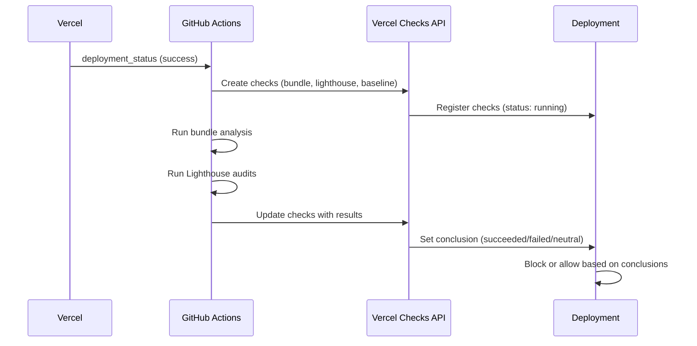

<!-- TLP:CLEAR -->

# Vercel Deployment Checks Integration

**Status:** ✅ Active  
**Last Updated:** December 5, 2025

This document explains how Vercel Deployment Checks are integrated into the dcyfr-labs project to provide automated quality gates on every deployment.

---

## Overview

Vercel Deployment Checks run **automatically on every Vercel deployment** and provide:

- ✅ **Bundle Size Validation** - Prevents bundle bloat from reaching production
- ✅ **Lighthouse Performance Audits** - Maintains Core Web Vitals and UX standards
- ✅ **Baseline Regression Detection** - Compares against historical performance data

**Key Benefit:** Deployments are **blocked** if critical checks fail, ensuring only high-quality code reaches production.

---

## How It Works

### Trigger Flow



### Workflow: `.github/workflows/vercel-checks.yml`

**Trigger:** `on: deployment_status` (when Vercel deployment succeeds)

**Jobs:**
1. **Bundle Size Check**
   - Builds production bundle
   - Runs `scripts/check-bundle-size.mjs`
   - Compares against `performance-baselines.json`
   - Reports to Vercel Checks API

2. **Lighthouse Performance Check**
   - Audits 5 key pages (/, /blog, /work, /about, /contact)
   - Runs 3 times per page (median score)
   - Validates against thresholds:
     - Performance ≥ 90% (error)
     - Accessibility ≥ 95% (error)
     - Best Practices ≥ 85% (warning)
     - SEO ≥ 90% (warning)

3. **Baseline Regression Check**
   - Aggregates bundle + Lighthouse results
   - Compares against configured thresholds
   - Provides unified pass/fail decision

---

## Check Conclusions

Each check can have one of these conclusions:

| Conclusion | Meaning | Action |
|------------|---------|--------|
| `succeeded` | ✅ All metrics within target thresholds | Deploy proceeds |
| `neutral` | ⚠️ Minor regressions within warning thresholds | Deploy proceeds with warning |
| `failed` | ❌ Critical regressions exceed error thresholds | **Deployment blocked** |
| `skipped` | ℹ️ Check not run (e.g., no baselines yet) | Deploy proceeds |

---

## Regression Thresholds

Configured in `performance-baselines.json`:

### Bundle Size
- **< 10% increase:** Pass ✅
- **10-25% increase:** Warning ⚠️
- **> 25% increase:** Error ❌ (blocks deployment)

### Lighthouse Scores
- **< 5 point decrease:** Pass ✅
- **5-10 point decrease:** Warning ⚠️
- **> 10 point decrease:** Error ❌ (blocks deployment)

### Web Vitals
- **< 15% increase:** Pass ✅
- **15-30% increase:** Warning ⚠️
- **> 30% increase:** Error ❌ (blocks deployment)

**Why configurable?** Teams can adjust sensitivity based on velocity and optimization priorities.

---

## Setup Requirements

### 1. Vercel Token

Create a Vercel API token with deployment write permissions:

1. Go to [Vercel Account Settings → Tokens](https://vercel.com/account/tokens)
2. Create new token with scope: `Deployments (Read & Write)`
3. Add to GitHub repository secrets as `VERCEL_TOKEN`

```bash
# GitHub CLI
gh secret set VERCEL_TOKEN --body "your-vercel-token-here"

# Or via GitHub UI
# Settings → Secrets and variables → Actions → New repository secret
```

### 2. Add Automation Bypass Secret (Optional - For Password-Protected Deployments)

If your Vercel deployments use password protection, add the bypass secret:

**Get the secret:**
1. Go to Vercel dashboard → Your project
2. Settings → **Deployment Protection**
3. Enable "Password Protection" (if not already enabled)
4. Copy the **"Automation Bypass Secret"**

**Add to GitHub:**
```bash
gh secret set VERCEL_AUTOMATION_BYPASS_SECRET --body "your-bypass-secret"
```

**How it works:**
- Lighthouse audits append `?x-vercel-protection-bypass=SECRET` to URLs
- Allows automated checks to access password-protected preview deployments
- Does not affect production deployment protection

### 3. Enable Deployment Status Events

Vercel automatically triggers `deployment_status` events to GitHub. Ensure:

- ✅ Vercel is connected to your GitHub repository
- ✅ GitHub App integration is active
- ✅ Deployment notifications are enabled

### 3. Baseline Data (Optional)

First deployment will skip baseline comparison. After collecting baselines:

1. Run production build
2. Extract bundle sizes and Lighthouse scores
3. Populate `performance-baselines.json`
4. Future deployments will compare against these baselines

---

## Usage

### Viewing Checks in Vercel Dashboard

1. Go to Vercel dashboard → Your project → Deployments
2. Click on any deployment
3. Scroll to "Checks" section
4. See real-time status of:
   - Bundle Size Validation
   - Lighthouse Performance
   - Performance Baseline Validation

### Viewing Checks in GitHub

1. Go to repository → Actions tab
2. Find "Vercel Deployment Checks" workflow
3. Click on specific run for detailed logs
4. Each check shows full output and conclusion

### Rerunning Failed Checks

If a check fails due to transient issues:

1. Click "Re-run check" in Vercel dashboard
2. Or re-trigger GitHub Action workflow
3. Check will run again without new deployment

---

## Check Details

### Bundle Size Check

**What it validates:**
- Total First Load JS size
- Individual page bundle sizes
- Comparison against baselines (if established)

**Output includes:**
- Current bundle sizes
- Baseline comparison (% change)
- Top 10 largest page bundles
- Actionable recommendations

**Example output:**
```
📦 Bundle Size Monitor (Next.js 16 / Turbopack)

📊 Total First Load JS
✅ Budget: 152 kB / 150 kB (target)
   Target: 150 kB | Warning: 200 kB | Error: 250 kB
✅ Baseline: 150 kB → 152 kB (+1.3%)

📄 Page Bundles (Top 10)
✅ /                    35 kB
✅ /blog                42 kB
✅ /work                38 kB
...

✅ Bundle size check PASSED
```

### Lighthouse Check

**What it validates:**
- Performance score (target: ≥90)
- Accessibility score (target: ≥95)
- Best Practices score (target: ≥85)
- SEO score (target: ≥90)
- Core Web Vitals (LCP, INP, CLS, FCP, TTFB)

**Pages audited:**
- Homepage (/)
- Blog archive (/blog)
- Work page (/work)
- About page (/about)
- Contact page (/contact)

**Example output:**
```
🔦 Lighthouse Performance Audit

Homepage (/)
  Performance: 96 ✅
  Accessibility: 98 ✅
  Best Practices: 92 ✅
  SEO: 95 ✅
  
  LCP: 1.8s ✅
  INP: 150ms ✅
  CLS: 0.05 ✅

All checks passed!
```

### Baseline Regression Check

**What it validates:**
- Aggregates results from bundle + Lighthouse checks
- Compares against configured thresholds in `performance-baselines.json`
- Provides unified pass/fail decision

**Output includes:**
- Bundle check conclusion
- Lighthouse check conclusion
- Overall regression assessment
- Links to detailed reports

---

## Blocking Behavior

### When Checks Block Deployment

Deployments are **blocked** when:
- Bundle size exceeds 25% regression threshold
- Lighthouse score decreases by >10 points
- Performance score drops below 90
- Accessibility score drops below 95

**What happens:**
1. Vercel marks deployment as "failed checks"
2. Deployment does NOT receive production alias
3. Preview URL remains accessible for testing
4. Team is notified of failure

### When Checks Allow Deployment

Deployments **proceed** when:
- All checks return `succeeded` or `neutral`
- No critical regressions detected
- Warnings may be present (logged but not blocking)

---

## Troubleshooting

### Check fails with "401 Unauthorized"

**Cause:** Missing or invalid `VERCEL_TOKEN`

**Fix:**
1. Verify token exists in GitHub secrets
2. Ensure token has `Deployments (Read & Write)` scope
3. Regenerate token if expired

### Check fails with "Deployment not found"

**Cause:** Workflow triggered before deployment ready

**Fix:**
- Workflow already handles this with `if: github.event.deployment_status.state == 'success'`
- If issue persists, check Vercel GitHub App integration

### Bundle check passes but deployment blocked

**Cause:** Other checks (Lighthouse, baseline) may have failed

**Fix:**
1. Review all check outputs in Vercel dashboard
2. Check GitHub Action logs for detailed error messages
3. Fix underlying issues and redeploy

### Lighthouse check fails with "401 Unauthorized" or "Password Required"

**Cause:** Deployment is password-protected and bypass secret is missing

**Fix:**
1. Get automation bypass secret from Vercel:
   - Project Settings → Deployment Protection → Automation Bypass Secret
2. Add to GitHub secrets as `VERCEL_AUTOMATION_BYPASS_SECRET`
3. Workflow automatically appends `?x-vercel-protection-bypass=SECRET` to URLs

### Lighthouse check times out

**Cause:** Slow deployment or network issues

**Fix:**
1. Increase `timeout-minutes` in workflow (currently 15)
2. Reduce number of Lighthouse runs (currently 3)
3. Audit fewer pages temporarily

---

## Performance Impact

### Workflow Execution Time

- **Bundle Size Check:** ~2-3 minutes (includes build)
- **Lighthouse Check:** ~5-8 minutes (3 runs × 5 pages)
- **Baseline Check:** &lt;30 seconds (aggregation only)
- **Total:** ~8-12 minutes per deployment

### Cost Considerations

- **GitHub Actions:** Free for public repos, included in plans for private
- **Vercel Checks API:** Free (no additional cost)
- **Lighthouse CI:** Free (runs in GitHub Actions)

---

## Advanced Configuration

### Adjusting Thresholds

Edit `performance-baselines.json`:

```json
{
  "regressionThresholds": {
    "bundles": {
      "warning": 10,  // Adjust: 5-15% recommended
      "error": 25     // Adjust: 20-30% recommended
    },
    "lighthouse": {
      "warning": 5,   // Adjust: 3-10 points recommended
      "error": 10     // Adjust: 8-15 points recommended
    }
  }
}
```

### Disabling Specific Checks

Comment out check creation in `.github/workflows/vercel-checks.yml`:

```yaml
# - name: Create Bundle Size Check
#   id: create-bundle-check
#   run: |
#     # ... (check disabled)
```

### Adding Custom Checks

Extend workflow with additional checks:

```yaml
- name: Create Custom Check
  id: create-custom-check
  run: |
    curl -X POST \
      "https://api.vercel.com/v1/deployments/${{ github.event.deployment.id }}/checks" \
      -H "Authorization: Bearer ${{ secrets.VERCEL_TOKEN }}" \
      -d '{
        "name": "Custom Validation",
        "path": "/"
      }'
```

---

## Comparison: Vercel Checks vs. GitHub Actions Only

| Feature | GitHub Actions Only | Vercel Checks Integration |
|---------|---------------------|---------------------------|
| Run on deployment | ❌ Manual trigger | ✅ Automatic |
| Block deployment | ❌ No | ✅ Yes |
| Visual feedback in Vercel | ❌ No | ✅ Yes |
| Rerun failed checks | ❌ Full re-deploy | ✅ Click to rerun |
| Team visibility | ⚠️ Limited | ✅ Dashboard + notifications |
| Production safety | ⚠️ Manual review | ✅ Automated gates |

**Recommendation:** Use both! GitHub Actions for PR validation, Vercel Checks for deployment gates.

---

## Integration with Existing Workflows

### Works alongside:
- ✅ `.github/workflows/test.yml` - PR testing
- ✅ `.github/workflows/lighthouse-ci.yml` - PR Lighthouse audits
- ✅ `.github/workflows/design-system.yml` - Design token validation

### Differences:
- **PR workflows:** Run on code push (pre-deployment)
- **Vercel Checks:** Run on deployment (post-build, pre-production)

**Why both?** Catch issues early (PR) AND prevent bad deployments (Vercel Checks).

---

## Future Enhancements

### Planned Features
- [ ] Visual diffs for bundle size changes
- [ ] Historical trend charts in check output
- [ ] Slack/Discord notifications on check failures
- [ ] Custom threshold overrides per branch
- [ ] A/B test performance comparison

### Potential Integrations
- [ ] Sentry performance monitoring
- [ ] Real User Monitoring (RUM) data
- [ ] CDN cache hit rate validation
- [ ] API response time checks

---

## Resources

### Documentation
- [Vercel Checks API Reference](https://vercel.com/docs/checks/checks-api)
- [Vercel Deployment Webhooks](https://vercel.com/docs/webhooks)
- [GitHub deployment_status Events](https://docs.github.com/en/actions/using-workflows/events-that-trigger-workflows#deployment_status)

### Related Files
- `.github/workflows/vercel-checks.yml` - Workflow definition
- `performance-baselines.json` - Threshold configuration
- `scripts/check-bundle-size.mjs` - Bundle analysis script
- `lighthouserc.json` - Lighthouse CI configuration

### Support
- Report issues: [GitHub Issues](https://github.com/dcyfr/dcyfr-labs/issues)
- View workflow runs: [GitHub Actions](https://github.com/dcyfr/dcyfr-labs/actions)
- Check status: [Vercel Dashboard](https://vercel.com)

---

**Last Review:** December 5, 2025  
**Next Review:** December 12, 2025 (Weekly)
