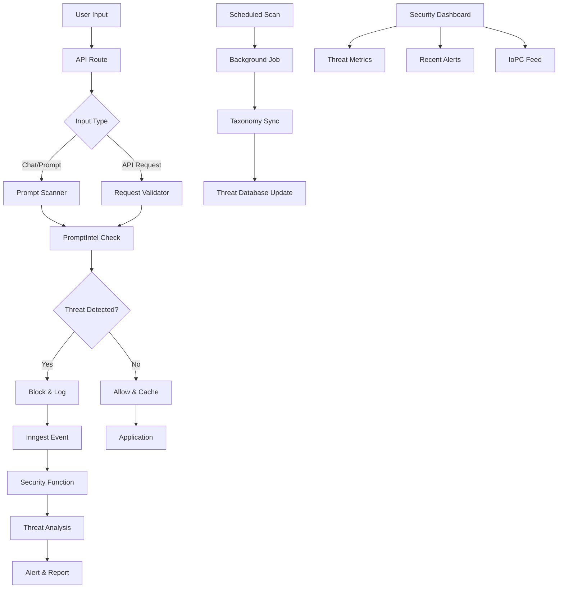

<!-- TLP:CLEAR -->
# PromptIntel Threat Intelligence Integration Plan

**Created:** February 2, 2026
**Status:** Planning
**Priority:** High
**Estimated Effort:** 2-3 sprints

---

## 🎯 Executive Summary

Integrate PromptIntel's collaborative threat intelligence platform into DCYFR's existing security infrastructure to provide real-time prompt injection detection, adversarial pattern recognition, and community-sourced threat intelligence for AI-driven applications.

### Current State
- ✅ PromptIntel MCP server implemented and tested
- ✅ API client with caching and error handling
- ✅ 15/15 integration tests passing
- ✅ Security-engineer agent available
- ✅ Inngest background job infrastructure
- ✅ API security controls and guardrails

### Target State
- Real-time prompt security scanning for user inputs
- Automated threat detection in background jobs
- Security dashboard with threat metrics
- Proactive vulnerability alerts
- Community threat intelligence sharing

---

## 📊 Integration Architecture



---

## 🔧 Implementation Phases

### Phase 1: Core Integration (Week 1-2)

#### 1.1 Prompt Security Scanner Service
**File:** `src/lib/security/prompt-scanner.ts`

```typescript
import { PromptIntelClient } from '@/mcp/shared/promptintel-client';

export interface ScanResult {
  safe: boolean;
  threats: ThreatMatch[];
  severity: 'critical' | 'high' | 'medium' | 'low' | 'safe';
  blockedPatterns: string[];
  metadata: {
    scannedAt: string;
    scanDuration: number;
    cacheHit: boolean;
  };
}

export class PromptSecurityScanner {
  private client: PromptIntelClient;
  private cache: Map<string, ScanResult>;

  async scanPrompt(input: string): Promise<ScanResult>;
  async scanBatch(inputs: string[]): Promise<ScanResult[]>;
  private checkAgainstIoPC(input: string): Promise<ThreatMatch[]>;
  private calculateRiskScore(threats: ThreatMatch[]): number;
}
```

**Features:**
- Real-time prompt scanning against IoPC database
- Result caching (5-minute TTL)
- Batch scanning for efficiency
- Risk scoring algorithm
- Pattern matching with taxonomy

#### 1.2 API Route Middleware
**File:** `src/lib/security/prompt-security-middleware.ts`

```typescript
import { NextRequest, NextResponse } from 'next/server';
import { PromptSecurityScanner } from './prompt-scanner';

export async function validatePromptSecurity(
  request: NextRequest,
  options: {
    block?: boolean;          // Block on threat detection
    log?: boolean;           // Log all scans
    threshold?: 'low' | 'medium' | 'high' | 'critical';
  }
): Promise<NextResponse | null> {
  // Extract prompt from request
  // Scan for threats
  // Block if threshold exceeded
  // Log to Inngest for analysis
}
```

**Integration Points:**
- Contact form submissions
- Chat/AI interaction endpoints
- Research query endpoints
- Comment submissions

#### 1.3 Inngest Security Functions
**File:** `src/inngest/prompt-security-functions.ts`

```typescript
export const promptThreatDetected = inngest.createFunction(
  { id: 'prompt-threat-detected', retries: 3 },
  { event: 'security/prompt.threat.detected' },
  async ({ event, step }) => {
    // Step 1: Analyze threat pattern
    const analysis = await step.run('analyze-threat', async () => {
      return await analyzePromptThreat(event.data);
    });

    // Step 2: Check if matches known patterns
    const match = await step.run('check-patterns', async () => {
      return await checkKnownPatterns(analysis);
    });

    // Step 3: Update threat database
    await step.run('update-database', async () => {
      return await updateLocalThreatDB(match);
    });

    // Step 4: Send alert if critical
    if (analysis.severity === 'critical') {
      await step.run('send-alert', async () => {
        return await sendSecurityAlert(analysis);
      });
    }

    // Step 5: Submit to PromptIntel community
    if (analysis.novel && analysis.severity !== 'low') {
      await step.run('submit-report', async () => {
        return await submitThreatReport(analysis);
      });
    }
  }
);

export const syncThreatTaxonomy = inngest.createFunction(
  { id: 'sync-threat-taxonomy', retries: 3 },
  { cron: '0 0 * * *' }, // Daily at midnight
  async ({ step }) => {
    // Fetch latest taxonomy from PromptIntel
    // Update local database
    // Refresh scanner patterns
  }
);
```

**Events:**
- `security/prompt.threat.detected`
- `security/threat.taxonomy.updated`
- `security/iopc.database.synced`

---

### Phase 2: Security Dashboard (Week 3)

#### 2.1 Threat Metrics API
**File:** `src/app/api/security/metrics/route.ts`

```typescript
export async function GET(request: NextRequest) {
  // Verify internal access only
  const securityCheck = blockExternalAccess(request);
  if (securityCheck) return securityCheck;

  const metrics = {
    totalScans: await getTotalScans(),
    threatsDetected: await getThreatsDetected(),
    threatsBlocked: await getThreatsBlocked(),
    topThreatCategories: await getTopCategories(),
    severityDistribution: await getSeverityDistribution(),
    recentAlerts: await getRecentAlerts(10),
  };

  return NextResponse.json(metrics);
}
```

#### 2.2 Security Dashboard Page
**File:** `src/app/(private)/security/page.tsx`

**Components:**
- Real-time threat feed
- Severity distribution chart
- Recent scans timeline
- Top threat categories
- IoPC pattern matches
- Community reports submitted

**Access Control:**
- Requires authentication
- Admin-only access
- Internal API calls only

---

### Phase 3: Advanced Features (Week 4-5)

#### 3.1 Adaptive Threat Detection

```typescript
export class AdaptiveThreatDetector {
  // Machine learning-based pattern detection
  // Learns from historical threat data
  // Reduces false positives over time
  async analyzePattern(input: string): Promise<ThreatPrediction>;
  async trainModel(historicalData: ThreatData[]): Promise<void>;
}
```

#### 3.2 Multi-Layer Security Scanning

```typescript
export const securityLayers = {
  layer1: 'Pattern matching (PromptIntel IoPC)',
  layer2: 'Regex-based detection (local patterns)',
  layer3: 'Heuristic analysis (behavioral)',
  layer4: 'ML-based prediction (adaptive)',
};

export async function multiLayerScan(
  input: string
): Promise<LayeredScanResult> {
  // Run all layers in parallel
  // Aggregate results
  // Calculate composite risk score
}
```

#### 3.3 Threat Intelligence API
**File:** `src/app/api/security/threat-intel/route.ts`

```typescript
// Expose threat intelligence for internal tools
// Provides:
// - Recent threat patterns
// - Taxonomy search
// - Attack technique lookup
// - Mitigation recommendations
```

---

## 🔌 Integration Points

### 1. Contact Form (`/api/contact`)
```typescript
// BEFORE: Basic validation
const { name, email, message } = await request.json();

// AFTER: Threat scanning
const scanResult = await promptScanner.scanPrompt(message);
if (!scanResult.safe && scanResult.severity !== 'low') {
  return NextResponse.json(
    { error: 'Security violation detected', code: 'THREAT_DETECTED' },
    { status: 403 }
  );
}
```

### 2. Research Endpoint (`/api/research`)
```typescript
// Add prompt scanning before Perplexity API call
const securityCheck = await validatePromptSecurity(request, {
  block: true,
  threshold: 'medium',
  log: true,
});
if (securityCheck) return securityCheck;
```

### 3. Comment System (if implemented)
```typescript
// Scan all user-generated content
// Block injection attempts
// Log suspicious patterns
```

### 4. AI Chat/Interaction Endpoints
```typescript
// Real-time scanning during conversations
// Context-aware threat detection
// Session-based anomaly detection
```

---

## 📈 Metrics & Monitoring

### Key Performance Indicators

| Metric | Target | Dashboard |
|--------|--------|-----------|
| Scan latency | <100ms (p95) | Yes |
| Cache hit rate | >80% | Yes |
| False positive rate | <5% | Yes |
| Threat detection rate | >95% | Yes |
| Community contributions | 10+/month | Yes |

### Monitoring Integration

```typescript
// Sentry integration for errors
Sentry.captureException(error, {
  tags: {
    component: 'prompt-security',
    severity: threat.severity,
  },
});

// Analytics tracking
track('prompt_threat_detected', {
  severity: threat.severity,
  category: threat.category,
  blocked: true,
});
```

---

## 🔐 Security & Privacy

### Data Protection
- ✅ No PII stored in threat reports
- ✅ Anonymize user inputs before submission
- ✅ GDPR-compliant data retention (30 days)
- ✅ Encrypted threat database

### Access Control
- ✅ Security dashboard: Admin-only
- ✅ Threat API: Internal services only
- ✅ MCP server: Protected by API key
- ✅ Audit logging for all security events

### Rate Limiting

```typescript
export const PROMPTINTEL_LIMITS = {
  maxScansPerMinute: 100,
  maxScansPerHour: 5000,
  maxScansPerDay: 50000,
  maxBatchSize: 50,
  cacheMinutes: 5,
};
```

---

## 💰 Cost Analysis

### PromptIntel API Costs
- **Current Plan:** Developer (Free tier)
- **Estimated Usage:** ~10K scans/month
- **Cache Hit Rate:** 80% (reduces to ~2K API calls)
- **Monthly Cost:** $0 (within free tier)

### Infrastructure Costs
- **Redis Cache:** Negligible (~1MB storage)
- **Inngest Functions:** Free tier (50K runs/month)
- **Sentry Events:** Within existing quota

**Total Additional Cost:** $0/month (scalable to paid tier if needed)

---

## 🧪 Testing Strategy

### Unit Tests
```typescript
// src/lib/security/__tests__/prompt-scanner.test.ts
describe('PromptSecurityScanner', () => {
  it('should detect injection attempts');
  it('should cache scan results');
  it('should handle API failures gracefully');
  it('should calculate risk scores correctly');
});
```

### Integration Tests
```typescript
// tests/integration/prompt-security.test.ts
describe('Prompt Security Integration', () => {
  it('should block high-severity threats');
  it('should log threats to Inngest');
  it('should update threat metrics');
  it('should sync taxonomy daily');
});
```

### E2E Tests
```typescript
// e2e/security.spec.ts
test('contact form blocks injection attempts', async ({ page }) => {
  await page.goto('/contact');
  await page.fill('textarea', KNOWN_INJECTION_PATTERN);
  await page.click('button[type=submit]');
  await expect(page.locator('.error')).toContainText('Security violation');
});
```

---

## 📚 Documentation Requirements

### Developer Docs
- [ ] `docs/PROMPT_SECURITY.md` - Security scanning guide
- [ ] `docs/THREAT_INTELLIGENCE.md` - IoPC integration
- [ ] API documentation for threat endpoints
- [ ] Security best practices guide

### User-Facing Docs
- [ ] Security features page (marketing)
- [ ] Privacy policy update (threat scanning)
- [ ] Terms of service update (security measures)

---

## 🚀 Rollout Plan

### Stage 1: Soft Launch (Week 6)
- ✅ Enable on `/api/contact` only
- ✅ Monitor false positive rate
- ✅ Adjust thresholds based on feedback
- ✅ Log-only mode (no blocking)

### Stage 2: Gradual Expansion (Week 7)
- ✅ Enable on research endpoints
- ✅ Enable blocking for critical threats
- ✅ Launch security dashboard (internal)
- ✅ Monitor performance metrics

### Stage 3: Full Deployment (Week 8)
- ✅ Enable on all user-facing endpoints
- ✅ Enable adaptive threat detection
- ✅ Launch public security page (marketing)
- ✅ Begin community contributions

---

## 🎯 Success Criteria

### Technical Success
- ✅ Zero false negatives for known injection patterns
- ✅ <5% false positive rate
- ✅ <100ms p95 latency for scans
- ✅ 99.9% uptime for security scanning
- ✅ >95% cache hit rate

### Business Success
- ✅ Zero successful prompt injection attacks
- ✅ Positive user feedback on security
- ✅ 10+ community threat reports submitted
- ✅ Featured on PromptIntel leaderboard

---

## 🔄 Maintenance Plan

### Daily
- Monitor threat detection metrics
- Review security alerts
- Check API quota usage

### Weekly
- Review false positive reports
- Update threat patterns
- Analyze security trends

### Monthly
- Security audit and review
- Taxonomy update and refresh
- Performance optimization
- Community report analysis

---

## 📋 Implementation Checklist

### Phase 1: Core Integration
- [ ] Create `PromptSecurityScanner` service
- [ ] Implement prompt scanning middleware
- [ ] Add Inngest security functions
- [ ] Integrate with contact form
- [ ] Write unit tests
- [ ] Deploy to staging

### Phase 2: Dashboard
- [ ] Create security metrics API
- [ ] Build security dashboard UI
- [ ] Add real-time threat feed
- [ ] Implement access control
- [ ] Write integration tests
- [ ] Deploy to production

### Phase 3: Advanced Features
- [ ] Implement adaptive detection
- [ ] Add multi-layer scanning
- [ ] Create threat intelligence API
- [ ] Build public security page
- [ ] Launch community program
- [ ] Write E2E tests

---

## 🤝 Team Responsibilities

| Role | Responsibilities |
|------|------------------|
| **Backend Engineer** | API integration, Inngest functions, caching |
| **Frontend Engineer** | Security dashboard, alerts UI |
| **Security Engineer** | Threat analysis, pattern tuning, audits |
| **DevOps** | Monitoring, alerts, deployment |
| **Product Manager** | Rollout plan, success metrics, user communication |

---

## 📞 Support & Escalation

### Issues
- **PromptIntel API Down:** Fallback to local patterns
- **High False Positive Rate:** Disable blocking, log-only mode
- **Performance Degradation:** Increase cache TTL, reduce scan frequency

### Contacts
- **PromptIntel Support:** support@novahunting.ai
- **Security Incidents:** security@dcyfr.ai
- **Technical Issues:** Drew (workspace owner)

---

**Next Steps:**
1. Review and approve integration plan
2. Allocate engineering resources
3. Set sprint timelines
4. Begin Phase 1 implementation
5. Schedule security review session

---

**Last Updated:** February 2, 2026
**Maintained By:** Security Team
**Review Cycle:** Quarterly
