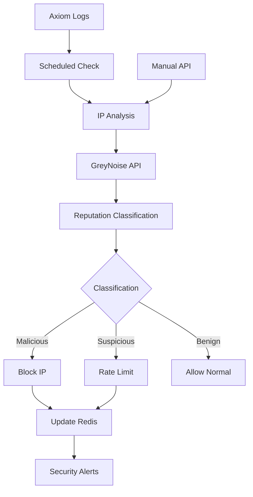

<!-- TLP:CLEAR -->

# IP Reputation & WAF Automation System

**Status:** Production Ready  
**Implementation Date:** December 14, 2025  
**Integration:** GreyNoise API v3 + Axiom Analytics + Redis + Inngest

## 📋 Overview

The IP Reputation system provides **automated malicious IP detection and blocking** using GreyNoise threat intelligence integrated with your existing security stack. It automatically analyzes traffic from Axiom logs, checks IP reputation with GreyNoise, and applies adaptive rate limiting or blocking based on threat classification.

### Key Benefits

- **🛡️ Proactive Threat Detection**: Identifies malicious IPs before they cause damage
- **🔄 Fully Automated**: Scheduled hourly checks with immediate blocking of confirmed threats
- **📊 Data-Driven**: Uses real traffic analysis from Axiom to prioritize checks
- **⚡ Performance Optimized**: Redis caching + bulk processing minimizes API costs
- **🔗 Native Integration**: Works seamlessly with existing rate limiting and security systems

---

## 🏗️ Architecture



### Component Integration

| Component | Role | Integration Point |
|-----------|------|------------------|
| **Axiom Analytics** | Traffic analysis & IP discovery | Query: `['vercel'] \\| summarize count() by ['request.ip']` |
| **GreyNoise API** | IP reputation & threat intelligence | Context API, RIOT dataset, bulk lookups |
| **Redis** | Caching & blocked IPs storage | `security:blocked-ips`, `security:ip-reputation` |
| **Inngest** | Background processing & scheduling | Hourly automated checks + manual triggers |
| **Rate Limiting** | Adaptive protection | Reputation-based limits (malicious=1/hr, suspicious=10/5min) |
| **Sentry** | Security monitoring & alerting | Threat detection events + error tracking |

---

## 🔧 Setup & Configuration

### 1. Environment Variables

```bash
# Required
GREYNOISE_API_KEY="your_greynoise_api_key_here"
ADMIN_API_KEY="your_secure_api_key_for_manual_access"
REDIS_URL="your_redis_connection_string"

# Optional (uses sensible defaults)
AXIOM_DATASET="vercel"
IP_REPUTATION_CHECK_INTERVAL="60" # minutes
```

### 2. GreyNoise API Setup

1. Sign up at [GreyNoise](https://viz.greynoise.io/)
2. Get your API key from the dashboard
3. Add to Vercel environment variables
4. Test with: `curl -H "key: YOUR_API_KEY" https://api.greynoise.io/v3/context/8.8.8.8`

### 3. Axiom Integration

The system uses your existing Axiom setup to analyze traffic patterns:

```typescript
// Default query (customizable)
const AXIOM_QUERY = `
['vercel'] 
| where isnotnull(['request.ip']) 
| summarize Value = count() by ['request.ip'] 
| where Value > 10  // Only check IPs with 10+ requests
| order by Value desc
`;
```

---

## 🚀 Usage

### Automated Operation

The system runs automatically every hour with no manual intervention required:

1. **Scheduled Check** (every hour)
   - Queries Axiom for high-traffic IPs
   - Checks reputation with GreyNoise
   - Updates blocking rules automatically
   - Sends alerts for critical threats

2. **Real-time Protection**
   - All API routes now include IP reputation checking
   - Malicious IPs are blocked immediately
   - Suspicious IPs receive enhanced rate limiting

### Manual Operations

#### Check Single IP Reputation

```bash
curl -H "Authorization: Bearer YOUR_ADMIN_API_KEY" \\\n  "https://your-domain.com/api/ip-reputation?ip=1.2.3.4"
```

Response:
```json
{
  "success": true,
  "data": {
    "ip": "1.2.3.4",
    "is_malicious": false,
    "is_suspicious": true,
    "classification": "suspicious",
    "confidence": 75,
    "details": {
      "tags": ["scanner", "tor"],
      "country": "US",
      "organization": "Example ISP"
    }
  }
}
```

#### Bulk IP Check

```bash
curl -X POST \\\n  -H "Authorization: Bearer YOUR_ADMIN_API_KEY" \\\n  -H "Content-Type: application/json" \\\n  -d '{"ips": ["1.2.3.4", "5.6.7.8"]}' \\\n  "https://your-domain.com/api/ip-reputation"
```

#### Trigger Manual Reputation Check

```bash
curl -X POST \\\n  -H "Authorization: Bearer YOUR_ADMIN_API_KEY" \\\n  -H "Content-Type: application/json" \\\n  -d '{"ips": ["1.2.3.4"], "config": {"auto_block_malicious": true}}' \\\n  "https://your-domain.com/api/ip-reputation"
```

---

## 🛡️ Security Features

### IP Classification System

| Classification | Criteria | Action | Rate Limit |
|---------------|----------|--------|------------|
| **Malicious** | GreyNoise classification=malicious | Block permanently | 0 requests |
| **Suspicious** | TOR, VPN, scanning activity | Enhanced rate limiting | 10 req/5min |
| **Benign** | RIOT dataset (known business services) | Normal operation | 1000 req/5min |
| **Unknown** | No GreyNoise data | Standard rate limiting | 100 req/5min |

### Threat Detection

The system identifies threats based on:

- **GreyNoise Intelligence**: Confirmed malicious activity, botnets, scanners
- **RIOT Dataset**: Distinguishes legitimate business traffic from threats
- **Behavioral Analysis**: Scanning patterns, exploit attempts, brute force
- **Infrastructure Analysis**: TOR nodes, VPN exits, hosting providers known for abuse

### Blocking Strategy

```typescript
// Automatic blocking triggers:
if (classification === "malicious") {
  blockIP(ip, "malicious", "greynoise", { permanent: true });
}

if (tags.includes("botnet") || tags.includes("malware")) {
  blockIP(ip, "malicious", "greynoise", { permanent: true });
  sendCriticalAlert(ip, "botnet/malware detected");
}

if (classification === "suspicious") {
  applySuspiciousLimits(ip); // 10 req/5min
}
```

---

## 📊 Monitoring & Alerting

### Security Alerts

The system sends alerts for:

- **High-Confidence Malicious IPs** (confidence ≥ 80%)
- **Critical Threats** (botnet, malware, ransomware tags)
- **Volume Thresholds** (>5 new malicious IPs per hour)
- **Unusual Activity Patterns**

### Metrics Dashboard

Available metrics:
- Total blocked IPs
- Malicious vs. suspicious classification ratios
- Request volume by reputation
- GreyNoise API usage
- Blocking effectiveness

### Sentry Integration

All security events are captured in Sentry with:
- IP addresses and classifications
- GreyNoise confidence scores
- Request patterns and metadata
- Alert correlation

---

## 🔧 API Reference

### GET `/api/ip-reputation`

Check reputation for one or more IP addresses.

**Parameters:**
- `ip` (string): Single IP address
- `ips` (string): Comma-separated IP list
- `useCache` (boolean): Use cached results (default: true)

**Headers:**
- `Authorization: Bearer YOUR_ADMIN_API_KEY`

**Rate Limits:**
- 10 requests/hour per IP (GreyNoise API costs)

### POST `/api/ip-reputation`

Trigger manual IP reputation check with Inngest.

**Body:**
```json
{
  "ips": ["1.2.3.4", "5.6.7.8"],
  "config": {
    "auto_block_malicious": true,
    "auto_rate_limit_suspicious": true
  }
}
```

**Rate Limits:**
- 5 requests/hour per IP

### PUT `/api/ip-reputation`

Manual reputation override (administrative).

**Body:**
```json
{
  "ip": "1.2.3.4",
  "classification": "malicious",
  "reason": "Manual investigation confirmed threat"
}
```

---

## 🧪 Testing

### Unit Tests

```bash
npm run test src/__tests__/ip-reputation.test.ts
```

### Integration Tests

```bash
# Test GreyNoise API connection
curl -H "key: $GREYNOISE_API_KEY" https://api.greynoise.io/v3/context/8.8.8.8

# Test manual IP check
curl -H "Authorization: Bearer $ADMIN_API_KEY" \\\n  "http://localhost:3000/api/ip-reputation?ip=8.8.8.8"

# Test Inngest function trigger
npm run inngest:test -- --function checkIpReputation
```

### Load Testing

```bash
# Test rate limiting with reputation
for i in {1..20}; do
  curl -H "Authorization: Bearer $ADMIN_API_KEY" \\\n    "http://localhost:3000/api/ip-reputation?ip=1.2.3.$i"
done
```

---

## 🔍 Troubleshooting

### Common Issues

#### GreyNoise API Rate Limits
```
Error: GreyNoise API error: 429 Too Many Requests
```

**Solution:**
- Check your GreyNoise plan limits
- Increase `CACHE_TTL_SECONDS` to reduce API calls
- Implement request queuing for bulk operations

#### Redis Connection Failures
```
Error: IP Reputation Redis error: Connection timeout
```

**Solution:**
- Verify `REDIS_URL` environment variable
- Check Redis instance health
- System fails open (allows requests) when Redis is down

#### Missing IP Data
```
Warning: No reputation data found for IP
```

**Solution:**
- New IPs may not be in GreyNoise database
- Classification will be "unknown" with confidence 0
- Consider manual classification for internal IPs

### Debug Mode

Enable detailed logging:

```bash
export DEBUG=ip-reputation,greynoise-api,blocked-ips
npm run dev
```

### Health Checks

```bash
# Check system status
curl -H "Authorization: Bearer $ADMIN_API_KEY" \\\n  "http://localhost:3000/api/ip-reputation?ip=127.0.0.1"

# Should return classification="benign" for localhost
```

---

## 🔮 Roadmap

### Phase 1 Enhancements (Q1 2026)
- [ ] Axiom integration for automatic IP discovery
- [ ] Slack/Discord webhook notifications
- [ ] Geographic blocking rules
- [ ] Custom reputation scoring

### Phase 2 Features (Q2 2026)  
- [ ] Machine learning-based behavior analysis
- [ ] Honeypot integration
- [ ] Automated SOAR (Security Orchestration) workflows
- [ ] Custom threat feeds integration

### Phase 3 Advanced (Q3 2026)
- [ ] Real-time threat intelligence sharing
- [ ] Advanced persistent threat (APT) detection
- [ ] Automated incident response
- [ ] Compliance reporting (SOC 2, ISO 27001)

---

## 📚 Related Documentation

- [Security Architecture](../security/index.md)
- Rate Limiting Guide  
- [GreyNoise API Documentation](https://docs.greynoise.io/)
- Inngest Functions
- Redis Security Patterns

---

## 🤝 Contributing

### Adding New Threat Sources

1. Implement threat provider interface in `src/lib/threat-providers/`
2. Add configuration to IP reputation types
3. Update classification logic in `analyzeReputation()`
4. Add tests for new provider
5. Update documentation

### Custom Classification Rules

Create custom rules in `src/lib/ip-reputation-rules.ts`:

```typescript
export function customClassification(ip: string, greynoiseData: GreyNoiseIPContext): string {
  // Your custom logic here
  if (greynoiseData.metadata?.country === "CN" && greynoiseData.tags?.includes("scanner")) {
    return "suspicious"; // Custom rule for China-based scanners
  }
  return "unknown";
}
```

---

## ⚖️ Legal & Compliance

### Data Privacy
- IP addresses are processed for security purposes (legitimate interest under GDPR)
- Retention: 30 days for blocked IPs, 24 hours for reputation cache
- No PII correlation with IP reputation data

### GreyNoise Terms
- Ensure compliance with GreyNoise API terms of service
- Respect rate limits to maintain good standing
- Commercial use requires appropriate GreyNoise plan

### Incident Response
- All security events are logged for audit purposes
- 24-hour retention for most events
- Critical threats logged permanently for analysis

---

**Questions or Issues?**  
- 🐛 Report bugs: GitHub Issues  
- 📚 Documentation: `/dev/docs/security/ip-reputation`
- 🔒 Security concerns: security@dcyfr.ai

**Implementation Status:** ✅ Production Ready  
**Last Updated:** December 14, 2025