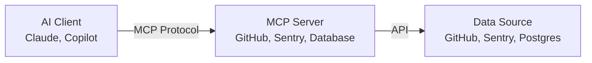

AI coding assistants are everywhere now, but there's a critical gap: **how do they access your actual development context?** Your database schema, API routes, recent commits, production errors—all the things you need to write real code. This is the problem Model Context Protocol (MCP) was designed to solve.

---

## What is Model Context Protocol?

[Model Context Protocol](https://www.anthropic.com/news/model-context-protocol) is an open standard introduced by Anthropic that enables AI assistants to securely connect with external data sources and tools. According to Anthropic's announcement, "Instead of maintaining separate connectors for each data source, developers can now build against a standard protocol."

The protocol has gained significant traction in 2025. According to [Wikipedia's MCP entry](https://en.wikipedia.org/wiki/Model_Context_Protocol), "In March 2025, OpenAI officially adopted the MCP, following a decision to integrate the standard across its products, including the ChatGPT desktop app."

Before MCP, each AI tool had to build custom integrations for every service. Want GitHub access? Custom integration. Need database queries? Another custom integration. MCP changes this by providing a universal protocol that works across AI assistants and development tools.

### The Architecture

MCP follows a client-server model:



**Key benefits:**
- **Security**: Credentials stay server-side; AI never sees your tokens
- **Standardization**: One protocol for many tools
- **Composability**: Mix and match servers for your workflow
- **Local-first**: Servers run on your machine, not in the cloud

---

## Real-World Example: This Portfolio

This portfolio uses several MCP servers in the development workflow. Here's the actual configuration from my `.github/copilot-instructions.md`:

```markdown
### Core MCPs
- **Memory** - Maintains project context across conversations
- **Sequential Thinking** - Complex problem-solving and planning
- **Context7** - Documentation lookup for libraries

### Integration MCPs  
- **Sentry** - Production error monitoring
- **Vercel** - Deployment management and build logs
- **GitHub** - Repository operations and PR management
```

### Practical Use Cases

**1. Production Debugging with Sentry MCP**

Instead of copying error traces into chat, the AI can directly query production errors:

```typescript
// AI can analyze real production errors
const issues = await mcp_sentry_search_issues({
  naturalLanguageQuery: "database errors from last hour"
});

// Then get detailed stack traces
const details = await mcp_sentry_get_issue_details({
  issueId: "PROJECT-123"
});
```

This means debugging sessions start with actual production context, not guesswork.

**2. Documentation Lookup with Context7**

When working with a library, the AI can fetch current docs:

```typescript
// Get up-to-date Next.js documentation
const docs = await mcp_context7_get_library_docs({
  context7CompatibleLibraryID: "/vercel/next.js",
  topic: "server actions"
});
```

No more "trained on data from 2023" problems. The AI has access to current documentation.

**3. Deployment Management with Vercel MCP**

The AI can check build status and logs:

```typescript
// Check deployment status
const deployment = await mcp_vercel_get_deployment({
  idOrUrl: "my-app-abc123.vercel.app",
  teamId: "team_xyz"
});

// Get build logs if something fails
const logs = await mcp_vercel_get_deployment_build_logs({
  idOrUrl: "my-app-abc123.vercel.app",
  teamId: "team_xyz"
});
```

---

## Building Your Own MCP Server

MCP servers are surprisingly simple. Here's a minimal example:

```typescript
import { Server } from "@modelcontextprotocol/sdk/server/index.js";
import { StdioServerTransport } from "@modelcontextprotocol/sdk/server/stdio.js";

const server = new Server(
  {
    name: "my-custom-server",
    version: "1.0.0",
  },
  {
    capabilities: {
      tools: {},
    },
  }
);

// Define a tool
server.setRequestHandler(ListToolsRequestSchema, async () => {
  return {
    tools: [
      {
        name: "query_database",
        description: "Query the development database",
        inputSchema: {
          type: "object",
          properties: {
            query: { type: "string" },
          },
          required: ["query"],
        },
      },
    ],
  };
});

// Handle tool calls
server.setRequestHandler(CallToolRequestSchema, async (request) => {
  if (request.params.name === "query_database") {
    const result = await db.query(request.params.arguments.query);
    return {
      content: [{ type: "text", text: JSON.stringify(result) }],
    };
  }
});

// Start server
const transport = new StdioServerTransport();
await server.connect(transport);
```

---

## Patterns I've Learned

After using MCP extensively on this portfolio, here are some patterns that work well:

### 1. **Memory for Project Context**

Use the Memory MCP to store project-specific knowledge:

```typescript
// Store architecture decisions
await mcp_memory_create_entities({
  entities: [
    {
      name: "Blog System",
      entityType: "Architecture",
      observations: [
        "Uses MDX with next-mdx-remote",
        "Syntax highlighting via Shiki",
        "View counts stored in Redis"
      ]
    }
  ]
});
```

This means the AI remembers your project's patterns without you repeating them.

### 2. **Sequential Thinking for Complex Tasks**

For architectural decisions or debugging, use Sequential Thinking to break down problems:

```typescript
// AI uses this internally for multi-step reasoning
await mcp_thinking_sequentialthinking({
  thought: "First, analyze the current rate limiting implementation...",
  thoughtNumber: 1,
  totalThoughts: 5,
  nextThoughtNeeded: true
});
```

This gives better results than asking for immediate solutions.

### 3. **Filesystem Operations Stay Local**

Never upload credentials or sensitive files. MCP filesystem servers let AI read your local files without sending them anywhere:

```typescript
// AI reads local files securely
const config = await mcp_filesystem_read_file({
  path: "./.env.local"
});
```

The file contents stay on your machine.

---

## The Developer Experience

Here's what a typical workflow looks like:

**Before MCP:**
1. Check production errors in Sentry (browser)
2. Copy error message
3. Search codebase for relevant files
4. Paste everything into AI chat
5. Get generic suggestions
6. Check documentation (browser)
7. Paste docs into chat
8. Iterate...

**With MCP:**
1. Ask AI: "What's causing the database errors in production?"
2. AI fetches errors from Sentry, finds relevant code, checks docs
3. Get specific fix with context from your actual system
4. Deploy and verify

The difference is dramatic. **The AI works with your actual project state**, not a text summary you typed.

---

## Security Considerations

MCP is designed with security in mind, but you still need to be careful:

- **Credentials**: Keep tokens in MCP server config, never expose them
- **Scope**: Only grant necessary permissions (read-only when possible)
- **Audit**: MCP servers log all operations
- **Isolation**: Servers run locally, no external data sharing

From the [MCP security guidelines](https://www.anthropic.com/news/model-context-protocol):

> "MCP servers run with the same permissions as your user account. Only install servers from trusted sources."

---

## Getting Started

To start using MCP with GitHub Copilot in VS Code:

**1. Install MCP servers:**

```bash
# Core servers
npm install -g @modelcontextprotocol/server-memory
npm install -g @modelcontextprotocol/server-filesystem
npm install -g @upstash/context7-mcp

# Integration servers (HTTP-based)
# Configure in VS Code settings
```

**2. Configure VS Code settings:**

Add to `.vscode/settings.json` or user settings:

```json
{
  "github.copilot.chat.mcp.enabled": true,
  "github.copilot.chat.mcp.servers": {
    "memory": {
      "command": "npx",
      "args": ["-y", "@modelcontextprotocol/server-memory"]
    },
    "context7": {
      "command": "npx",
      "args": ["-y", "@upstash/context7-mcp@latest"]
    }
  }
}
```

**3. Start using MCP-aware prompts:**

```
"Use the Sentry MCP to find production errors from the last 24 hours"
"Use Context7 to look up the latest Next.js App Router patterns"
"Use Memory to recall our authentication architecture"
```

---

## What's Next for MCP?

The protocol is still evolving, but the direction is clear:

- **More integrations**: Database tools, cloud platforms, analytics
- **Better discovery**: Marketplace for MCP servers
- **Cross-editor support**: Beyond VS Code (JetBrains, Cursor, etc.)
- **Enterprise features**: Team-shared servers, permission management

---

## Closing Thoughts

Model Context Protocol represents a shift in how we think about AI-assisted development. Instead of AI as a chatbot that gives generic advice, it becomes **a teammate with access to your actual development context**.

The key insight: **context is everything**. An AI that can query your production errors, read your actual codebase, and fetch current documentation is infinitely more useful than one working from a text description.

If you're building AI tools or just trying to improve your development workflow, MCP is worth exploring. The protocol is open, the SDKs are straightforward, and the ecosystem is growing fast.

---

*This post was written with assistance from GitHub Copilot using MCP servers for Memory, Sequential Thinking, and Context7 documentation lookup. The irony is not lost on me.*
