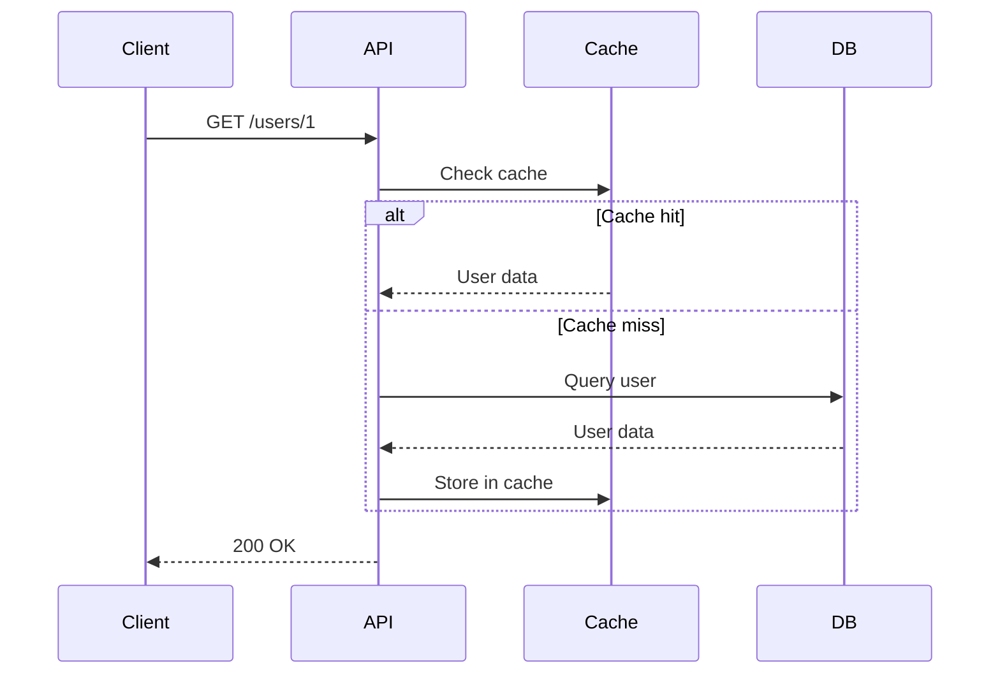
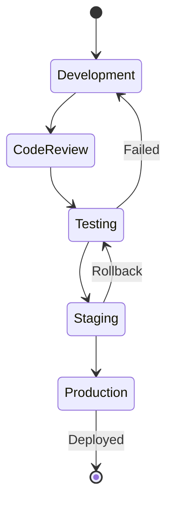
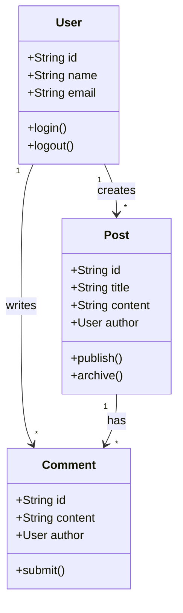
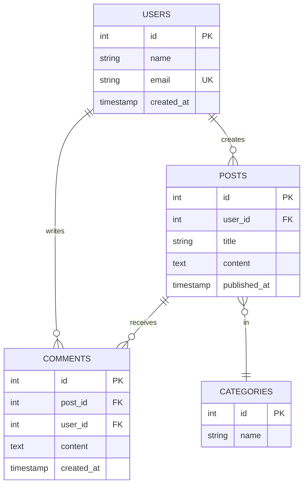
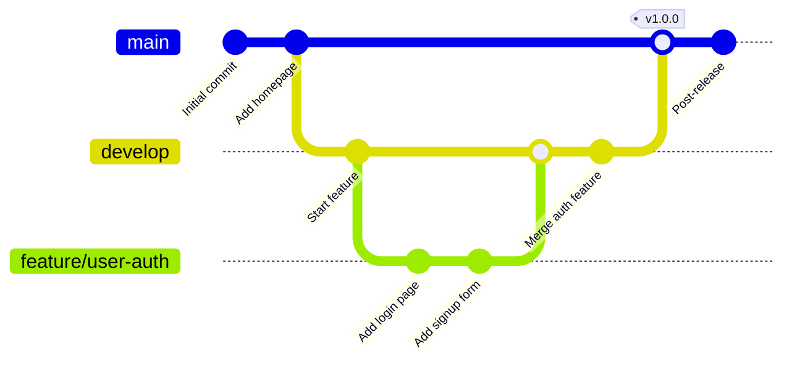
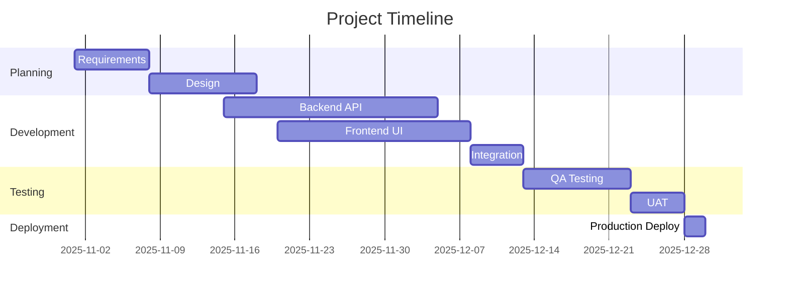
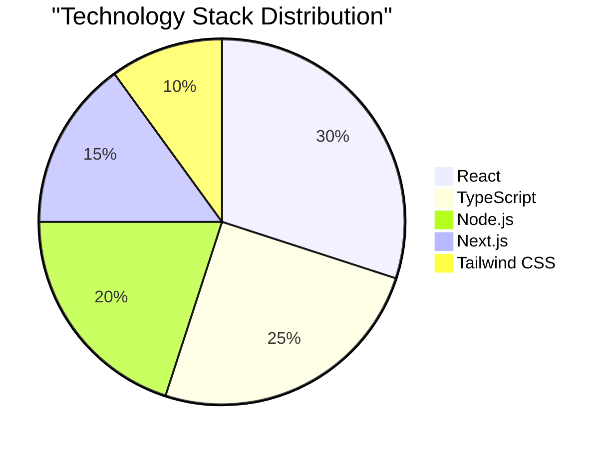
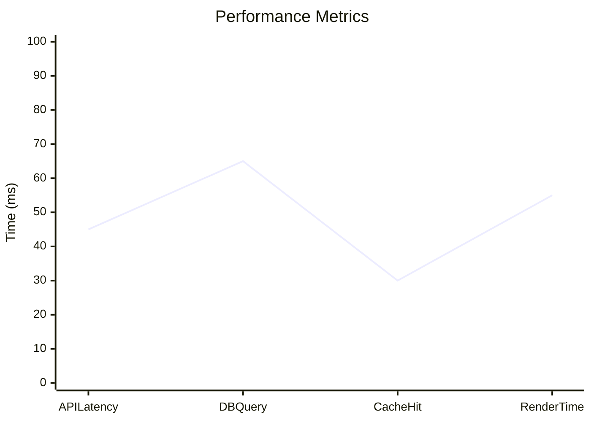
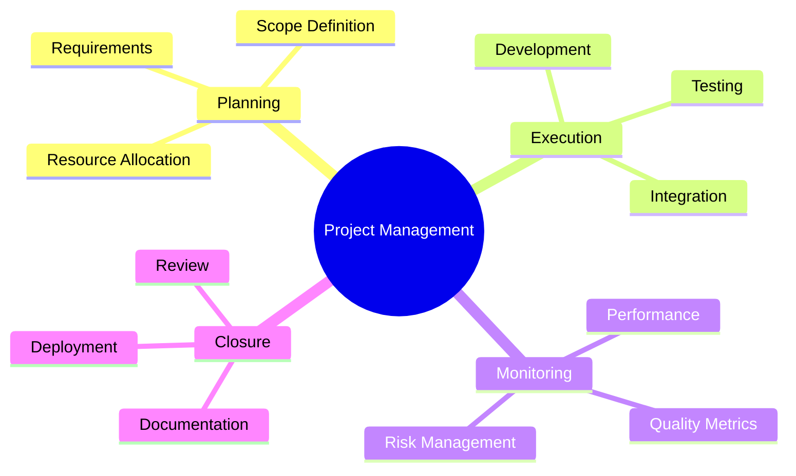
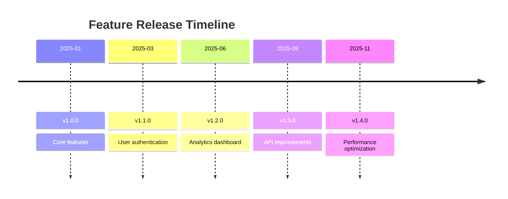

This post demonstrates all Mermaid diagram types supported in the blog, perfect for documenting architectures, workflows, and system design.

---

## What is Mermaid?

**Mermaid** is a JavaScript-based diagramming and charting tool that renders Markdown-inspired text definitions to create and modify diagrams dynamically. It integrates seamlessly with the site's MDX pipeline.

---

## Flowchart Example

A simple user authentication and dashboard flow:

<AuthenticationFlow height={500} />

**Use cases**: System architecture, application flow, decision trees

---

## Sequence Diagram

API interaction flow showing cache patterns:

**Use cases**: API interactions, communication protocols, message flows

---

## State Diagram

Feature deployment workflow:

**Use cases**: State machines, workflow pipelines, deployment processes

---

## Class Diagram

Object-oriented design example:

**Use cases**: OOP design, entity relationships, system architecture

---

## Entity Relationship Diagram (ERD)

Database schema design:

**Use cases**: Database design, data model documentation, schema planning

---

## Git Commit Graph

Branch workflow visualization:

**Use cases**: Git workflows, release planning, branching strategies

---

## Gantt Chart

Project timeline:

**Use cases**: Project management, timeline planning, milestone tracking

---

## Pie Chart

Technology distribution:

**Use cases**: Statistics, distribution analysis, resource allocation

---

## Bar Chart

Performance metrics:

**Use cases**: Metrics visualization, performance tracking, data analysis

---

## Mind Map

Project organization:

**Use cases**: Brainstorming, organization structure, concept mapping

---

## Timeline

Feature release history:

**Use cases**: Version history, release notes, feature timeline

---

## Best Practices

### When to Use Mermaid Diagrams

**Use Mermaid for**:
- System architecture documentation
- Process workflows and flowcharts
- Database schema design
- API interaction flows
- Project timelines and Gantt charts
- Release planning and git workflows

**Consider alternatives for**:
- Complex architectural diagrams (use tools like Lucidchart, Draw.io)
- Highly customized branding/styling
- Real-time collaborative editing
- 3D visualizations

### Tips for Readable Diagrams

1. **Keep it simple**: Complex diagrams become hard to understand
2. **Use clear labels**: Every node/edge should have descriptive text
3. **Consistent naming**: Use similar terminology across diagrams
4. **Logical flow**: Arrange elements to show natural progression
5. **Color strategically**: Use highlighting for important paths or decisions

---

## Summary

Mermaid diagrams provide powerful visualization capabilities for:

- [x] Flowcharts for process documentation
- [x] Sequence diagrams for API/system interactions
- [x] State diagrams for workflow pipelines
- [x] Class diagrams for OOP design
- [x] Entity relationship diagrams for database design
- [x] Git commit graphs for branching strategies
- [x] Gantt charts for project planning
- [x] Pie and bar charts for statistics
- [x] Mind maps for organization
- [x] Timeline for version history

Visit the [Math & LaTeX](/blog/demo-math) post for mathematical equation rendering examples.
