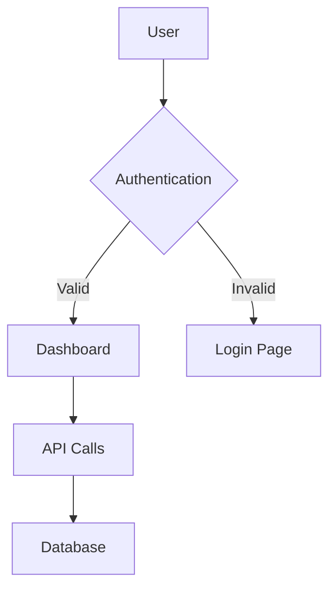
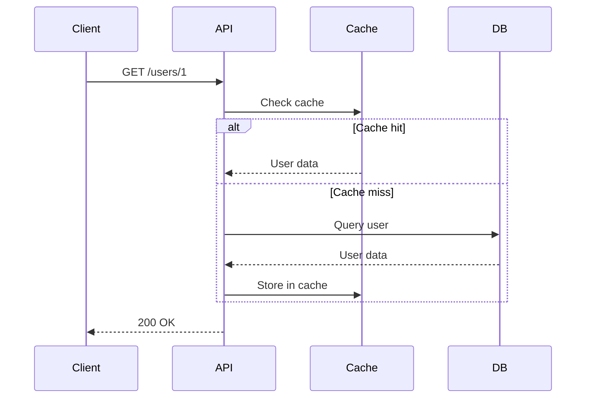
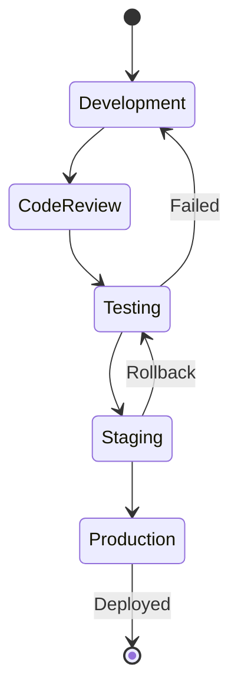
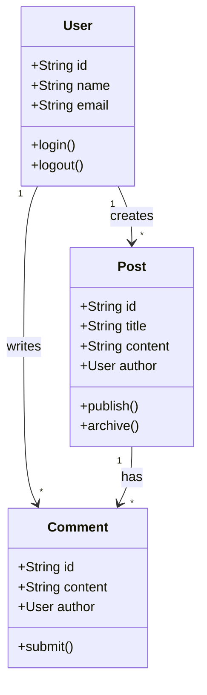

This post demonstrates Mermaid diagram and LaTeX math rendering capabilities.

---

## Flowchart Example

Here's a simple architecture diagram:

---

## Sequence Diagram

API interaction flow:

---

## Inline Math

Einstein's famous equation is $E = mc^2$, where $m$ is mass and $c$ is the speed of light.

The quadratic formula is $x = \frac{-b \pm \sqrt{b^2 - 4ac}}{2a}$.

## Block Math

The Gaussian integral:

$$
\int_{-\infty}^{\infty} e^{-x^2} dx = \sqrt{\pi}
$$

Euler's identity (often called the most beautiful equation):

$$
e^{i\pi} + 1 = 0
$$

A system of equations:

$$
\begin{aligned}
x + y &= 5 \\
2x - y &= 1
\end{aligned}
$$

## State Diagram

Feature deployment workflow:

---

## Matrix Example

A simple transformation matrix:

$$
\begin{bmatrix}
\cos\theta & -\sin\theta \\
\sin\theta & \cos\theta
\end{bmatrix}
$$

---

## Summation and Products

Sum of first n natural numbers:

$$
\sum_{i=1}^{n} i = \frac{n(n+1)}{2}
$$

Product notation:

$$
\prod_{i=1}^{n} i = n!
$$

---

## Class Diagram

Object-oriented design example:

---

## Calculus

Derivative of a function:

$$
\frac{d}{dx}(x^n) = nx^{n-1}
$$

Integral:

$$
\int x^n \, dx = \frac{x^{n+1}}{n+1} + C, \quad n \neq -1
$$

---

## Conclusion

Both Mermaid diagrams and LaTeX math rendering work beautifully! 🎉
